+++
title = "Protoss has always had a cost efficiency problem"
date = "2024-02-07"
description = ""
[taxonomies]
tags=["starcraft", "games"]
+++

To keep the preamble brief, I did a bunch of digging and analysis a year or two ago and never did anything with the data. I wrote an [app](https://github.com/Walnut356/SC2-Upgrade-Calculator), compiled spreadsheets, drafted (and deleted) many documents. Most recently, I had planned to write something more formal - akin to a patch proposal (the actual "patch notes" and data at will be at the bottom, they're vaguely interesting but they're some context). I don't think I have it in me to do something so ambitious on this topic anymore. Unfortunately, the conclusions I've drawn from that data will continue to bang around in my head until I say something. This will be an informal "post-mortem" of sorts, thus my focus is more on sharing my thought process and conclusions, rather than presenting a compelling argument meant to convince. You'll have to meet me half way on that front. If you're wondering who I am and/or my qualifications: I'm nobody and have none.

With that out of the way, on to the good stuff:

## Where we are now

Protoss is kinda a joke. Even the biggest of protoss detractors have been coming around to the idea that the race is in the worst state any race has been in since WoL's release. It all boils down to 2 interlinked issues:

1. Protoss is designed like garbage and isn't really fun to play as or against

2. Protoss is very weak

While the first issue has almost always been true, the second has been slowly creeping up on us for a long, _long_ time. I want to explain what "weak" means, because I think it'll probably be controversial to say protoss has been weak since sc2 released. To help tide you over until I get to the point, ponder this: has protoss's core design changed much since WoL?

My core idea should be clear from the title of the article: protoss simply isn't cost efficient. I think right now, that's fairly obvious based on the existance of the disruptor. It's a unit thats sole purpose is to periodically **delete portions of your opponent's army**. It's a reload-able baneling that 1shots most units in the game. It is incredibly cheap for its potential and isn't really that hard to use effectively. And yet despite having one of the most absurd unit designs I've ever seen in an RTS, protoss wasn't completely busted. It follows then that everything _around_ the disruptor must be equivalently *under*whelming. If disruptors are the kings of cost efficiency, then everything else protoss has must be the paupers.

Assuming both players are competent and playing reasonable build orders, they should have roughly the same amount of resources at the same time. Assuming they spend their money in a reasonable way and play equally well, their armies should be of equal strength and any engagement should be decided by the context surrounding that engagement. To clarify, while the armies should be overall similar "strength", they'll likely be good at different things. A mech army will want a different kind of engagement than a bio army, a blink-based army will favor different terrain and engagement styles than an equivalent chargelot-archon-based army.

I'm not going to bother establishing at length that this isn't true for protoss right now - it's obvious enough. The long and short of it really is the whole "**deleting portions of your opponent's army** just to make the game even" thing. It was kept in careful balance until recently, and the series of nerfs to the disruptor (without equivalent compensatory buffs to surrounding units) have finally collapsed the house of cards. Instead, I want to spend some time proving that this has _always_ been the case, it has just been masked by a set of increasingly contrived cries for help.

## Where we used to be

Let's assume the same situation as above, except you're aware that your army is weaker than theirs, and there's no possible way to rectify that. How do you win anyway? You play smarter. Exploit the types of engagements, the terrain, the timing that your opponent's army can't handle well. Get scrappy, get crafty, get weird. Claw for any way to unbalance their position. Everyone does this to some extent, but it becomes the _only_ way when you can't win a straight-up fight.

So what about before the disruptor, back in HotS? The predominant strategy in PvZ was mostly variants of blinkstalker sentry. There were some weirdos like myself who played 9 colossus mothership vs swarmhosts on gigantic 4 player maps, but I think most people agree that blinkstalker sentry was not only the most common, but the most effective. For those that weren't around, or those that forgot, here is my favorite game of all time: [Parting vs True game 3 at Gfinity 2015](https://www.youtube.com/watch?v=3jZaHbkqMDw&) (skip to ~16:45 if you're impatient). That game alone just about sums up HotS to me.

Blink is the best ability in the game. Put it on any unit, and that unit is incredible. Forcefield is also stupidly strong in isolation. Combining these (and recall) is the pinnacle of hit and run cost efficiency - it's hard to imagine a better set of abilities. Despite that, it _barely_ worked. I don't mean that it was too weak, I mean on the whole it was a very fragile strategy - balance-wise - that was reliable enough to be a mainstay, but there's no hidden extra layer or whatever that makes it broken or can be adapted if things change. A single nerf to stalkers or sentries could, and indeed did, kill this strategy outright.

Can't out-greed? Make your opponent bleed off money constantly, put pressure on any auxiliary bases. Can't take straight up engagements? Hit and run, trade shields for HP. Can't hit and run without losing more than you kill? Use forcefields to only fight tiny sections of the army, in combination with blink to retreat when necessary. Force everything to be on your terms and _maybe_ you can swing the pendulum in your favor and wear them down. It's an exciting style to watch and play, and is represented by the other races in the MMM vs ling bane muta wars that have nearly always existed in the meta.

This strategy unfortunately no longer works in LotV as ravagers ruin the delicate sentry energy math. The composition can no longer trade effectively with large numbers of low/mid tier units. In effect though, disruptors are a streamlined version of forcefielding off a handful of roaches and killing them "for free".

The other option is to go lategame and hope to weather the storm until such a time as core armies aren't primarily made of up of t1/1.5 units, and when production and tech limitations no longer exist. Some players were very successful with this strategy, but it's still just masking the cost efficiency issue by avoiding confrontation rather than min-maxing every little aspect of it.

Before that, in WoL, play was much the same. People were generally worse at the game, both executionally, and mentally. Play revolved around mostly turtling to avoid fighting with primarly t1/1.5-based armies, gimmicks like archon toilet, or early all-ins like the Soul Train which, surprise surprise, relies on forcefields to eke out an advantage via the same tactics as above.

The other major playstyle throughout sc2's history was cheese. If you can't win engagements on the map, why let it get there in the first place? I wonder which race was the most infamous for cheese...

Unfortunately, because of this infamy, Protoss cheeses and all ins were targeted and patched more aggressively than those of Terran and Zerg (see: treatment of adept all ins vs nydus all ins at the beginning of LotV).

## The point

While the previous section was by no means extensive, I think those of you who have been around for a while can recognize the pattern and fill in the gaps with your own experience. There are all sorts of problems that have come up as a result of the lack of cost efficiency:

- Over centralization on colossus, high templar, or carriers

  - If you have them, fights feel even. Once they die, the other 90% of your army may as well not exist

- Frail earlygame

  - See: WoL PvP earlygame and the forge fast expand for examples, and mothership core+photon overcharge/shield batteries+battery overcharge for bandaid fixes.

- Doubling down on annoying/gimmicky unit design

- Lack of compositional and strategic variety

  - Many niche units fall by the wayside and are completely unused, most compositions are just miniscule variations of the 2 cost effective units + whatever hard counter you need at the time

- **deleting portions of your opponent's army** being a necessity

- Infrastructure feels too expensive

  - Lots of tech is required which leads to less production structures. Less production and less money means less units. Units which already aren't cost efficient, leading to an even weaker position than an investment in tech normally risks. That means people play more passively or cheese, which leads to less interesting games. Going for production structures is a fool's errand because even if you have as many units as your opponent, your army won't trade effectively anyway since you don't have the tech to **delete portions your opponent's army** (or play tactically pre-LotV).

- Very difficult to come back from even a single mis-step or mistake
  - very little "extra" money, difficult to replace what's lost. Usually have to skimp on base defenses which makes drops and harassment more effective.

All of this stems from the simple fact that that the Zealot, Sentry, Adept, Archon, Phoenix, and Immortal do _substantially_ less than their requisite costs would imply. I want to emphasize that again. _Substantially_ less. Honorable mentions go out to the photon cannon, voidray, and observer for being somewhat weak and contributing to the above. Below are some of the compiled cost-efficiency numbers I wrote down a while back, categorized by DPS-, supply-, and health- per-cost and per-size. Per-cost is a decent metric for midgame, where money is your main limiting factor. Per-size is a decent metric for larger army sizes where cost is less important compared to terrain and damage density. Keep in mind that other factors also matter, such as production-structure efficiency (e.g. reactors make marines more efficient to build, observers take highly contested robo-facility time making their efficiency worse than it would initially seem), movement speed, utility, range, upgrade scaling, etc.

The data is restricted to "core army units", who focus on providing "meat" - solid HP and damage to fill out your army. These need to be supported by utility units (e.g. medivacs, lurkers, etc.) and higher tier damage dealers to thrive in the mid and late game. They should be all-arounders with quirks that lead to interesting dynamics during fights (e.g. marine stutter step, FF's exploiting roach range, banelings punishing clumping while zerglings punish spreading, etc.)

Efficiency Charts

Cost is just a simple sum of minerals + gas. Technically gas "worth more", but it's also used in smaller quantities, mined in different amounts, different builds prioritize different ratios of mining, etc. etc. etc. Suffice it to say the ratios cancel out for it to be close enough to 1:1, and even if it didn't, builds would compensate to make them equivalent.

Also worth noting that these calculations were done with float point arithmetic, whereas starcraft 2 uses a 32 bit Fixed Point numbers. If you don't know what that means, essentially the numbers might be a tiny bit off compared to the game (or compared to what you might calculate, depending on your order of operations), but they're close enough that it'll make no difference.

## DPS

### No Upgrades

| Unit     | DPS/Cost | DPS+bonus/Cost | DPS/Supply | DPS+bonus/Supply |
| -------- | -------- | -------------- | ---------- | ---------------- |
| Zealot   | 0.1860   | -              | 9.3023     | -                |
| Stalker  | 0.0554   | 0.0768         | 4.8507     | 6.7164           |
| Adept    | 0.0497   | 0.1093         | 3.1056     | 6.8323           |
| Marine   | 0.1967   | -              | 9.8361     | -                |
| Marauder | 0.0748   | 0.1495         | 4.6729     | 9.3458           |
| Zergling | 0.4024   | -              | 20.120     | -                |
| Roach    | 0.1119   | -              | 5.5944     | -                |
| Queen    | 0.0751   | -              | 5.6338     | -                |

Sorted:

| BaseDPS/Cost | DPS+bonus/Cost | BaseDPS/Supply | DPS+bonus/Supply |
| -------- | -------------- | ---------- | ----------------------- |
| 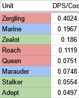 | 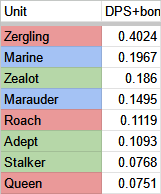 | 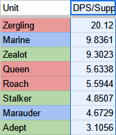 | 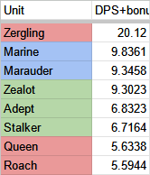 |

### Midgame Upgrades

(charge, glaives, stim, blueflame, speed)

| Unit        | DPS/Cost | DPS+bonus/Cost | DPS/Supply | DPS+bonus/Supply |
| ----------- | -------- | -------------- | ---------- | ---------------- |
| Zealot      | 0.1860   | -              | 9.3023     | -                |
| Stalker     | 0.0554   | 0.0768         | 4.8507     | 6.7164           |
| Adept       | 0.0497   | 0.1093         | 3.1056     | 6.8323           |
| Archon\*    | 0.0500   | 0.0700         | 5.0000     | 7.0000           |
| Immortal    | 0.0513   | 0.1282         | 4.8077     | 12.019           |
| Marine      | 0.2948   | -              | 14.742     | -                |
| Marauder    | 0.1127   | 0.2254         | 7.0423     | 14.085           |
| Hellbat\*   | 0.1259   | 0.2098         | 6.2937     | 10.490           |
| Zergling    | 0.4024   | -              | 20.121     | -                |
| Roach       | 0.1119   | -              | 5.5944     | -                |
| Ravager\*\* | 0.0702   | -              | 4.6784     | -                |
| Hydralisk   | 0.1356   | -              | 10.170     | -                |
| Queen       | 0.0751   | -              | 5.6338     | -                |

\* Slightly misleading due to AoE

\*\* Slightly misleading due to biles

---

| BaseDPS/Cost | DPS+bonus/Cost | BaseDPS/Supply | DPS+bonus/Supply |
| ------------ | -------------- | -------------- | ---------------- |
| 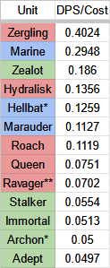 | 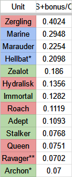 | 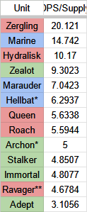 | 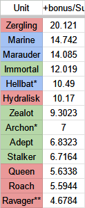 |

### Midgame by size

| Unit      | DPS/Size | DPS+bonus/Size |
| --------- | -------- | -------------- |
| Zealot    | 37.2093  | 37.2093        |
| Stalker   | 15.5224  | 21.4925        |
| Adept     | 12.4224  | 27.3292        |
| Archon    | 20.0000  | 28.0000        |
| Immortal  | 30.7692  | 76.9231        |
| Marine    | 39.3120  | 39.3120        |
| Marauder  | 25.0391  | 50.0782        |
| Hellbat   | 20.1399  | 33.5664        |
| Zergling  | 26.8276  | 26.8276        |
| Roach     | 17.9021  | 17.9021        |
| Ravager   | 18.7135  | 18.7135        |
| Hydralisk | 32.5424  | 32.5424        |
| Queen     | 12.8773  | 12.8773        |

Sorted:

| BaseDPS/Size | DPS+bonus/Size |
| ------------ | -------------- |
| 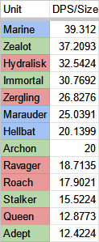 | 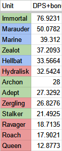 |

## Health

* Assumes all upgrades listed in DPS Midgame

* Health is simply health + shields

I factor in armor as a bonus 10% hp. I ran a simulation of every unit attacking every other unit at every possible combination of upgrades on the attacker and defender a while back and iirc the average "effective HP" for each point of armor was ~8% higher than their base health

| Unit      | HP/Cost | HP/Supply | Health/Size |
| --------- | ------- | --------- | ----------- |
| Zealot    | 1.5110  | 75.55     | 302.20      |
| Stalker   | 0.9206  | 80.55     | 257.76      |
| Adept     | 1.1288  | 70.55     | 282.20      |
| Archon    | 0.9000  | 90.00     | 360.00      |
| Immortal  | 0.8029  | 75.28     | 481.76      |
| Marine    | 1.1000  | 55.00     | 146.67      |
| Marauder  | 1.0088  | 63.05     | 224.18      |
| Hellbat   | 1.3500  | 67.50     | 216.00      |
| Zergling  | 1.4000  | 70.00     | 93.33       |
| Roach     | 1.4610  | 73.05     | 233.76      |
| Ravager   | 0.6055  | 40.37     | 161.47      |
| Hydralisk | 0.6000  | 45.00     | 144.00      |
| Queen     | 1.1740  | 88.05     | 201.26      |

Sorted:

| Health/Cost                                    | Health/Supply                                  | Health/Size                                           |
| ----------------------------------------------------- | ----------------------------------------------------- | ----------------------------------------------------- |
| 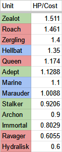 | 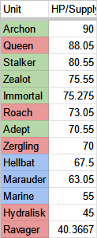 | 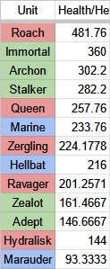 |

## Where do we go from here?

There's 2 solutions:

- Make things cost less

- Make things do more

It really is that simple.

The caveat is that, right now, protoss is both weak AND poorly designed. That means that in addition to removing disruptors and redistributing their power, you'd also likely need to add a bit of extra sauce on top to make things truly even. I'm not saying it's easy, the number fiddling for such a large scope is incredibly intensive. It requires lots of careful consideration, lots of testing to cover for your inevitably flawed considerations, and even more tweaking after the most egregious oversights have been fixed and mature strategies begin to emerge. But the path is straight forward: if you want a less gimmicky, less annoying, less fickle-to-balance Protoss in the long run, you need to make their core army function like a core army. It needs to be cost efficient.

I could go on at length about why this situation has gotten as bad as it has - a lack of clear direction for the race's design, community complaints, misunderstandings of core mechanics, etc. I could also go on at length about the various "tools" in the balance-design toolkit that can be used to change some aspects without affecting others, but that's all for another time. Instead, I'll leave you with the rough draft of the patch notes I wrote. It's split into 3 sections: The design philosophy, some changes to core system mechanics, and then changes to each unit. The only restrictions I set on the changes were that these changes must be reasonable to implement by the Balance Council - no brand new abilities or assets. I also wanted to try to change at least 1 thing per unit. Keep in mind, this was written before patch 5.0.11, which was the first major Balance Council patch afaik. I'm not 100% pleased with it, but I think it's interesting enough to drop in here at least.

Design Philosophy

## Core Design Principles

The major feeling I've gotten from both Blizzard and the balance council is that there isn't a clear _direction_ that they want to take Protoss in. There's a lot of fumbling, throwing shit at walls, and solving symptoms without solving core issues. The goal of this redesign is as follows:

1. Define an archetype that Protoss should fill
2. Make changes that take Protoss in that direction

It's not so complicated when you put it like that. Ideally my changes would be accompanied by similar, but less heavy-handed changes to Zerg and Terran.

- Things instantly exploding is not fun for anyone
- Lategame mass air is not fun for anyone if it's not rare
- Both players playing out on the map is more fun and interesting than if one or both players stay at home
  - The safer your base is, the more willing you are to play on the map
- There needs to be a good mix of simple units, "complex" units, and units with actives
- There should be several viable compositions and strategies at every phase of the game
- Simple, elegant solutions tend to have better gamefeel than complicated solutions even if they both accomplish the same thing
- "Micro" as people think of it mostly has to do with a unit's **base stats**, and has very little to do with its abilities
- "A core army of effective, but somewhat expendable units supported by a small number of higher tier, niche units that cover some deficiency of the core army " is always a safe pattern to fall back on

Core Mechanics Changes

## Global

- All starting worker counts reduced from 12 -> 10

>Allow for more dynamic earlygame with a longer t1 phase before t1.5

- Main and Natural bases have full mineral saturation on all 8 patches

>Main mines out a little too quickly, forcing a 3rd base earlier than feels natural.

- All workers now have a proper moving shot

Micro is cool

- Massive air units can no longer stack ontop of eachother

>Mass air is lame and ignores too many core RTS mechanics

---

## Protoss

### Power Fields

- Slow/Fast warp-in zones completely removed. Warp-in time is always a flat X seconds.

>artifact from when we thought reinforce time was more important than it is. This sort of added complexity is a little gross and has far-reaching consequences that still require dumb workarounds to this day.

- Nexus now has an innate powerfield (only active after construction finishes). Powerfield can just barely fit a single 3x3 structure directly adjacent to the nexus

>probably not 100% necessary, but could increase build variety

### Shields

The main goal here is twofold:

1. It opens up an additional tool for tweaking specific unit properities by allowing one to shift it from one shield type to another

2. It makes protoss units tankier and encourages shield upgrades due to a neat quirk of the damage calculation. When damage spills from shields to hull, the damage that is dealt to shields is reduced by shield armor. When the overflow is applied to the hull, it's _reduced again_ by the hull's armor. Since most protoss units come with 1 hull armor, getting the extra shield armor might be the better call, especially when

- Shields are now split into 3 categories: Personal, Purifier, Building
  - Personal shields have no shield recharge cooldown, restore 1/s
  - Purifier shields function the same as current shields, 7s recharge delay, restore 2/s
  - Building shields have a minimum of 1 armor a 14s recharge delay, and restore 3/s. Buildings do not restore shields when unpowered (but do not lose current shields either).

| Personal     | Purifier   |
| ------------ | ---------- |
| Probe        | Stalker    |
| Zealot       | Immortal   |
| Adept        | Colossus   |
| Sentry       | Disruptor  |
| High Templar | Voidray    |
| Dark Templar | Oracle     |
| Phoenix      | Tempest    |
| Observer     | Carrier    |
| Interceptor  | Mothership |

\* Archon: see unit rework notes

### Nexus

- Recall and battery overcharge removed.
  - Chronoboosting a canon will increase its fire-rate
  - Chronoboosting a shield battery will increase its energy regen rate

### Photon Cannon

- Attack is now split between ground and air
  - identical stats but will auto-prioritize air units similar to the thor and queen

### Shield Battery

- Starting energy 100 -> 50
- Maximum energy 100 -> 200
  - Maximum potential heal is 600 shields, up from 300
- Cost 100 minerals -> 75 minerals

Protoss Unit Changes

## Disruptor

>(ಠ_ಠ)

>I unfortunately have to get this out of the way right away, as it flavors the entire rest of the changes. This change alone highlights how dire of a situation protoss is in, and how much it's been covered up. Here is a brief description of the unit: It exists to instantly delete a significant portion of your opponent's army because nothing else you can build can trade cost efficiently.

>Here it is again for dramatic effect, because that is _fucked_. This unit DELETES portions of your opponent's army, because all your other units are so cost-inefficient. The correlary here is that it _has to_ accomplish this, otherwise you lose badly. If you get the money shot the game instantly ends in your favor, if you get several OK shots it's even, and if you whiff you get stomped. I've seen it happen in so many GSL games it's not even funny. It's so swingy, so unpredictable, both sides are forced to just cope with this dumpster fire and just hope that things go their way.

>I'm sorry to anyone who like this unit, but it is terrible, it has made the game significantly worse, and it isn't salvageable. Best to rip off the bandaid and see where else we can redistribute this power to.

- Removed, stomped on, and thrown through a shredder into an incinerator

## Zealot

>Zealots are by far the weakest t1 unit. Despite what some would have you believe, they aren't very good in the mid and lategame either (see Unit Efficiency Charts). While they have _some_ utility in the midgame and lategame - particularly due to their cost and building damage - they are still outclassed in damage, tanking, and utility by their contemporaries. They also critically lack basic earlygame usability, and are hard to use tactically due to charge being a 1-way trip. These changes aim to put zealots on even footing in the ultra-early game, and to help them come online a bit quicker and cheaper in the midgame.

- Base movespeed 3.15 -> 3.5 (charge values unchanged)
- Charge cost reduced 200/200 -> 100/100 AND/OR charge impact damage re-added
- Shields increased 50 -> 60
- Weapon upgrades increased +1 -> +1.5 (zealot attack is 8x2, so this change is 9x2 -> 9.5x2)

## Adept

>When LotV came out, I was incredibly excited to see protoss getting a new core army unit. For those that weren't there or don't remember, it was originally incredibly tanky and had an additional upgrade for a bonus 50 shields. It also had a glaive bounce similar to mutas (though only 1 bounce, and only when an attack killed). A new core army unit was exactly what protoss needed to fill in the early game and add a bit of meat to the army so that it would be less reliant on splash damage and gimmicks. Unfortunately, most of that magic was removed in favor of what we have now. These changes aim to make the adept a much more viable alternative to stalkers (and complement to the army as a whole) without ruining the somewhat interesting properties they've acquired. An additional benefit is giving protoss a slightly more robust pivot against muta switches in PvZ and mass phoenix in PvP.

- Health/shields increased from 70/70 -> 75/75
- Resonating glaives moved to cybernetics core
- New upgrade on the twilight council, 200/200
  - Glaives now bounce once for 33% damage
    - Non-Light: 3.33 damage bounce, total dps 12.012 (compared to 9 without bounce)
    - Light: 7.33 damage bounce, dps of 26.426 (compared to 19.81 without bounce)
  - allows adepts to hit air units
- Weapon upgrades rescaled +1(+1 vs light) -> +2

## Sentry

>The sentry kinda got bodied in LotV. It has very little utility for its cost, and even the utility it has is pidgeonholed. Hallucination may as well be named "spawn scouting phoenix" ever since it was made a base ability. I'd like to make it more appealing to summon other types of units, either as damage sponges or as misdirections

- Health/shields rescaled from 40/40 -> 20/60
- Ravager biles no longer break forcefields
  - Queens are now massive units
- Psionic transfer can no longer pass through forcefields
- Forcefield duration reduced from 11s -> 8s
- Guardian shield radius 4.5 -> 5.0
- Guardian shield gives a flat +2 armor rather than decreasing ranged damage by 2.
- Hallucination summoned unit counts increased. Effective summoned HP differences in parentheses
  - Probes: 4 -> 8
  - Zealots: 2 -> 6 (150 -> 480)
  - Adepts: 2 -> 5 (140 -> 375)
  - Stalkers: 2 -> 4 (180 -> 360)
  - Immortals: 1 -> 2 (150 + barrier -> 300)
  - Archons: 1 -> 3 (180 -> 540)
  - Voidrays: 1 -> 2 (125 -> 250)

## Stalker

>Stalkers are probably the only unit that I think are in a pretty much perfect position right where they are. Blink is an incredible ability, and putting it on any unit would instantly make that unit S tier. The stalker's stats are mediocre, but with blink that's fine. As a result, they won't see much change aside from a minor increase to their scalability

- Weapon upgrades rescaled from +1(+1 vs armored) -> +2

## Immortal

>Immortals are in a similar position to sentries. The changes against them were so heavyhanded that it left protoss in a dire position without many other options. These changes are mostly meant to revert the nerfs, while not overcentralizing around immortals quite as much as before.

- Cost reduced to 250/100
- Barrier removed
- Hardened Shields added and reworked
  - Any damage inflicted to shields that is greater than 10 is reduced to 10 OR reduced by 50%, whichever is larger.

## Colossus

>Iunno, it's probably fine. I wouldn't want to make it any more powerful than this though. If any more efficiency or damage is needed in the protoss army, it needs to be put on the adept, archon, voidray, or zealot first so we don't end up right back in WoL deathball territory.

- Damage rescaled from 10(+5 vs light) -> 12

## Observer

>Slightly more elegant solution than other suggestions I've heard. Makes proxying vs retaining a stargate much more of a choice, and relieves some of the pressure from robo production time.

- Can now be built from both the robotics facility and the stargate

## Warp Prism

>Another change meant to make people's bases a bit safer. Lategame warpins were a bit much, and this should help to keep them from being too egregious.

- Power field radius severely reduced (4-6 unit warp-ins max)

## Phoenix

>Phoenix are going to have some big shoes to fill (as you'll see), thus they need some usability improvements. Their attack range was increased all the way back in heart of the swarm, but graviton beam range wasn't increased to compensate. This should make phoenix a bit more viable for harass and for picking off key targets, as you won't have to get quite as close.

- Graviton beam range increased 4 -> 5
- Anion pulse crystals
  - moved to the cybernetics core, requires either fleet beacon or robotics bay
  - Also increases the range of graviton beam 5 -> 7
  - Cost increased to 200/200

## Oracle

>Remember the dreams of the worker-friendly harass unit? Me too. Good times. This was one of the hardest units to make a call on, since I'm trying to work within the confines of what's realistically able to be put in the game at the moment. That takes a lot of new ability ideas off the table. A tiny recall could work, but there's so much potential for that to be fucked up that I couldn't justify it as anything other than a "Maybe". Pulsar beam _had_ to go though, both to allow the phoenix space to shine, and to move towards the general direction of making everyone's bases a little bit safer. It leaves the oracle feeling a little empty, but hopefully the return of interesting stasis mechanics (and a DOOR FOR PROTOSS) will make up for that.

- Health/shields rescaled from 100/60 -> 60/100
- Pulsar beam removed
- Stasis ward autocast can be turned off
- Stasis ward lifespan does not decrease while in a powerfield
- Cost reduced to 100/100
- (Maybe) Recall ability added, functions similarly to the mothership core but with a very small radius (3-6 units max)

## Voidray

>Not only was the usage of passive-prismatic more tactically interesting, but the addition of a button has done nothing to cause the unit to require more skill during an actual fight. In addition, they're a little frail. Sharing a range with stalkers means they're usually targetted with equal priority which isn't ideal, since having to move back to re-juggle priority works against prismatic alignment. This may not be as much of a problem with the buffs to the sentry, adept, and zealot (which all stand closer than voids), but oh well.

- Prismatic alignment reverted to WoL behavior
- Attack range 6 -> 7

## Tempest

>The tempest have always been such a weird unit. First it was meant to be anti-muta, then it was meant to be anti-zerg lategame, then we had fun for about 2 weeks, and then it was back to being anti-zerg lategame. I'm bringing the fun back. Disintegration (i.e. irradiate) is an incredibly fun to use ability, pairs well with the idea of a hit-and-run midgame, and provides unique gameplay styles over the robotics and twilight tech paths (i.e. taking out key targets to keep your opponent's army complexity low)

- Tectonic destabilizers removed
- Disintegration re-added and reworked
  - 10 Range
  - Deals 300 damage over 45 seconds
  - 70 second cooldown

## Carrier

>Carriers are pretty gutted by change to massive air units, so I wanted to provide them with some extra utility. That utility comes in the form of tanking damage and repairing damage, which can be drag-and-dropped from the campaign

- Carriers now come with 2 drones that can repair friendly mechanical units
- Interceptor health/shields increased 40/40 -> 50/50

## High Templar

>Templars are fine. The added auto attack was dumb, but I don't really mind that much either way. It's not super necessary now that many of protoss's pointless fiddly buttons are removed

- Auto attack removed

## Dark Templar

>Why was this even added?

- Auto attack delay after blink removed

## Archon

>Archons are surprisngly bad. On paper they're not, but in practice... Their splash radius is abysmally low, they take far too long to regen their shields, they're a t3 unit that gets bodied in cost efficiency by t2 units, they're bulky and reduce your army's surface area, and they cost two production cycles and 400 total resources to build. They also almost never benefit from defensive upgrades, making them laughably flimsy in the lategame despite their high HP total.

>There are 2 options here because I'm indecisive, but I think both would accomplish a similar thing - making archons less of a sink-unit and more of something you actually want. For their cost, they should provide much more meat and stability to an army. They retain the unique "making these from templar feels bad" in the first option due to paying extra for the same unit.

Option 1:

- Can be directly built/warped-in from the gateway for a cost of 125/150 and 3 supply (similar cost to siege tank/liberator/lurker)
  - yes, merging 2 templar that cost 4 supply would result in a unit that costs 3 supply. Theoretically this could allow for a protoss "extractor trick", it's up in the air if that's okay or not.
- Has a unique shield type that does not have a recharge delay and recharges 2 shields per second

Option 2:

- 100% damage splash radius increasd from .25 -> .5
- 50% damage splash radius increased from .5 -> .75
- 25% damage splash radius increased from 1 -> 1.5
- Has a unique shield type that does not have a recharge delay and recharges 3 shields per second

## Mothership

> If it's gonna be a meme unit, at least let it be an *extra* silly one

- Tech requirement is now a Cybernetics Core rather than Fleet Beacon
- (Maybe) Add in mothership core with different, less obnoxious abilities

