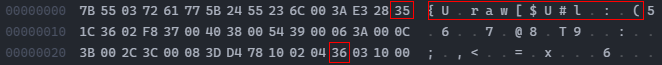
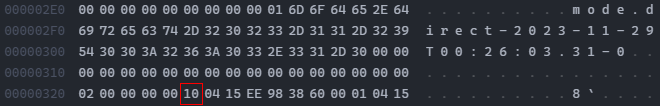
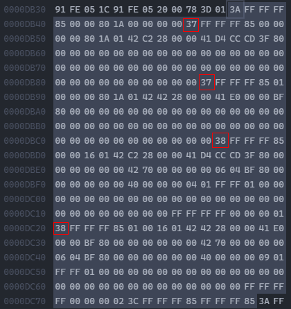
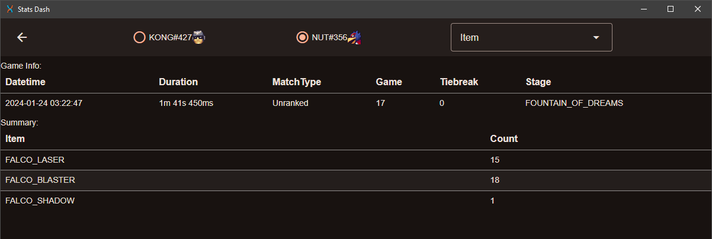

+++
title = "Can you estimate playtime from replay folder size?"
date = 2024-01-25

[taxonomies]
tags=["programming", "rust", "ssbm", "games"]
+++

I've seen this question come up a few times on r/ssbm and while I've given hand-wavey answers before, I find myself in a good place to answer more rigorously now. We can break this question down to more basic ones: "how many bytes of replay data correspond to a single frame of gameplay?" and "how many bytes in the replay are unrelated to frames?". From there, we can estimate a duration by simply translating the 16.667ms per frame to minutes and seconds.

<!-- more -->

For the analysis, we'll be using the replay parser I wrote in Rust. Replays *do* store their duration - both in their total frame count, and directly - so we'll easily be able to check our work. We'll be using my current netplay replays folder which contains my most recent ~1000 replays, several of which were filtered out for unimportant reasons.

<details>
<summary>
Code
</summary>

```rust
// The DB here is still a WIP, so this is
// the only SQL that will be in this post
let conn = Connection::open_in_memory()?;

let stubs = parse_stubs(r"E:\Slippi Replays\Netplay\", true);
dbg!(stubs.len());

let mut total = 0u128;
for stub in stubs {
    total += stub.path.metadata().unwrap().file_size() as u128;
}

dbg!(total);

create_stubs(&conn, &parse_stubs(r"E:\Slippi Replays\Netplay\", true))?;
export(&conn, "test_db")?;
let mut stmt = conn.prepare(
    "SELECT sum(duration) FROM stub;"
)?;

let mut val = stmt.query([])?;

println!(
    "{:?}",
    val
        .next()
        .unwrap()
        .unwrap()
        .get::<usize, usize>(0)
        .unwrap() // just give me the number already >=(
);
```
</details>

<details>
<summary>
Output
</summary>

```cmd
    [slp_db\src\main.rs:13] stubs.len() = 1048 // # of games
    [slp_db\src\main.rs:20] total = 3682219473 // byte count
    155336180 // total playtime in ms
```

</details>

After loading these into the database, a quick query gives us the total duration of all of the games: 155,336,180ms. Or, in a less disgusting unit, ~43 hours and 9 minutes. Accounting for the filtered replays, the total file size is 3,682,219,473 bytes or ~3.43GiB.

## What exactly is in a replay file?

This is both an easy and a difficult question to answer. While we could directly inspect the assembly code that exports the replay data or the .slp file itself in a hex editor, there's a much easier way: a [file specification](https://github.com/project-slippi/slippi-wiki/blob/master/SPEC.md) maintained by the slippi and slippi-adjacent devs. The spec helpfully lists the hexadecimal byte offsets of each field in each subsection. The values are not encoded or padded in any way, so simply adding the byte-length of the last field to the offset of the last field gives us the total size:

| Event: | Size: |
| ----- | ---- |
| Payloads | 30 |
| Game Start| 761 |
| Pre-Frame | 65 |
| Post-Frame | 85 |
| Game End | 7 |
| Frame Start | 13 |
| Item Update | 45 |
| Frame Bookend | 9 |
| Gecko List | uhh... |


The metadata event at the end doesn't have a guaranteed size, but it's roughly 250 bytes.

It's also worth noting that these sizes are specifically for replays of version 3.16.0. As new versions come out and add new fields, events can be larger. It follows that events in older replays have smaller events. We can't extract the replay version without parsing the replay, but the file creation date and/or default file name (which contains the replay's creation date) can be used as a proxy to that information. I manually compiled the release dates of the replay file versions by walking the git history of the replay recording asm file, a list is available [here](https://github.com/Walnut356/SlpProcess/blob/37c25c8488178157c0f97e1184385a62af82a6e1/slp_parse/src/events/game_start.rs#L508)

So now we know what's in a replay file, but that doesn't tell us what's *in* a replay file. For that, we need to bust out the hex editor:



...



At the top we see the header, a 15 byte sequence that marks the beginning of a .slp file, which we can add on to our non-frame data total. Next we can see the command byte for the Event Payloads (`0x35`), followed by the command byte for the Game Start event (`0x36`). The next thing we see though isn't the start of the first frame of data as might be expected, it's event code `0x10` which corresponds to the Message Splitter. The layout and implementation are a bit confusing, so I'll gloss over the specifics. Long story short this contains all of the gecko codes used when the replay was recorded. As I understand it, this exists to prevent playback desyncs, especially in spectator mode. Unfortunately for us it means we're going to have to formalize the fact that our playtime estimate will be an *estimate*, not an exact match.

See, when you play a match against someone online, each of your dolphin instances generates a replay file. As many of you probably know, there are a handful of "netplay safe" gecko codes out there - codes that can be added by an individual, but won't desync if their opponent doesn't have it. These can change from game to game as the player toggles them on or off. Also, there is no "sharing" of gecko codes, and no "canonical" list of gecko codes for that game, thus each dolphin instance records the gecko codes that it had enabled at the time. That means 2 (or more via broadcasting) replay files of the same game are *not* guaranteed to be identical. Keep that in mind, as it will come up again later.

This means that, at best, we can only guess at how large people's gecko codes will be. There are some limits to how small and large the gecko codes section can be, but for now, we'll just assume everyone uses the same ones I do: the required and recommended set, as well as Flash Red on Failed L-Cancel.

My parser stores offsets of each event as an intermediate step, so we can pull the offset of the first pre-frame event, subtract out the non-gecko event sizes, and we get a gecko code size of 56,124 bytes. The game-end and metadata events also occur once per game (assuming no bugs). That means that, for this replay, ~56,374 bytes do not contribute to the duration.

We can multiply this by the total number of replays and subtract it out from the total byte count of the files, leaving us with ~3,623,139,521 bytes of pure frame data

## Frame data

The naive solution is to just divide the remaining bytes by the size of frame start + pre frame + post frame + frame end (172 bytes). That gets us 21,064,764 frames, which we can multiply by 16.667 to get 351,086,432ms, or ~97.5 hours, which slightly more than double the actual time.

One issue stands out immediately: frame start and frame end events only happen once per frame, whereas pre- and post-frame events happen once *per character* per frame. Note how there are 2 pre-frames (`0x37`) and 2 post-frames (`0x38`) in this single span from one frame start (`0x3A`) to another:



Because these are generated per character, there will sometimes be more than 2 pre/post frame events per frame start/end. Nana generates her own frame events when she's alive, and doubles games will generate events for everyone who is alive. In my case, I don't have any doubles replays and I don't think there's a statistically significant enough number of ice climbers games in my replay set for it to matter. That means each 16.667ms, it should be exactly (13 + 9 + (65 * 2) + (85 * 2)) = 322 bytes. That would mean we have ~11,251,986 frames, which is 187,536,852ms, or ~52 hours. It's fairly close to our goal of 43 hours, but still about 20% too high.

## Item Frames

Items are a bit of a can of worms. "Item" in this context is more a game engine term than a colloquial one. We'd normally think of items as being projectiles - falco's laser, turnips, pills. In engine terms though, an item is basically any non-player, non-stage, non-ui entity. Using the items tab of [stats dash](https://github.com/Walnut356/stats-dash), we can see what (and how many) items falco spawned in a single game:



Huh. Not just are lasers items, but also falco's gun itself as well as the trail left behind by his side B. Some characters have lots of items - most of GnW's attacks involve an item - some characters have basically none. There's also some extra weirdness with things like samus's charge shot, which count as items during the charging animation, even though they're not "active" and able to deal damage. Things like marth's sword that are permanently attached to his player model don't count, but then shine doesn't count when it seems like maybe it should. I've been surprised more than a few times by what does and doesn't count as an item.

Either way, that means that there isn't a perfect "generalized" method to predict how many item frames are present in a game. Knowing what characters are in it *helps*, but we've restricted ourselves to file size as our only source of info so at best we could only guess by an additional proxy guess of the average character distribution (which also assumes that you have roughly the same set length vs, say, game and watch that you do vs fox which likely isn't true). It's still probably worth checking if item frames occupy a significant fraction of my game time though which is pretty simple:

<details>
<summary>
Code
</summary>

```rust
let replay = r"E:\Slippi Replays\Netplay\";
let mut games = parse(replay, true);
dbg!(
    games
        .iter()
        .map(|g|
            g.item_frames.as_ref().unwrap().len()
        )
        .sum::<usize>()
);
```

</details>

<details>
<summary>
Output
</summary>

```cmd
[slp_parse\src\main.rs:91] games.iter().map(|g| g.item_frames.as_ref().unwrap().len()).sum::<usize>() = 5229553
```

</details>

5,229,553 * 45 = 235,329,885 bytes. Removing that from our total gives us 3,387,809,636 bytes, which is 10,521,148 frames, 175,355,973ms, or ~48.71 hours. At least for someone who plays falco 90% of the time. Our estimate is still about 13% too high though.


## Too many frames

13% too high is kind of a lot. The remaining data is purely frame data, and it's not being thrown off by items or characters generating extra frames. So why do we have so much extra data?

When I built the parser, I compared the output to the [py-slippi parser](https://github.com/hohav/py-slippi) which I had previously verified as accurate, and I found that the outputs didn't match. The data from the first bit of the replay seemed fine, but later in the replay some things appeared to be happening "too early". The data looked "valid", it was just in the wrong location in the parsed data. I agonized a bit over how I was handling offsets, but the end-game data was correct as well. After some time stepping through my parser with a debugger and comparing the output to dolphin playing back the replay, I wrote a quick test that should have occurred to me from the start - do these parsers end up with the same total number of frames?

<details>
<summary>
Code
</summary>

```python
import slippi # py-slippi
import slp_parse # rust parser via python wrapper

replay = r"test_replays\netplay_sample.slp"
# frame count from py-slippi
print(len(slippi.Game(replay).frames))
# frame count from my parser
print(slp_parse.parse(replay, true)[0].players[0].frames.len())
```

</details>

<details>
<summary>
Output
</summary>

```cmd
9808 // py-slippi
9822 // slp_parse
```
</details>

Ah. Shit.

As many of you probably know, rollback netplay works by guessing your opponent's inputs when they arrive too late, then re-simulating the previous few frames once the accurate inputs finally arrive. What you may not know is that the code that generates the replay is written in assembly and is called directly by the engine's main loop. That means when the game re-simulates, it calls the recording code again and records those re-simulated frames. This is a good thing, it means that the "canonical" game exists within the replay file. The bad news is that there's no handling for "cleaning up" those rollback'd frames (and it's generally good that they're left in for debugging purposes) and my parser was treating them just like any other frame. Py-slippi has special handling for "finalized" frames - and the slippi file spec even mentions it in the frame end event.  For compatibility reasons, I don't rely on the frame end event, and I didn't have any special handling. As a result, my parser's frames were drifting apart from "reality" because rollback'd frames were sneaking in. Solving that was fairly easy, but what does this mean for estimating playtime?

All replay files will have extra "garbage" data that doesn't count towards playtime. How much "garbage" data? Depends on how bad your connection was as well as how often the engine mis-predicted inputs. It's worth noting that because the engine is re-simulating full frames, all the above issues (Nana, items, doubles) apply to each rollback'd frame. Remember when I said that 2 replay files of the same aren't guaranteed to be identical? That's true for this too. The rollback'd frames in each replay will very likely be different between the two replays because your opponent's client has to re-simulate via your inputs and you have to re-simulate via theirs; one client may guess wrong at the same time that the other guesses right.

All hope isn't lost though. Matchmaking typically makes sure pings aren't too ridiculous between players. Even when it can't, most players won't play those games out. That means, in general, the number of rollback frames should be pretty low. Finding out how many is pretty simple, just compare the total number of frames in the replay to the amount of "valid" frames:

<details>
<summary>
Code
</summary>

```rust
let replay = r"E:\Slippi Replays\Netplay\";
let mut games = parse(replay, true);

// a replay *probably* can't be 100% rollback frames
// but may as well be safe
let mut counts = [0; 11];
let mut max: f32 = 0.0;
let mut min: f32 = 100.0;
let mut total_frames = 0;
let mut total_rbs = 0;

for game in games {
    let tf = game.total_frames;
    let rbs = game.frames_rollbacked;
    total_frames += tf;
    total_rbs = rbs;
    if rbs == 0 {
        counts[0] += 1;
        continue;
    }
    let p = rbs as f32 / (rbs + tf) as f32;
    // group by 10%, shifted 1 idx forward
    counts[(p * 10.0 + 1.0) as usize] += 1;

    max = max.max(p);
    min = min.min(p);
}

// maximum rollback percentage
dbg!(max);
// minimum non-0 rollback percentage
dbg!(min);
// number of games with X% rollbacks
// where idx 0 = 0%, idx 1 = 0..10% non-inclusive...
dbg!(counts);
dbg!(total_rbs);
dbg!(total_frames);
// percentage of rollback frames over all games
dbg!(total_rbs as f32/ (total_rbs as f32 + total_frames as f32));

```

</details>

<details>
<summary>
Output
</summary>

```cmd
[slp_parse\src\main.rs:113] max = 0.51921797
[slp_parse\src\main.rs:114] min = 6.818957e-5
[slp_parse\src\main.rs:115] counts = [
    148,
    575,
    120,
    89,
    102,
    12,
    2,
    0,
    0,
    0,
    0,
]
[slp_parse\src\main.rs:116] total_rbs = 1073691
[slp_parse\src\main.rs:117] total_frames = 9450144
[slp_parse\src\main.rs:118] total_rbs as f32 / (total_rbs as f32 + total_frames as f32) = 0.10202469
```

</details>

| Percent | Count |
| --- | --- |
| 0 | 148 |
| 0.01-9.99 | 575 |
| 10.00-19.99 | 120 |
| 20.00-29.99 | 89 |
| 30.00-39.99 | 102 |
| 40.00-49.99 | 12 |
| >50 | 2 |

The vast majority of replays were less than 10% rollback'd data, and the total number of rollback'd frames is ~10.2%. If we remove this data from our total we are left with 3,042,081,134 bytes. Converting this to time as above leaves us with 9,447,457 frames and a playtime of 157,460,765ms or ~43.74 hours. That's a difference of only 35 minutes compared to our expected time! We got there by cheating a little, but we've established some important invariants and some decent guesses for things that aren't guaranteed. In this instance, items + rollbacks accounted for ~20% of replay data, and the rest can be accounted for via file spec guarantees. 20% isn't a bad number to start guessing with

There are a few other things that could affect the replay size, but involve incredibly rare bugs that cause events to be duplicated or missing.

## The test

I have ~63GiB of replays dating back to 2020, so for this test I'll combine everything we've learned above into a simple formula and apply it to my replay data from 2022. One thing worth mentioning is the slippi versions at that time. 2022 had 4 major versions, but 3 of them were released in January/February. Most of the year was played on 3.12.0, with a solid few months on both 3.13.0 and 3.14.0. Thankfully, the size of the pre-, post-, and item-frame events are all the same on all of those versions. There's a few minor differences in some of the "once per file" fields, but since metadata and gecko codes are already estimates, it shouldn't matter too much. If I was building this more robustly, I'd have it dynamically alter the byte counts based on file dates, but that's not necessary for this test.

<details>
<summary>
Code
</summary>

```rust
let mut games = parse(replay, true);
let actual_dur: u128 = games
                        .iter()
                        .map(|g| g.duration.as_millis()).sum();
let size = games
        .iter()
        .map(|g|
            File::open(g.path.to_str().unwrap())
                .unwrap()
                .metadata()
                .unwrap()
                .file_size()
        )
        .sum::<u64>();
dbg!(size);

let guess_frames =
    ((size - (games.len() as u64 * 56_300)) as f32 * 0.8) / 314.0; // post-frame is 4 bytes smaller than 3.16.0

dbg!(guess_frames);

let guess_ms = guess_frames * 16.667;
dbg!(guess_ms);

dbg!(actual_dur.abs_diff(guess_ms as u128));
```

</details>

<details>
<summary>
Output
</summary>

```cmd
[slp_parse\src\main.rs:97] size = 16837148506
[slp_parse\src\main.rs:100] guess_frames = 42221164.0
[slp_parse\src\main.rs:103] guess_ms = 703700160.0
[slp_parse\src\main.rs:104] actual_dur = 703206555
[slp_parse\src\main.rs:106] actual_dur.abs_diff(guess_ms as u128) = 493605
```
</details>

| | Playtime (ms) | Playtime (hours) |
| --- | --- | --- |
| Guess | 703700160 | 195.5 |
| Actual | 703206555 | 195.3 |
| Diff | 493605 | .14 |

Well well well, that's a difference of only *8 minutes*, a difference of ~0.07%. Using only the file size, the number of files, and a little bit of investigation into a file format. I'd say that's a success. There's a few asterisks, but they can mainly be boiled down to the `0.8` scalar in the formula. If you play a different character or have better/worse connections on average, that number might need to be fiddled with.

Is it practical? Uh... kinda. Opening a bunch of file handles and doing a handful of math operations is WAY faster than parsing all of the replays - especially if you aren't using a compiled parser (which are still bottlenecked by disk read speed, even when only partially parsing files). I think most slippi-adjacent apps are already parsing replays for other purposes though, so there's not really anything gained over just pulling it straight from the parsed file.

Still, neat.