+++
title = "Investigating the SuperNote Notebook Format"
date = 2026-02-20

[taxonomies]
tags=["programming", "rust"]
+++

I'm a big fan of eink tablets. I read a lot, I write a lot, I prefer handwritten notes, it's a match made in heaven. I've been using a Kindle Scribe for the past several years - I probably used it as much or more than my phone. Recently, I upgraded to a Supernote Nomad, which has been a lovely experience so far.

One thing that always bothered me about the Scribe is how subpar its notebook exporting is. I don't want to have to be online to do it, I want to be able to do it from my computer rather than my phone, and I want the output file to look exactly like the note I wrote on the screen. Amazon is 0 for 3 on that. Luckily, someone has already solved this problem with a third party app, and I was able to learn a lot from their implementation.

The SuperNote has its own proprietary format for its notebooks, so I figured I'd give it a look. This is mostly going to be about the SuperNote format, but the Scribe format will be my main point of reference.

<!--more-->

Ratta has said several times that they will eventually release a full spec for the format, huge props to them for that. Unfortunately, they've been saying "this year for sure" for about [5 years](https://old.reddit.com/r/Supernote/comments/kv7ccz/the_spec_for_the_note_file_format/giybmww/) from what I've seen on [various reddit posts](https://old.reddit.com/r/Supernote/comments/kv7ccz/the_spec_for_the_note_file_format/n7djup8/). I don't doubt that they'll get it done eventually, their plugin system appears to be next on the priorities list, so we'll see. Every experience I've had with them thusfar has been great. They're very transparent, they engage well with their power users, and they make a damn good product. For the moment though, we don't have that spec and I'm *impatient*.

The parser I wrote for the format while working on this post is available [in this repo](https://github.com/Walnut356/snlib). It's a simple Rust library that parses files into a `zerocopy` view into the file. There is also an ImHex pattern file if you wanted a nicely highlighted view in a hex editor.

Additionally, you can find the parser for the Scribe format [here](https://github.com/Walnut356/de_scribe). Please don't look too closely at it, the code was 100% exploratory and the moment it worked I said "awesome" and never bothered to clean up any of the dead paths or commented out sections.

> [!Important]
> I am not associated with Ratta or Amazon in any way. This isn't a sponsored post, I wasn't paid to do this or write about it, I'm just a dork and find this sort of thing fun.<br/><br/>
> Additionally, all my sample notebooks are from the 1st gen Kindle Scribe and Supernote Nomad, as those are what I own. At time of writing, I haven't gotten my hands on any of the Color-eink Scribe's files, nor any SuperNote Manta files. Keep that in mind if using the library or ImHex file.

# A Little Background

I looked into the Scribe format a few times a couple years ago, but never made much progress. It was a fair bit out of my depth. As I said before though, there *is* a 3rd party program that allows one to export notebooks files as SVGs-embedded-in-an-epub. I would link it, but I'm not going to for big corpo reasons. I get the impression that it doesn't want any more attention than it needs. I don't want to fuck anybody over. Suffice it to say, if you google it, you can probably find it.

The people who wrote it are way smarter than I am, their program works wonderfully. But I did have one small problem: it's written in Python and, as such, is very slow. I figured I'd kill two birds with one stone: learn how the file format works, *and* make the conversions faster by giving it the classic "Rewrite it in Rust". It was a bit of an arduous process. I don't want to get into it too much, but the tool handles much more than just notebook conversions, the code was not commented at all, there's no type annotations, and the structure of the project took a while for me to untangle. The rewrite is incredibly ugly, but works great for notebooks. If I ever get around to cleaning it up more, I'll probably set up a public repo or something.

The SuperNote notebook format has been inspected a bit (though, spoilers, it's significantly less obtuse), and there's a [python tool that can convert files](https://github.com/jya-dev/supernote-tool). I learned a lot from this tool as well. The `.note` format stores a compressed bitmap of each layer of the page, which can be exported and/or vectorized somewhat trivially. That said, there is still a big gap in that tool's conversion process. The real holy grail is the stroke data: the pen config values and coordinate data that makes up each mark on the page.

Raw stroke data does exist in the `.note` format, but it hadn't been decoded yet. Sortof. One person has more or less figured it out I think - he's made some neat tools that allow one to automate pen strokes on the device itself. I didn't use their tool as a reference though, as it looks like a giant one-file Python project that I don't really want to sift through. Plus, I wanted to see if any of the knowledge I'd acquired from the Scribe's format would help here.

# The Container and Navigation

## Scribe's `.nbk`

From what I understand, `.nbk` is actually just `.kfx` in a trench coat. `.kfx` is Amazon's current flagship ebook file format. It's proprietary, somewhat convoluted, all the usual stuff.

Opening a Scribe notebook in [ImHex](https://imhex.werwolv.net/) reveals a slightly red-tinged herring.

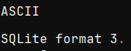

That's very clearly an SQLite magic number, but running it through any SQLite reader results in errors.

For whatever reason, the SQLite data is split apart into several large sections? So we need to manually stitch it back together, which is pretty straightforward, *then* we can access it as an SQLite database. The exact schema isn't super important, but it does contain what are called "fragments". Fragments have a type, and typically some raw binary bytes that should be read as that type.

When inspecting the binary data, one can easily find raw-text data referencing something called `$ion_symbol_table` which looks rather promising.

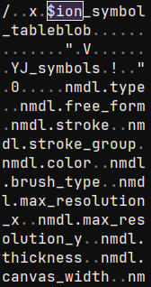

Looking up "ion amazon" reveals the [Amazon Ion data serialization format](https://amazon-ion.github.io/ion-docs/). Luckily the documentation is pretty comprehensive and they even have parsers in tons of different languages. I ended up forking the Rust parser to bypass some annoying lifetime issues.

Even with a parser, there's still a fair few more hoops to jump through. Lots of identifiers are of the form `$123` rather than anything readable. There's also some forms of compression on the data itself that need to be untangled. We'll get into those later.

## SuperNote's `.note`

Thankfully, Ratta's format is basically not obfuscated at all. We have a magic number and a version number:

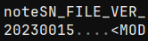

One slightly weird quirk though, we are required to immediately jump to the *end* of the file. The last 4 bytes indicate the offset of a length-prefixed footer, usually only a few dozen to a few hundred bytes back.

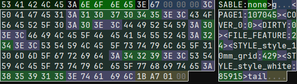

The footer is a set of textual key-value pairs, creating a sort of "table of contents" for the file.

Ironically, one of those entries is the header (called `FILE_FEATURE`, contains various config details), which points us straight back to the bytes just after the version number. Not sure why the footer couldn't have just gone up there instead, but whatever.

Each page gets an entry in the footer, and points to the page's data. The page data is another set of key-value pairs. Before we get to the stroke data though, we can take a quick pitstop in the `MAINLAYER` key, which points to more key-value pairs. Within these, there is a `LAYERBITMAP` which, as the name states, is a bitmap of the layer's contents. It's in a slighty special run-length-encoded format, but it's not too difficult to turn that into a PNG.

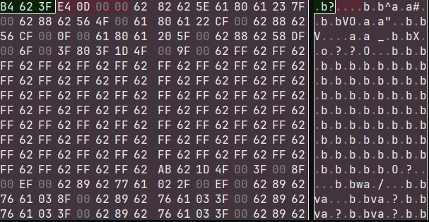

Moving on, we get to the `TOTALPATH` entry which points to the stroke data from, presumably, all layers of that page. As always, the section is length prefixed, but it's *not* filled with key-value pairs.

# Stroke data

The `TOTALPATH` section starts with a few values, then a string `straightLine`, some more data, and then the string `superNoteNote`.

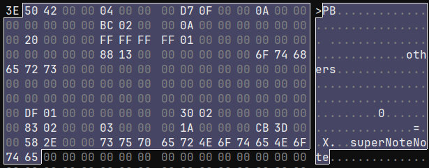

It was pretty easy to determine that the first value after the size of the `TOTALPATH` section is the size of the individual stroke. I was able to determine that the next handful of values are the pen type, the pen color, and the stroke thickness using a test notebook containing one stroke of each pen and color combination, along with several strokes of different thicknesses. After that are some values that seem lik econfiguration values? They don't change very much (or at all), stroke-to-stroke, and often notebook-to-notebook.

Some fiddling with other test notebooks reveals that `straightLine` can instead be `others`. Straight lines have a special input method, so that this seems to be a "stroke category" field.

One oddity is that, despite there being 2 different string values, there's no indication of their length. Looking at more strokes, I noticed a pattern. I believe both `others`/`straightLine` and `superNoteNote` exist in 52-byte fixed-sized buffers. This is a bit strange because, spoilers, but length-prefixed strings *do* exist later on in the stroke data.

It's also moderately wasteful. This "stroke header" data is duplicated for each stroke - on a fully hand-written page with 5mm ruled lines, there are 1962 strokes on page 1 (all of the `other` category). That means, between the two buffers, there are 90,252 bytes wasted from the `other` buffer and 76,518 bytes wasted in the `superNoteNote` buffer. That whole file is multiple pages and a total of 18.5MB, so maybe that's not a whole lot in the grand scheme of things, but unfortunately wasted space will become a bit of a pattern.

It's worth noting at this point that, while the SuperNote uses a 64bit mixed-endian CPU (Arm Cortex-A55), the size fields for each section and all non-string pointers have been 32 bit, little-endian integers, so we'll assume all values have that shape until we can prove otherwise.

Two numbers that jumped out at me immediately were inbetween the `straightLine` and `superNoteNote` fields: 110 and 109.

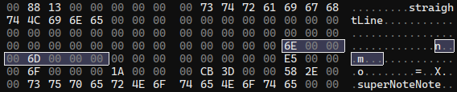

I drew this line horizontally using the 10mm grid template, starting at the intersection in the top left corner. The pixel resolution of the SuperNote Nomad is 1404x1872 (exactly 3:4, this will come up later). This template has 12 boxes horizontally. 1404/12 = 117, which is close enough for margin of error. The boxes are square, so we can assume 110 and 109 are pixel coordinates. I drew the line along the grid-lines to the next intersection. Sure enough, the next set of values are 229 and 111.

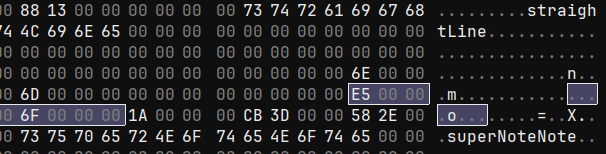

This isn't the stroke data though. Inspecting some `others` strokes, it appears this is a bounding-box for the stroke. The two dead bytes in the middle, for non-1D bounding boxes, seem to be populated with the midpoint of the bounding box.

After `superNoteNote`, there is some more data, and then what is very clearly a bunch of data with a regular struture to it. Here is the data from another notebook with more points per stroke to make it more clear how regularly-structured the data is:

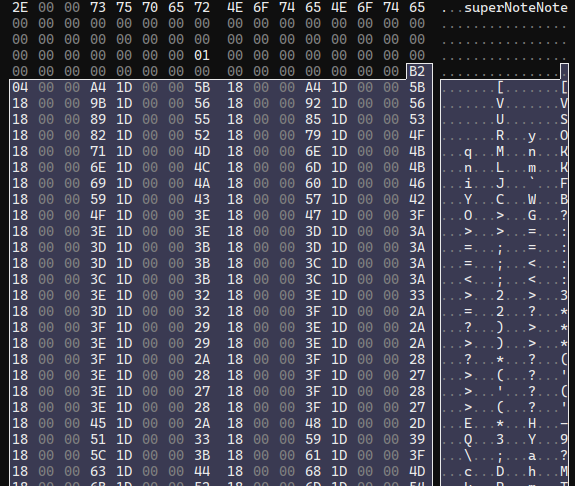

These numbers are fairly uniform and don't change much from line to line. That suggests that these are our stroke points. The first number is a bit suspicious though, since it doesn't follow the pattern of the rest and isn't particularly close in value. That value as a `u32` is 1202. In the notebook with the straight line, it's 2. Selecting data until the pattern of regular numbers stops gives us a length of 9616 bytes. 9616 / 1202 = 8, so we have a sized array of of 8-byte values. Or, more than likely, a bunch of `struct Point { i32, i32 }`

Looking back at the point data for our straight line, we know the starting position is (roughly) x: 110, y: 110. However, the first point stored is `(930, 10925)`. Those are most certainly not the pixel coordinates we expect.

One interesting thing I learned while working on the Scribe format is that there are multiple different coordinate spaces. There are the pixel coordinates *and* a separate, much larger grid (in the order of 10x larger). When outputting SVGs for scribe notebooks, the point data uses the larger grid's coordinate system, then the final SVG element is scaled down to the Scribe's purported pixel resolution.

## "Canvas" Coordinates

I had a bit of a suspicion with some values we saw above, right before the `superNoteNote` text: `15819`, and `11864`. These numbers aren't a perfect 3:4 ratio like the pixel resolution, though it's close (~0.7499841962). The pixel resolution also isn't a perfect divisor for these values, nor are the horizontal and vertical scales exactly equal, though they are *very* close:

`1872/15819 ≈ 0.1183387066`
`1404/11864 ≈ 0.1183412003`

With a difference that small, I do suspect these are some sort of scaling factor. With that hypothesis in mind, I made another test notebook where I drew long strokes directly along each edge of the screen. Inspecting these points revealed maximum values of `15819` vertically which is spot on, and `11856` horizontally which is 8 short? I checked the minimum values and they were `0` vertically and... `-8` horizontally. Weird, but that does mean `(15819, 11864)` *is* the total range of values.

I had another hunch, so I checked the tech specs for the Nomad. The diagonal size of the screen is listed as 7.8 inches. Converting that to Width:Height, we have 4.7 inches by 6.2 inches. Converting that to metric, it's 11.9cm by 15.8cm.

11.9, 11864.

15.8, 15819.

Aha!

So it would seem this second coordinate grid is the phyiscal size of the screen measured in 10 micrometer increments. I know absolutely nothing about touch screens or eink screens or whatever, but I would assume these correspond to the raw values used by the screen itself (i.e. its touch-resolution). Very cool.

Using this information, we can easily convert back and forth between the pixel grids. There are 2 important caveats though. The first is that these points are stored `(y, x)`, not `(x, y)`. The second is that `(0, 0)` appears to be at the top *right* of the screen. That means when translating x coordinates, you need to subtract the coordinate from `11864` before applying the conversion factor.

One thing stands out to me though: this storage format seems *really* wasteful. `15819` and `11864` both fall well within the bounds of even a signed 16 bit integer. Half of the bytes in these points are completely wasted. Even for the Nomad's big brother, the Manta, whose screen size screen size is 21.7cm by 16.3cm, all coordinates would still easily fall within `(32767, 32767)`.

## Scribe's Coordinates

A free 50% compression ratio on point data just by changing 1 data type would be pretty nice, but what if we could go further? Amazon's Ion format uses variable-length integers, so only the bytes that are needed are included. That helps with things like array length, offset pointers, etc. but it would be identical to using `i16` values for every coordinate outside of `(255, 255)`.

Instead, Amazon stores the x and y values in 2 separate arrays. Also, they don't store the position directly. Instead, they use a 4-bit instruction interpreter to store the *acceleration of the pen at each step*. It feels overengineered for a notebook file format, but I kindof love it.

The interpreter is pretty straight forward. You are given a list of instructions, and a list of data. The instructions are nibbles (4 bits), with 2 bits being the opcode and 2 bits being the operand. The loop looks as follows:

```rust
...
// size: usize - total number of instructions
// bytes: &[u8] - instructions from [0..size], data
// from [size..bytes.len()]
// data: &[u8] - a "storage" section that hold
// any values that don't fit within the
// instruction nibble. Split from bytes for convenience.
let mut pos = 0;
let mut vel = 0;
let mut incr = 0;
let mut first = true;

for (i, b) in bytes.into_iter().enumerate() {
    for op in [b >> 4, b & 0b1111] {
        // if the instructions end on an odd byte
        if i > size {
            break;
        }

        let n = op & 0b0011;

        match op & 0b0100 {
            0 => match n {
                0 => accel = 0,
                1 => accel = data.get_u8() as i32,
                2 => accel = data.get_u16_le() as i32,
                _ => unreachable!(),
            }
            _ => accel = n as i32;
        }

        if op & 0b1000 == 0 {
            accel = -accel;
        }

        if first {
            value = accel;
            first = false;
        } else {
            vel += accel;
            pos += change;
        }
    }
}
```

To sum it up, the high order bit indicates the sign. If the next bit is a 1, the lowest 2 bits are treated as the acceleration. If it's 0, the lower 2 bits determine whether the acceleration is 0, or whether it should be an 8 or 16 bit value read from the `data` section. Note that the initial instruction's value is the offset into a bounding box, not an acceleration.

The advantage of this in terms of size is pretty clear: a relative offset is almost always going to be drastically smaller than an absolute offset. Additionally, the maximum X and Y coordinate values are always going to be higher than the velocity, which will always be higher than the acceleration.

What's most important though is the *average* values. I ran a quick check over one of my notebook files - several pages of thoughts about game design, written on 5mm ruled lines. This notebook had a total of 380,291 points. Here were the results:

| val          | min | max   | bits for max | avg val (rounded) | bits for avg |
| ------------ | --- | ----- | -------- | ------------- | -------- |
| x pos        | 715 | 11479 | 14       | 6219          | 13       |
| y pos        | 840 | 15282 | 14       | 7675          | 13       |
| velocity     | 0   | 103   | 7        | 6             | 3        |
| acceleration | 0   | 49    | 6        | 2             | 2        |

As we can see, there are modest gains to be made in how many bits are required to store the maximum value. The real win is being able to store the *average* acceleration values in just 2 bits. That means, using the Amazon's interpreter, the majority of instructions + operands can fit entirely in 1 nibble. In the perfect case, that would reduce the coordinate data in one of my files from just over 3mb to 380kb, which is pretty significant for an 11mb file.

Very cool.

This does come at the cost of taking longer to decode, but the space savings is substantial enough to make the tradeoff compelling.

## Back to the SuperNote

Just after the stroke points comes another length. It's the same length as the points array length, so what we have is likely a modifier for the point data. Some further inspection revealed an element size of 4 bytes. When taking a closer look at the values, I noticed they changed somewhat gradually, but do fluctuate both up and down. There's also a moderately large range between the lowest and highest value.

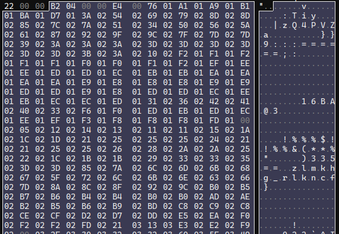

Crucially, the highest value was never higher than 4096. I'd searched for aftermarket EMR pens to replace the Scribe's included pen before (what I wouldn't give for a metal-bodied retractable pen with a side button), so I was aware that almost all EMR pens specifically advertise "4096 pen pressures". To test the pen pressures, I created a sample notebook with 1 stroke that started soft, gradually became firm, and then tapered off to soft again. This array's values rose and fell exactly as you'd expect.

Next is another sized array, this one with somewhat patterned data, 4 bytes in size.

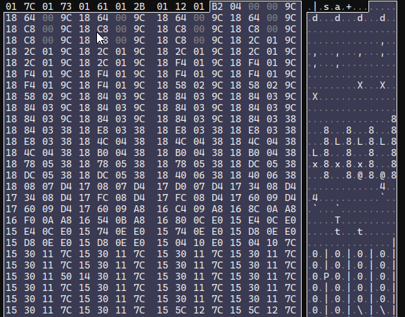

Judging by the patterns in the first and second half of these values, they appear to be 2 16-bit values rather than 1 32-bit value. They maybe look like coordinates, but it's weird they're 16-bit when the prior set was 32-bit. The only major piece of stroke data that the Scribe has that we're still missing is the pen tilt, so I figured I'd give that a shot. If these points are actually vectors, we can toss them through the trusty `atan2` function and normalize them to get an ouput.

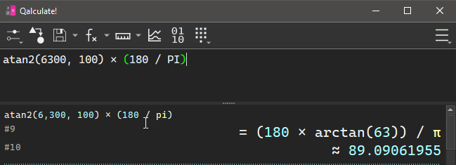

Now, is 89 degrees a reasonable angle to hold a pen? I'm a lefty, so when I hold a pen, the crook of my thumb has the pen facing towards the bottom of the device, slightly tilted to the left. Accounting for the upside-down, mirrored coordinate grid, we'd expect 90 degrees to be straight down.

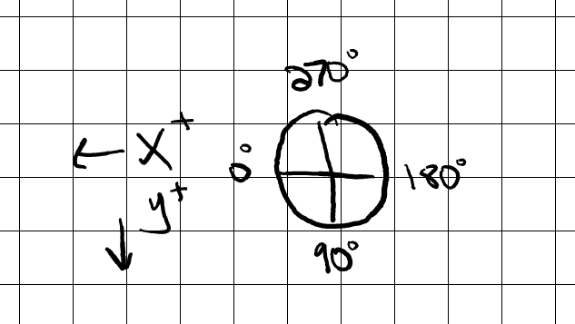

Sounds about right.

Just as an extra test, I made a document where I started with the pen tilted towards the top of the device, then did a full clockwise rotation of the pen in a single stroke. We'd expect it to start at 270 degrees, moving towards 0, then wrapping around and ending up back at ~270 degrees. This is the result:

<blockquote class="imgur-embed-pub" lang="en" data-id="a/K7W3y2C" data-context="false" ><a href="//imgur.com/a/K7W3y2C"></a></blockquote><script async src="//s.imgur.com/min/embed.js" charset="utf-8"></script>

Perfect! Next there's another sized array, this one is a bunch of `u8`'s, all with the value `0x01`.

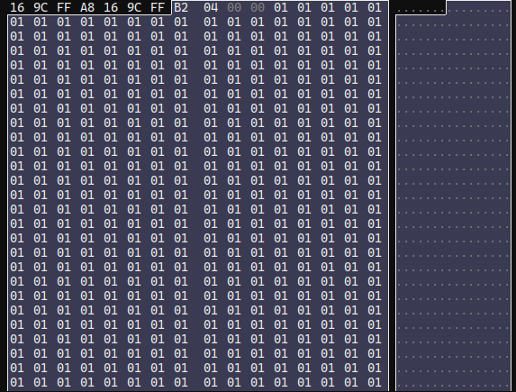

Weird. My best guess is this is some sort of flag for each point? Maybe whether a point is erased or not? Regardless, it's very inefficiently stored. Especially since I've literally never seen a value other than `0x01`, even in dirty notebooks.

After this, things get a bit complicated. I could figure out some patterns that would work, but when I tried them on other files, they wouldn't match. They'd either catch too many bytes or too few. The only things I was able to discern were that there's a stroke UID number, and an array of what appear to be screen-space points. There is also a listing of the pixel resolution (1404x1872) and what appear to be some other numbers that are probably constants?

No amount of fiddling was giving me much progress at this point, so I figured I'd take slightly more drastic measures to sate my curiosity.

## Reverse Engineering

Ratta has desktop and mobile Partner apps that allow you to sync your notebooks via the cloud, then access them and export them on other devices. I had a sneaking suspicion that the partner app was reading the raw notebook file (rather than a pre-exported PNG or PDF), as it allows you to export in multiple different formats at multiple different resolutions:

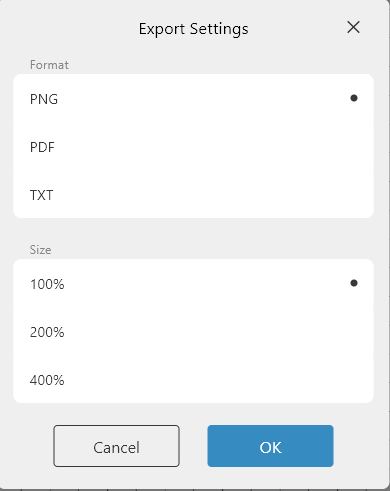

Slapping it in Ghidra, I checked the exe itself but had no luck. `plugin_note_plugin.dll` looks to be the entry-point for their upcoming plugin interface, but didn't contain anything useful. `note_common_lib_plugin.dll` was similarly unhelpful. I wasn't sure where else to look, so I tossed it into [AMD μProf](https://www.amd.com/en/developer/uprof.html), which is equivalent to Intel's vtune. It's a very capable profiling app I've used on several other occasions, mostly because it's one of the few profilers that works on Windows.

My basic thought process was that I could get some sort of metric of where the time was spent when I loaded up a notebook, and that would at least put me in the ballpark. I started the profiler, opened a notebook, and then flipped back and forth between pages of a notebook a few dozen times.

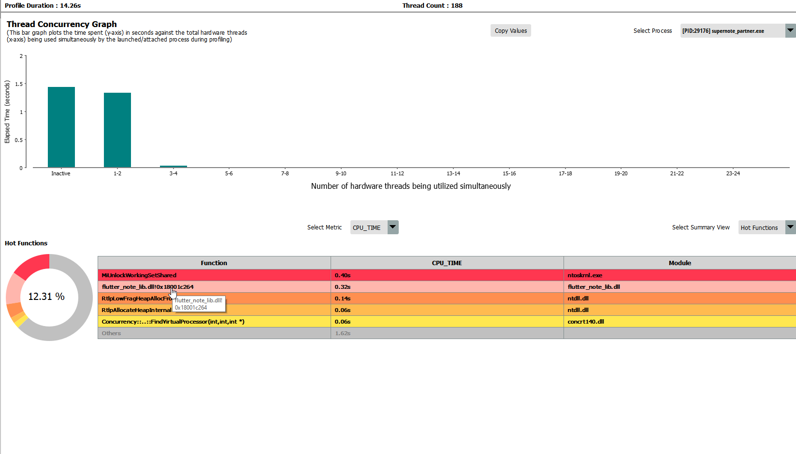

Looking at the profiling data, it placed most of the work in `flutter_note_lib.dll`. I let Ghidra disassemble that, and there was still some class information in the binary. One class, `TrailContainer`, seemed pretty promising from the name alone. The constructor didn't have too many answers though, and there weren't references to many other methods.

While scrolling around the disassembly, I noticed a lot of error logging functions, and they'd typically have raw strings with a simple 1-2 word message indicating what failed. I threw `"TOTALPATH"` into the string search just in case, and it turned up some results!

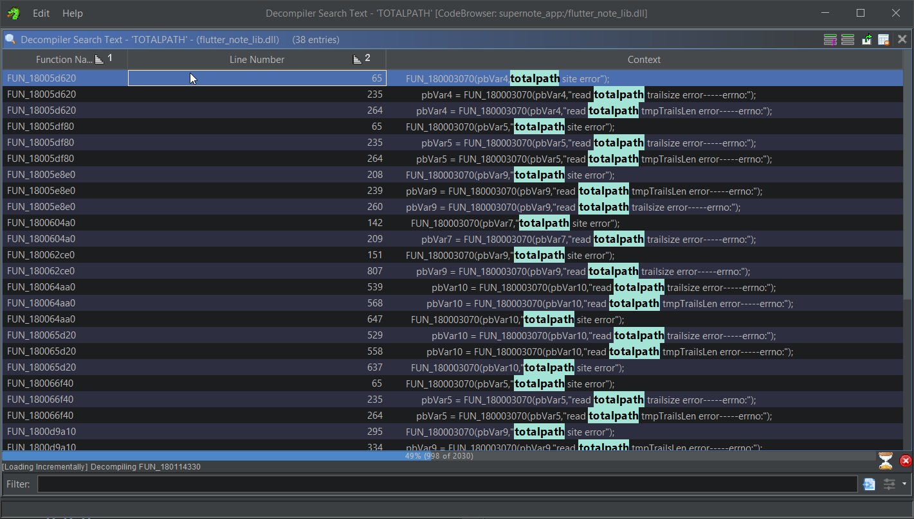

> [!Note]
> One other set of symbols that appeared frequently when profiling and debugging was `tokio`. Flutter is a Dart UI framework, and many of the files referenced via error messages in the disassembly are `.cpp` and `.h` files, but the use of `tokio` suggests that the Rust is also a core part of their development stack. Neat!

Scrolling around those results, I saw references to the `TrailContainer` constructor, as well as some strings that mentioned something called `data2Trail`. There seemed to be a few different execution paths, maybe for some kind of versioned or templated function? I'm not sure. To cut through the noise, I attached a debugger, set a breakpoint in the `TrailContainer` constructor, and opened a notebook file. Stepping out of the constructor lead to a function at offset `0x18005e8e0` in the binary. This function, in a loop, calls the `TrailContainer` constructor, passes it to a function, and then errors out (referencing `data2Trail`) if the return value from the function isn't 0.

```c
...
do {
// reference to stack location of `this`
TrailContainer::TrailContainer(&local_388);
local_994 = 0;
sVar10 = fread(&local_994,4,1,local_980);
// error handling
local_958 = malloc((longlong)(local_994 + 1));
... // error handling
memset(local_958,0,(longlong)(local_994 + 1));
sVar10 = fread(local_958,(longlong)local_994,1,local_980);
... // error handling
// last arg is a reference to the trail container
uVar22 = probably_data2Trail(local_958,local_994,&local_388);
if ((int)uVar22 != 0) {
    pLVar8 = (LogMessage *)
            google::LogMessage::LogMessage
                        (local_7b8,
                        "D:\\FlutterProjects\\supernote_partner\\windows\\flutter\\ephemeral\\ .plugin_symlinks\\flutter_note_lib\\src\\SnProcess\\SnFileProcess\\snd atafile.cpp"
                        ,0x9e5,2);
    pbVar9 = google::LogMessage::stream(pLVar8);
    FUN_180003070(pbVar9,"data2Trail error"); // 👀
    google::LogMessage::~LogMessage(local_7b8);
...
```

Inspecting `probably_data2Trail` (which I renamed from ghidra's default `FUN_<location>`), I was greeted with quite a long function. A cursory glance showed that I was correct with my analysis above:

```c
pbVar18 = google::LogMessage::stream(pLVar17);
FUN_180003070(pbVar18,"m_points");
google::LogMessage::~LogMessage(local_168);
...
FUN_180003070(pbVar18,"pressures");
...
FUN_180003070(pbVar18,"angles");
...
FUN_180003070(pbVar18,"flagDraw");
```

Additionally, I found some hints about the end section that I had trouble parsing:

```c
FUN_180003070(pbVar18,"epaPoints");
...
FUN_180003070(pbVar18,"epaGrays");
...
FUN_180003070(pbVar18,"m_controlNums");
...
FUN_180003070(pbVar18,"renderFlag empty");
...
FUN_180003070(pbVar18,"PointContour");
...
FUN_180003070(pbVar18,"m_MarkPenDFillDir");
```

I'm not exactly sure what those mean, but at least I know approximately what code processes them.

There was also potentially more info to be gleaned from that parts I *could* parse, but didn't understand the purpose of. So I began the (somewhat) grueling process of stepping through the assembly in [x64dbg](https://x64dbg.com/), taking note of the register values, the values in memory, the `TrailContainer` struct, and the notebook file's raw bytes. I would cross-reference that with Ghidra's disassembly, making sense of what I could and labelling what I already knew, then I would apply those file offsets to the ImHex pattern file to make things easier to visualize.

>[!Note]
> I'd have pereferred to used Ghidra's debugger, but I didn't have great luck with LLDB. I tried their built-in debug engine, but it choked to death on all the info it had to process. Waiting upwards of a 30 seconds to step through 1 assembly instruction was pretty painful. I think it's trying to save snapshots of every single thread at every step? I looked for a way to turn that off or tone it down, but couldn't find anything. x64dbg is very performant and served my needs well enough, I just wish I could have integrated it with Ghidra's disassembly more easily.

My first pass ensured I was handling all of the statically-sized elements correctly, and gave names to a few fields I had been unsure of. My second pass handled a lot of the dynamically sized arrays. One funny note is that I was able to recognize the C++ `Vector<T>` implementation even though I don't often program in C++. I saw a function that looked vaguely like a typical `Vec::resize`, and I had briefly viewed the [MSVC `Vector<T>` internals when looking at how the LLDB debugger visualizers](https://github.com/llvm/llvm-project/blob/main/lldb/source/Plugins/Language/CPlusPlus/MsvcStlVector.cpp) worked. Guess all that time I spent mucking around in LLDB helped more than I thought!

>[!Note]
> Rust's `Vec<T>` implementation is pretty much `struct Vec<T> { buf: *mut u8, len: usize, capacity: usize }`, which is very easy to recognize. C++'s looks more like an iterator; it stores a pointer to the first element, a pointer 1 past the last element (i.e. `last - start = len`) and a pointer to 1 past the end of the allocation (i.e. `end - start = capacity`). Filling these details improved Ghidra's disassembly a **lot**.

I needed a third pass with a specially made test notebook to handle the footer section that was giving me so much trouble. Here's the disassembly of that section being processed:

```c
if (loop_count != 0) {
    lVar25 = (longlong)iVar30;
    local_188 = (uint8_t *)(longlong)loop_count;
    local_1d8 = 0;
    do { // outter loop
    ... // error handling

    fVar3 = *(float *)(stroke_data + lVar25);
    local_1b8.y = fVar3;
    scratch_var_len = local_1b8;
    iVar30 += 4;
    lVar25 += 4;
    local_1b0.y = 0.0;
    local_1b0.x = 0.0;
    puStack_1a8.y = 0.0;
    puStack_1a8.x = 0.0;
    local_1a0 = NULL;
    if (local_1b8 != (Pointf)0x0) {
        if (0x1fffffffffffffff < (ulonglong)local_1b8) {
        FUN_18000ab50();
        }
        data_len_u64 = (longlong)local_1b8 * 8;
        PVar16 = puVar36;
        if (data_len_u64 != 0) {
        if (data_len_u64 < 0x1000) {
            PVar16 = (Pointf)operator_new(data_len_u64);
        }
        else {
            if (data_len_u64 + 0x27 <= data_len_u64) {
            FUN_18000a870();
            }
            pvVar21 = operator_new(data_len_u64 + 0x27);
            if (pvVar21 == NULL) goto LAB_18002354d;
            PVar16 = (Pointf)((longlong)pvVar21 + 0x27U & 0xffffffffffffffe0);
            *(void **)((longlong)PVar16 + -8) = pvVar21;
        }
        }
        local_1a0 = (undefined8 *)((longlong)PVar16 + (longlong)scratch_var_len * 8);
        puStack_1a8 = PVar16;
        for (puVar35 = scratch_var_len; local_1b0 = PVar16, puVar35 != (Pointf)0x0;
            puVar35 = (Pointf)((longlong)puVar35 + -1)) {
        *(undefined8 *)puStack_1a8 = 0;
        puStack_1a8 = (Pointf)((longlong)puStack_1a8 + 8);
        }
    }
    PVar16 = local_1b0;
    if (scratch_var_len != (Pointf)0x0) {
        iVar30 += (int)fVar3 * 8;
        puVar35 = puVar36;
        do { // inner loop
        lVar7 = *(longlong *)(stroke_data + lVar25);
        lVar25 += 8;
        local_198._0_4_ = (float)lVar7;
        ((Pointf *)((longlong)local_1b0 + (longlong)puVar35 * 8))->y = (float)local_198;
        local_198._4_4_ = (float)((ulonglong)lVar7 >> 0x20);
        ((float *)((longlong)local_1b0 + 4))[(longlong)puVar35 * 2] = local_198._4_4_;
        puVar35 = (Pointf)((longlong)puVar35 + 1);
        local_198 = lVar7;
        } while ((ulonglong)puVar35 < (ulonglong)scratch_var_len);
    }
    ppuVar23 = (Pointf *)
                ((longlong)&((l_container->contour_points_vec).start)->start + local_1d8);
    if (ppuVar23 != &local_1b0) {
        FUN_180004b90(ppuVar23,(Pointf *)local_1b0,
                    (longlong)puStack_1a8 - (longlong)local_1b0 >> 3);
    }
    if (PVar16 != (Pointf)0x0) {
        scratch_var_len = PVar16;
        if ((0xfff < (ulonglong)(((longlong)local_1a0 - (longlong)PVar16 >> 3) * 8)) &&
            (scratch_var_len = *(Pointf *)((longlong)PVar16 + -8),
            0x1f < ((longlong)PVar16 - (longlong)scratch_var_len) - 8U)) goto LAB_18002354d;
        free((void *)scratch_var_len);
    }
    local_1c8 = local_1c8 + 1;
    local_1d8 += 0x18;
    container = l_container;
    } while (local_1c8 < local_188);
}
```

Is that a set of nested loops I see? Well no wonder! Turns out it was a sized array of sized arrays. With that change, my ImHex pattern file seems to be able to parse any notebook I can throw at it. This nested loop in particular mentions the name `PointContours`, and plotting the points reveals exactly what you'd expect.

>[!Note]
> I copy-pasted the raw points into desmos for these graphs, though my program normalized the X values. Since desmos has (0,0) in the bottom left, the contour graphs are mirrored vertically, but not horizontally.

|Rendered|pointContours|
|---|---|
|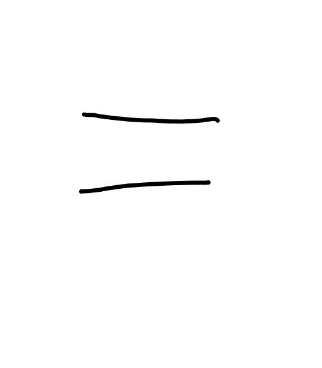 | 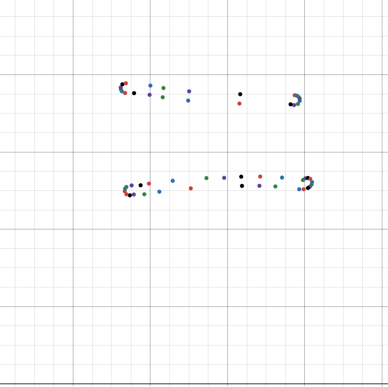 |

Interestingly, *significantly* more contour points are added if you erase part of the line.

|Rendered|pointContours|
|---|---|
|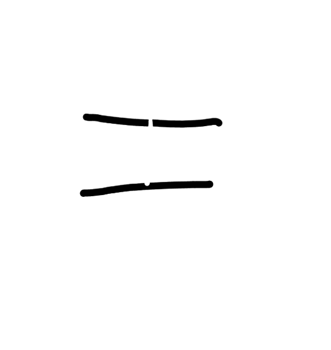 | 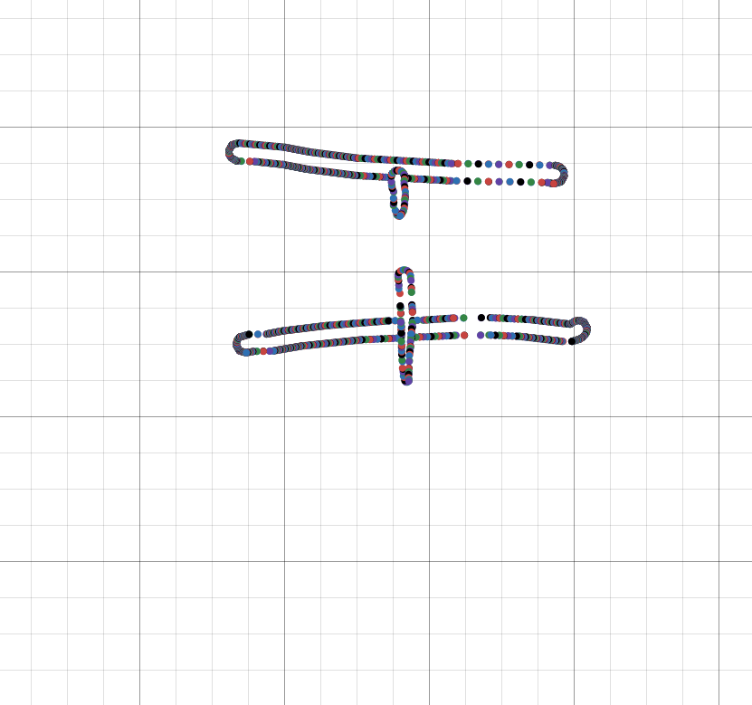 |

A lot of the values after this seem to be config values, as well as several sized strings (two of which (almost?) always say "none", the third of which is (almost?) always empty).

I'm still in the process of discovering what all the little miscellaneous tidbits do, but it's a slow and imprecise process. For example, it's not always easy to tell when something is a pad byte vs "unreferenced but does have meaning".

I also haven't put much effort into inspecting "dirty" (i.e. currently being edited) notebook files, though they are absolutely accessible. They tend to contain things like orphaned strokes that have been erased (probably for the `undo` feature).

There are some advanced features too, like the title/header/link modifiers, text elements, and copy-pasting. I'm certain a fair number of the values I've labelled `unk` are used for those.

What I've discovered so far is more than enough to read the raw strokes and output an SVG equivalent though. Here are some notes I wrote during the investigation process:

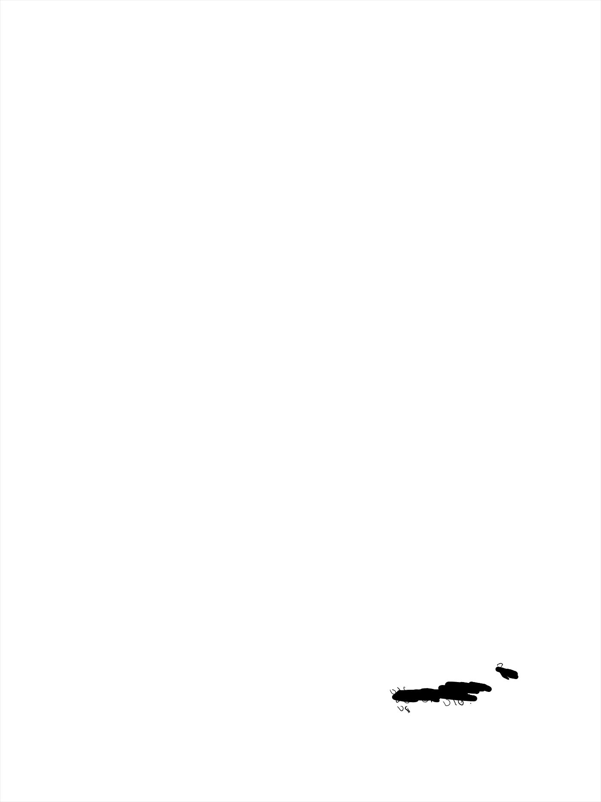

I haven't gotten the thickness calculation perfect, but it does look fairly accurate. It also probably doesn't handle layers properly, nor highlighter strokes, but for now it's good enough.

SVG probably isn't the best format for this sort of thing when using a pressure-aware pen type, but I prefer embedding SVG's in the blog since I can output css classes and restyle them. The frequent `stroke-width` changes mean that a ton of space is wasted just declaring separate `path` elements. The SVG file above is ~900kb. The text `<path d=` along with the quotation marks and the closing `/>` accounts for just about 200kb. The file size was worse before I switched from absolute to relative path instructions. I'd kill for a more succinct vector graphics format that's supported in the browser natively, but it is what it is.

I also played around with using `PointContours` to generate polylines with fills, but that came with a handful of other issues that I didn't want to solve. It'd certainly be more space efficient, and I'd guess that's what their library does internally most of the time, but that's a project for another day.

### Eraser

The Scribe's eraser works by straight up deleting points (and then adjusting one stroke into multiple where necessary). This is fast and efficient, but it also means there's very low granualirty when it comes to erasing. That contour points example above with the partially erased line isn't possible on the Scribe.

Despite only erasing the bottom portion of this line, because it deletes a while circle, you can see this "venn-diagram" pattern left behind:

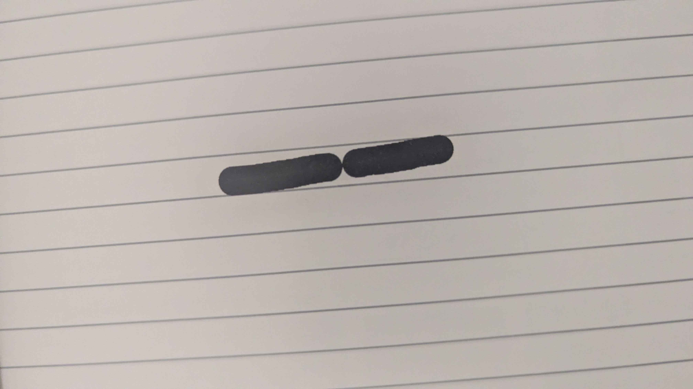

In any case, the Scribe doesn't store eraser strokes because there's nothing to store.

In contrast, the SuperNote's "eraser" is just the standard pressure-sensitive pen, but with a special color (`255`, rather than the white-ink's `254`). It then uses the eraser's stroke as a mask.

There seem to be heuristics to delete stokes that are entirely masked out by an eraser (and to delete the eraser stroke too), which is great, but it is only a heuristic. It can lead to situations where only a handful of points aren't erased, so you have an imperceptible dot that contains a ton of data between itself and the eraser points. Eraser strokes especially tend to be quite long since I, and probably others, use a back-and-forth erasing motion as if it's a pencil.

Eraser strokes aren't the only erasing option though, so it's not a huge problem. I definitely prefer this eraser behavior over the Scribe's.

# Thoughts and Speculation

I'm not a reverse engineering expert by any means - I'm hardly even a beginner - and I didn't look through the application *too* much further, but a couple things stand out.

I suspect that the underlying notebook processing code in `flutter_note_lib.dll` is identical to that used on the device. Not only is the `TrailContainer` class pretty close to a 1:1 mapping of stroke data in the file, the class also seems to have facilities for editing-based features (e.g. removing unreferenced strokes). Flutter being a multiplatform - mobile especially - UI also somewhat supports this.

While the format itself is fairly inefficient, size-wise, I'd guess the higher priority was placed on how fast the data could be read and written. That sort of thing is especially important for mobile eink devices, where battery life is a huge selling point. On the other hand, due to using an `i32` for "addressing", notebooks have a 2gb size limit (that users do end up hitting). Making some small changes, like using 16-bit values to store coordinates, would have a direct impact on the user experience. I'd have to imagine at least a small gain when reading the data from a file as well, since you're reading significantly less of it.

Alternatively, they could use a variable-sized (or 64-bit) integer for addresses and lengths to eliminate the problem entirely. I guess that also assumes that the RAM capacity isn't the bottleneck, but there have been ways of manipulating larger-than-memory data for a long time.

With how close the `TrailContainer` (read: in-memory representation) is to the stored representation, I also wonder if they are just serializing large parts (or all) of the struct when they don't have to. I'm almost certain there's information the `TrailContainer` that is only used when actively processing strokes, and that the data is either static, useless, or both when stored in the `.note` file. Certainly some of the config values like the page resolution don't need to be repeated for every single stroke. Being more selective about what is stored, or maybe some sort of central dictionary where this information could be retrieved would save a ton of space.

All in all, this was a pretty fun investigation. Digging around in obscure file formats was [one of the first things I did](https://github.com/Walnut356/SlippiStats) when learning to program. I find all the little decisions, tradeoffs, and optimizations really interesting. I enjoy reverse engineering, it's very time consuming and the tools are pretty obtuse, but I see it as a fun puzzle more than anything. My dad used to talk about pulling apart old radios and clocks to see how they worked when he was a kid, I guess the apple didn't fall too far from the tree.