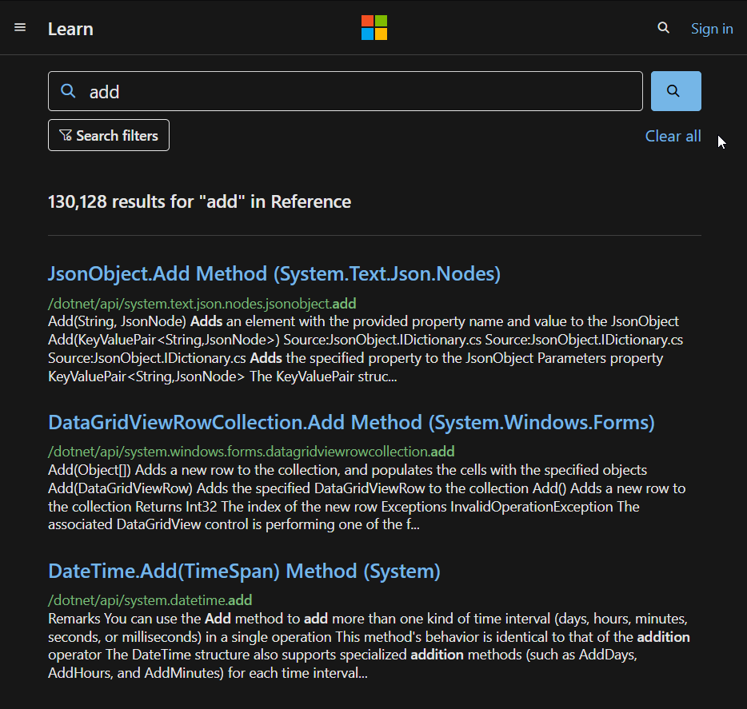

+++
title = "Why is language documentation still so terrible?"
date = 2024-09-12
description = ""
[taxonomies]
tags=["programming"]
+++

Seriously, is there a good reason for this? I feel like I'm going crazy because almost every language doc I've looked at is legitimately awful in a bunch of obvious ways. It's not uncommon to see third party libraries updated by a single person that are better structured, more thorough, with better layouts than the official documentation upheld by the language team itself.

<!--more-->

I can feel the rant calling to me like the green goblin mask, but to keep things snappy before I get into that, let me put some guidelines here. If your language docs do not have the following features, you should *very seriously* consider rewriting them:

* A canonical language documentation written for real human beings (really wish I didn't have to include this)
* Docs themselves should be versioned, so you do not have to sift through information that doesn't apply to the version you care about
* A reference section that contains the language specification (syntax, operator precedence, keywords, etc.)
* An individual page for each standard library class or built in type
  * Class and method descriptions should answer at least the first 2, but preferably all 3 of the following questions: **What does this do (effect)? How does it do it (internal implementation)? Why would I want it to (use-case, comparison to similar methods, etc.)?**
    * Link directly to the source code of the internal implementation. If your language implementation is closed-source, shame on you.
  * That page must be as uncluttered as possible
  * That page must *contain* (not link to) every method, and the descriptions of those methods, that can be called by that class, preferably including all inherited functions.
    * Most methods should have at least 1 example
    * There should be a sidebar or equivalent that contains all the method names *in alphabetical order* for easy searching and jumping
  * Code examples should be at least lightly syntax highlighted
  * examples, descriptions, and function signatures should link internally as much as possible
  * non-cryptic names, or at least like... tell me what your [8 byte contraction](https://stackoverflow.com/questions/7448262/why-are-c-names-shortened) expands to
* Preferably on a publicly accessible website, styled in a way that doesn't make my eyes bleed (dark mode option), and that responds appropriately to *at least* both full screen (16:9) and half screen (8:9) sizes
* A search function that isn't just [lmgtfy](https://letmegooglethat.com/?q=lmgtfy)?????? Are we for real???

Okay clearly I can't hold back the rant any more. Read at your own peril.

Seriously, cppreference straight up taking you to duckduckgo when using the search box is *fucked*. I cannot believe it still works like that. *The blog you are currently reading* has [client-side search](https://walnut356.github.io/search/) and I'm just some guy. That's not to imply that I wrote the search functionality myself, rather that if I can find out it exists and slot it into my site, they should be able to as well.

# Just Copy Rust

Please god.

I don't care how much you despise the language or refuse to learn it, you have to admit that Rust has put a *lot* of effort into the developer experience. It is the only language I've tried whose whole ecosystem feels modern and like it respects my time. Almost every other language has [configuration hell](https://cmake.org/), or [shitty package managers](https://pypi.org/project/pip/) (or NO package managers), or [slow/barely functional/confusing IDE plugins](https://old.reddit.com/r/vscode/comments/1856p4b/which_c_extension_should_i_choose_cc_or_clangd/), or non-existent onboarding, or... Look, I've got a **lot** of opinions on this. I'll try to stay on topic though.

Just look at this:

Oh man, that looks pretty good. Look at the tasteful, left-aligned, width-bounded main text. Look the tactful use of vertical whitespace. Look at the distinct headers and comfortable text size. Look at the visually-distinct sidebar that never distracts from the main body text. Look at the font-colors chosen with such *intention* - high-contrast, near-white for plain text, low-contrast grey for the less-important "stable since" version number, vivid orange for the links, with a darker background for code-links. There's even a nice highlight when linking directly to a [section of a page](https://doc.rust-lang.org/std/index.html#contributing-changes-to-the-documentation)

I'm not much of a front-end guy; maybe this isn't that impressive. After the horrors I've seen, it looks like art.

But does it also *resize properly*? In 2024? You bet your ass it does.

"Okay but I don't like the color-scheme" you might say, "It's not offensive, but it's a little dark/bright for me"

Don't worry, there's a whole-ass *options menu* with BOTH a lighter AND darker theme than the default

Look at how many links there are just in the description of the standard library alone. There's also hidden, bonus links. Clicking the logo in the top right corner will bring you back to this root page from anywhere in the docs. Lets click the link on `Vec<T>` and check it out:

It gets even better when looking at the methods themselves

Look at the level of *detail*. Everything in the rust docs looks like this, and I hardly ever come away with questions. And even if I did, the eagle-eyed among you may have noticed that "Source" button in the top right corner. Clicking on that brings us to this page:

Is that... is that the *source code of `.drain`, directly linked from the docs and available offline*? Even if the docs aren't specific enough about how things work internally, I can just go *look* at how they work internally with a single click? Absolutely incredible. My only complaint is that this is the one section of the docs that does not handle half-width correctly.

Anyway, lets talk about search. I'm sure you saw the box up there. Before we take that baby for a spin, I'd like to point out that it's not just "search", it's search *with convenience features:*

Holy *fuck*.

Lets try a search:

* Just Works™
* Filter by crate
* Search results by name, by functions that have an argument of that type, and by functions that return that type
* **DOESN'T REDIRECT YOU TO DUCKDUCKGO**

To sum up: rust docs are very close to perfect.

Want to know the kicker? Every single library uploaded to rust's package manager has *one of these websites auto-generated for it, containing all the doc comments from the library*.

There's even an *extra dropdown menu for crate metadata and access to older versions of the documentation*

*This* is what I mean when I say rust feels like modern programming. Things you usually don't care about are unobtrusive, have low-contrast colors, or are otherwise hidden away. Things you do care about are obvious, convenient, descriptive, easy to read, and customizable. None of this should be groundbreaking.

It is not impossible to have docs that I enjoy reading. Unfortunately, the industry standard seems to be somewhere between "outright offensive" and "a handful of glaring flaws".

# Hall of Shame

This isn't meant to be exhaustive. It consists of languages that I've used, as well as Java and Go as a "control group". For what it's worth, I also spent some time poking around the docs for Zig, Odin, PHP, OCaml, and Ruby and found similar issues with all of them.

## Python

Python does not have individual pages for its built in types, thus looking for the float documentation does not lead to the python docs when google searching it:

Unless you scroll down, which provides a link to inherent floating point limitations, and the CPython internal representation of floats. Neither of which tell you what methods you can call on a float.

Contrast this with rust:

First 3 links are official documentation, one for each bit-width of float, and another to the rust onboarding book that describes rust's built in data-types more informally. Python *does* have an [equivalent *section* of a page](https://docs.python.org/3/library/stdtypes.html#numeric-types-int-float-complex), but it doesn't show up when you search for "python float", as it lumps `int`, `float`, and `complex` together which turns the SEO into SE-No (sorry). Also the links to `int`, `float` and `complex` on that page don't link on to the class documentation, they link to the built in type-casting functions. Why.

Most of the documentation is layed out like this, and it makes it excruciating to find anything. You constantly need to be thinking "what other related things could this be grouped with" rather than just looking for what you want. It doesn't end up degrading the internal search performance too much, but the internal search has a few issues of its own. It takes entire headers and sorts those alphabetically, so it ends up with unintuitive results like this, where the shorter exact-match `dict` should really be above `ast.dict`:

Python also makes no effort to explain the internal implementation or semantics of most methods. It's sort of understandable for a language like Python, but I do remember lots of frustration and trips to CPython's source code. It also seems silly to me that the parts of CPython that are written in Python (i.e. most of the standard lib) don't link to the source code.

## C#

Hey look, a site that cannot handle both window sizes properly. The (pretty terrible) nav-pane, which I'll cover in a moment, disappears completely in half-width view. The burger menu in the top left opens up the site-wide nav-menu which is useless. The tiny little 3 dot menu in the top *right* corner opens up the nav-pane that people actually want, but only after an additional click on "Table of Contents" because why bother making it easy or convenient.

And oh boy the table of contents menu. **Ick**.

Why does it load with the module I'm in scrolled halfway off screen? Why even include other modules in the first place? It forces them to nest the menus, which makes it harder to read. If I wanted things in other modules, I would go to the other module's page (assuming it was easy to get there from a centralized location or the search feature). Also, all the expand-os for the module I'm in are minimized by default, requiring even more clicks to find what I'm looking for.

That's not all - did you notice that there's *two* search icons? One in the ToC and the other on the main page. I'm going to look up `add` because I want to know how to use the `List` method that lets me put things in the list. Here's using the main-page search:

huh... that looks suspiciously like cppreference's duckduckgo redirect, but more subtle. It's still obviously on Microsoft's page, but it *looks* like they've scraped the search results from a real search engine, pulled only the ones from their URL and then pasted them in the search results. The only thing that would make it *more* likely is if Microsoft owned and operated a search engine meant to compete with the likes of google and duckduckgo...

Also, these results are wack. They're not sorted or filtered in any discernable way, and there are no sort options. I ran this search from a page within `/dotnet/api/`, but some of the results on the first page are from `/powershell/` and `/javascript/` sections. I don't mind that they're there *at all*, but they should be further down the list, or the filters should be set to only show results from the `/dotnet/` section by default when I search from the `/dotnet/` section.

The ToC search is much *much* worse. I'm going to once again search for `add`, from the `system.collections.generic.list` page:

So I guess we're just populating partial matches before full matches? Weird. Except... hold on... I scrolled down the whole list and `List.Add` **is not on it**. Are we for real? Are we not prioritizing *content on the page that I'm already on?*

Okay, fine. Rust docs don't do that either. Lets search for `List.Add` then:

...

*sigh*

Yes, you are *required* to include the `<T>` when searching for the method. The most baffling part is that they've put in the effort to allow *anything* in place of the generic

But *you can't add a space between multiple generic parameters*

And yet *nobody* considered that an issue, or even thought "hey, maybe we should also match on things that don't have the generic too, for convenience reasons".

And don't worry, I'm *still* not done with C#. Inspecting the struct is a nightmare. Why isn't there a separate section for static and const members? Why are they lumped in with fields? What if someone forgets to mention that something is const and now people are trying to modify it and getting confused?

These short-form descriptions are usually just restating the name of the function, thus are pointless. Also, there really wasn't a better way for you to represent overloaded functions besides making them look like an entirely unique function entry?

Clicking on either of those functions even sends you to the same page **that has all the overloads on it**. Were these pages made by different people who didn't communicate with each other or look at the final product at all?

Oh yeah, one other thing about those function signatures. Did you notice that they **don't include the return type?** There isn't even a distinction between methods that return \<a value\> and methods that return nothing at all. I don't understand how this happens. Did they forget? Is something broken and nobody noticed? Why do I have to click to a new webpage and view the code snippet of the function declaration to even know what the return type is?

Anyway, even once you get to the method pages, the documentation is wildly inconsistent. Some of it is fantastic and detailed, some of it leaves you scratching your head. The official description of their own API is titled "Remarks". While that *is* hilarious, it kinda gives away how much effort they felt like putting in.

I could go on about C# for hours, but I'll leave you with one final thing:

You uh... maybe want to put that in like a table or bulleted list or grid or something? Maybe ignore the generic when sorting it? Last I checked I'm not a CSV parser. Also why is there a space *before* each comma?

## Java

Java's docs are surprisingly hard to *find* as someone who has never written any Java. Maybe I'm just dumb but searching "java api docs" puts Java *8* at the top of the list, followed by Java SE 7, and SE 19. For reference, the current up-to-date version of java is uh... let me consult the release matrix...

I burst out laughing when I saw this. It's like it was intentionally designed to be as confusing as possible. I can't decide which terrible feature is my favorite.

* Dates on both axes
* The table doesn't size itself to the window, but the blue top-banner does so there's just sad whitespace on the top if you scroll to the right
* "My favorite month is JDK 21 (bold)"
* Column named "Month", contains more than just the month. If only there was a word for a month and a year. Maybe I'll think of it at a later date.
* Vertical dividers? Nah, that's what padding is for. Wait there's no padding either?
* "Last 5 years", whose first sub-header is "Planned" (contains 2 future years)
  * Also links to an entirely separate page with an even *larger, uglier* table
* List view "button" that takes you to a page that's somehow just as bad
  * Contains a "View by Month" "button" that takes you back to the matrix page. Why isn't it called "Table View" or "Matrix View"?
  * What does "CPU" mean in this context? What does "Feature 23" mean?
  * Release types/support timeline/naming scheme at the bottom, beneath this massive list, but you don't have a table of contents so nobody's ever going to know it exists and there are no header links so if you want to show someone you have to say "yeah just keep scrolling for about 15 years it's definitely down there"

But anyway, I was able to locate a hub page with links to documents for Java SE/ME/EE. Except clicking the "documentation" links for SE, ME, and EE do *not* take you to the API docs. Each variant has a "landing page", each with completely different layouts from for some reason, and clicking on a link *there* will bring you to the API documentation. Jesus.

Anyway, once we finally get to the current docs (Java 22 I think?), it's borderline unreadable at full-width because the text is miniscule and isn't width-bounded. Great.

Hey wait, if Java SE doesn't necessarily implement all of the JDK, why doesn't the JDK have its own documentation page for *just* the JDK? Sorta like how Rust separates `core` from `std`.

It does resize properly, and demonstrates that if they'd just width-bound the page it wouldn't be quite so hard to read.

Also, when you skimmed the page did you notice that the text "file system provider" is a link? I sure didn't. Maybe it's just my monitor, but that blue-ish color with that teeny-tiny font on that bright background isn't quite distinct enough from... wait their default font color isn't even black? It's #474747. That's like a medium grey. Can we stop doing that? What is wrong with black text?

In any case, the links turn orange on hover, but who cares. This is not a 90's adventure game, I'm not pixel hunting for your links.

Syntax highlighting? Never heard of it.

Why are these nav-bar buttons sometimes not buttons? Shouldn't they just not be there if they aren't applicable, or maybe greyed out or something? Clicking on Class treats it as text, but Use is clearly a button

But hey, at least their search feature isn't insulting.

## C/C++

Maybe it's not fair to pick on cppreference since it's not "official" docs, but it's where everyone tells you to go, so oh well. Right off the bat it's pretty bad. I was not surprised in the slightest to scroll to the bottom of the page and see a MediaWiki logo.

Couple of first impressions:

* Ow my eyes
* Let me get out my microscope for this text (Those sub-headings are 9px high. *Nine*. What the fuck.)
* Is the line-height set to a negative value? Why is everything so smooshed together?
* No side-bar navigation at all
* Things are organized, but sorted in what looks like a pretty arbitrary way
* Is everything so small because you're trying to cram all of the C++ stuff within one screen-view and not show any C stuff? Why is it hanging out all the way down there like an 11th toe?

At first I thought it couldn't handle half-width properly, since it always had a horizontal scroll bar with some dead space. Turns out that's not the case. I've been writing this on my laptop, which uses the 125% scaling option through Windows because otherwise my taskbar icons are sized for amoebas. The site works fine on half-width at 100% scaling, but not at 125%. I didn't know this was something that could even be a problem.

At 100% scaling though, there is one small problem. Did you spot it?

As if the search bar wasn't cursed enough.

I wish I could move on and talk about the actual content of the pages, but unfortunately there's one more piece of mangled text we should look at. I'd isolate it, but that would make it look better than it is, so here's the whole page.

Good *god*. How did this even happen? Was that text put through a crusher, flipped on its side, and put through another, slightly stronger crusher? Why does it look like a jpeg instead of actual text? Seriously, go to the website and check it out yourself, it's wild. Using the browser zoom doesn't fix this issue, the text just like... has the wrong aspect ratio and resolution somehow? I don't even know.

In any case, the examples are *kinda* syntax highlighted, there's a decent amount of internal linking, so that's nice. It's not the fault of the documentation, but having to follow every definition with a bulleted list of "here's how to use this without instantly breaking everything" is pretty funny. The descriptions are generally pretty good, but I found the examples to be exceedingly lacking when I was first learning C.

The real issue is the layout. Everything is so smooshed together. It's especially bad with tables and headers, which seemingly aren't allowed any padding at all. It leads to weak skim-ability and the lack of a nav-bar hurts it even more. The best way to navigate the page ends up being ctrl+F. There aren't even header-links which is a shame.

It's especially horrible when there's lots of functions (or overloaded functions) within a page. I'm honestly not sure if this is a spacing issue, a font issue, a code-formatting issue, a highlighting issue, or something else but it takes genuine effort and willpower to stop my eyes from giving up halfway through a function signature when it's buried in this nonsense.

## Go

Go is a mixed bag. The layout is okay, it's got a light and dark mode, decently readable text coloring (though the light grey could be made a bit darker in the light theme). It resizes properly - though I'd prefer if the full-width view was width-bounded and had less space between the name of the sub-module and its description. It has (kinda functional) search, and everything is well organized on each page.

My main issue with Go comes from dogfooding their own documentation system. While I appreciate that confidence, I do think the standard library is a little bit special and deserves to be segregated from things made by \<not google\>. There's also quite a bit of metadata at the top of the page that's pointless for the language standard library.

Once again we have slight search issues. The dogfooding means searches will have things from the entire Go package database even if you only care about things in the standard library. It could be partially fixed by prioritizing results from the page you're already on, but really it should just have its own separate subdomain on the Go website.

The bigger problem is that Go has pulled the Python mistake and ruined their SEO by putting all their built-in types on a single page. It took a minute to realize that `Map` is a built-in type, thus is not documented with the rest of the standard library. Rust does not have this issue since their docs are slightly unique compared to the docs everyone else gets. In particular, none of the types are considered "special" in Rust. All of the built-in's are documented identically to those in the standard library, and are accessed from the same page. Not only is it easier to find manually, it also ensures consistency and improves search performance (both internal and through a search engine). This might not be so bad if the standard library documentation linked to the place where `Map` is specified, but it just sorta doesn't.

Oh yeah, and that isn't syntax highlighting, those types are just blue because they're links. The expand-o examples are even worse. Just dozens of lines of white-on-grey text. There aren't even line numbers. While it's cool that you can modify them, format them, and run them in the browser, I'm not sure who would want to when it looks like that.

Anyway, the documentation for the `map` type is not contained anywhere on the first *or second* page of google search. I won't bother looking further because most people won't have made it that far.

By manually navigating the Go home page, I was able to find the language specification that describes the [built-in types](https://go.dev/ref/spec#Map_types).

I take back what I said about the layout being okay. No sidebar, no search (aside from control F), a giant mostly unformatted list of the headers that simultaneously extends offscreen *and* leaves a bunch of empty space. Yuck.

Overall though, I really don't have a ton to complain about. Go follows the trend of many modern languages in having documentation that's simple and solid, but also has a few major flaws (e.g. Zig, Odin).

## Javascript

Javascript joins the C/C++ gang in not having an official documentation meant to be read by human beings. Neat. That leaves me to talk about MDN. It's worth noting here that I'm browsing all of these via an incognito window, so none of my extensions are enabled. I'm sorta surprised it took this long for this to come up but uh...

Kinda terrible first impression. I know Mozilla has to make money somehow but ads on the language docs? Oof. There's another banner if you scroll all the way down as well.

The best way to describe MDN is "wasted space". Three separate bars on the top is a bit much, though the top advertisement does go away on scroll thankfully. Where Rust and Python's docs felt tastefully width-bounded, MDN feels cramped and busy. The large font (16px vs Rust and Python's 14px) and narrow main article make the line length extremely short. Text ends up hard to parse, and it becomes easy to get "distracted" by the surrounding elements. Centering rather than left-aligning compounds this issue, and the half-width view makes it clear how much better things are by just removing the left-side whitespace. It does pose another small issue though.

*sigh* Of course you'd block half your side-bar with an ad.

It's been a problem in other docs, but I want to point it out here since it's such a clear-cut case. Why is the search function hidden in the burger menu? You have 700 pixels of width in the top bar doing absolutely nothing. I search things a lot in the docs. Just put the search bar next to the burger menu.

Past that though, MDN is fine. The docs link frequently, have decent examples (including clearly labeled passing **and** failing examples, which is great!)

Code is syntax highlighted, the search and side-bar filter both work decently well.

# It's just a website

Really this is the key to me - both why I can't believe it's still the way it is, and why I bothered to say anything in the first place. HTML and CSS are easy to change. It does not take a new language to have new docs, and it doesn't even take a major new language version to spruce up your existing ones. If I'm gonna spend a third of my life staring at these stupid pages, it would help a lot if they were designed to be read and navigated instead of whatever we've got going on right now.