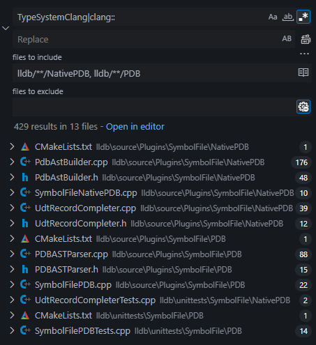

+++
title = "LLDB's TypeSystems Part 2: PDB"
date = 2025-07-07

[taxonomies]
tags=["programming", "rust", "debugging"]
+++

In my previous post, I described implementing PDB parsing as a can of worms. That might have been a bit of an understatement. PDB has been one "oh, it's gonna be twice as much work as I thought" after another. Implementing it has revealed many of the same issues as the `TypeSystem` itself: lack of documentation, cryptic implementations, poor naming schemes, and unclear expectations. Despite all that, I was able to get it working.

That means `TypeSystemRust` can be used for executables that target `*-gnu` or `*-msvc`. It's not quite done yet, but this is a massive step towards the `TypeSystem` being fully complete. I want to talk a bit about the process, at least partially for posterity. As we'll see later, PDB itself is *also* not documented very well, so any additional literature could be helpful to someone down the line.

Fair warning, we're getting into the weeds. This is gonna be a long one.

<!--more-->

Before I get more into that though, I want to give a few updates to the situation surrounding the debugging experience, as several people have contacted me after my previous posts. If you want to get straight into the PDB part of this post, [click here](#pdb-parsing). The TL;DR is this: both Rust compiler maintainers and LLDB maintainers are interested in improving Rust's debugging experience.

# LLVM and TypeSystemRust

In my blanket post about Rust's debug info, before I started implementing a `TypeSystem`, I posed the question: if Rust gets a `TypeSystem`, does it live in the Rust repo or the LLVM repo? While there's still not a solid answer, I have heard second-hand information from an LLDB maintainer: they *would* be open to Rust's `TypeSystem` living in LLDB's source, as well as a top-level `rust` directory in LLVM for any `rustc`-related dependencies. That directory would facilitate a "proper" `TypeSystemRust` implementation: the true intention is to have it interface directly with the target language's compiler, thus the target language's internal representation of types.

Direct compiler integration would theoretically allow for more accurate expression parsing, more/better information available from the types, etc. In my previous post, I mentioned that this integration was probably helpful for `clang`, but that other languages couldn't leverage it. Turns out leveraging it *is* the intention. Whoops. It's a pretty cool idea though, and could be a big deal for features "native" to other languages (e.g. Rust's borrows). For the moment though, the instability of the interfaces and the C++ FFI boundary make it somewhat unappealing. I have heard that some are looking to improve the situation, and there is the potential for something like a `TypeSystemLLVM` that is less opinionated than `TypeSystemClang` and could make minor customizations much easier for third-party languages.

>Aside: While looking through some old LLDB threads, I stumbled upon the "Open Projects" section of LLDB's documentation. I'd seen this page before, but only ever skimmed it. Reading it more closely shows that LLDB is aware of the issues I've brought up in my previous post. Of particular note are: <br> <ul><li>["Finish the language abstraction and remove all the unnecessary API's...How you would go about adding a new language is unclear and much more trouble than it is worth at present"](https://lldb.llvm.org/resources/projects.html#finish-the-language-abstraction-and-remove-all-the-unnecessary-api-s)</li><li>["Documentation and better examples"](https://lldb.llvm.org/resources/projects.html#documentation-and-better-examples)</li><li>["Make a more accessible plugin architecture for lldb... You can't implement any of the actual lldb Plugins as plugins. That means anybody that wants to add new Object file/Process/Language etc support has to build and distribute their own lldb."](https://lldb.llvm.org/resources/projects.html#make-a-more-accessible-plugin-architecture-for-lldb)</li></ul>While that last one is extra disappointing, it's good to see that they've identified the problems and are (hopefully) working on a solution.

# PDB Parsing

As a very short refresher, [PDB](https://llvm.org/docs/PDB/index.html) is a closed-source debug info format made by Microsoft for C. Languages that compile to the `MSVC` ABI generate PDB debug info, which requires special handling. Before we get into that special handling, I want to briefly talk about the limitations of PDB compared to DWARF.

## CodeView: Too Weak and Too Strong

PDB itself is a wrapper around CodeView objects. CodeView is a forty year old debugger built for C. As a result, the types of nodes, the data they can carry, and the ways you can find them are quite limited. The CodeView object format is still being updated (sortof?), but *not publicly*. That leads to a litany of issues.

Finding any information about PDB/CodeView is rough. LLVM has [some information](https://llvm.org/docs/PDB/index.html), this [ancient spec](https://www.openwatcom.org/ftp/devel/docs/CodeView.pdf) has some, Microsoft's [pdb parser (archived 2023)](https://github.com/microsoft/microsoft-pdb) has some, and Microsoft's [msdia documentation](https://learn.microsoft.com/en-us/visualstudio/debugger/debug-interface-access/debug-interface-access-sdk-reference?view=vs-2022) has some. And none of it matches. CodeView is clearly still an evolving format, as the msdia docs list an additional [user defind data kind (`TaggedUnion`](https://learn.microsoft.com/en-us/visualstudio/debugger/debug-interface-access/udtkind?view=vs-2022), possibly equivalent to the DWARF `DW_TAG_variant`?) compared to even the [equivalent data](https://github.com/microsoft/microsoft-pdb/blob/082c5290e5aff028ae84e43affa8be717aa7af73/include/cvconst.h#L181) in their archived parser.

That would imply that the `msdia` docs are the one source of truth and the `pdb` repo is at least slightly outdated, but that's not true. The `pdb` repo contains information that the `msdia` docs don't have, and third-party parsers have successfully used that information.

The description of Microsoft's PDB repo says "Just trying to help the CLANG/LLVM community get onto Windows". While the sentiment is nice, it's disappointing that this repo is no longer maintained and they also won't just open-source the full, modern CodeView specification. Working through all of these outdated/unreliable sources is really painful.

>Aside: Here's a fun example of how much of a disaster all these sources can be. Niche-optimized 128-bit enums (e.g. `NonZero<u128>`) result in a 128-bit discriminant value. When you try to inspect any 128-bit values via LLDB, it straight up pretends they don't exist. While the [documentation in the rust compiler](https://github.com/rust-lang/rust/blob/c02a4f0852e6665cf3df3867982021383f5615df/compiler/rustc_codegen_llvm/src/debuginfo/metadata/enums/cpp_like.rs#L100) claims that this is because the *debuggers* don't support 128-bit discriminants, if you look in the (20 year old) [CodeView specification](https://www.openwatcom.org/ftp/devel/docs/CodeView.pdf) under section `4. Numeric Leaves`, CodeView seems to only support 128 bit **floats and complex numbers**. So it would seem the problem is the format, not the debugger. But LLVM's documentation lists [128-bit types as valid nodes](https://llvm.org/docs/PDB/TpiStream.html#type-indices), and so does Rust's [pdb crate](https://docs.rs/pdb2/latest/pdb2/enum.PrimitiveKind.html#variant.Octa). The official `msdia` docs [don't list 128-bit integer types](https://learn.microsoft.com/en-us/visualstudio/debugger/debug-interface-access/basictype?view=vs-2022), but they [*do* exist in the Microsoft PDB repo](https://github.com/microsoft/microsoft-pdb/blob/805655a28bd8198004be2ac27e6e0290121a5e89/include/cvinfo.h#L2343).<br/><br/>Is that because `msdia` doesn't handle it and LLVM uses `msdia`? Probably, but then why doesn't `msdia` expose it? It's written and consumed by Microsoft, who are the ones who made a 128 bit value type in the first place. Looking into LLVM's source code, it looks like it has handling for that size of value in the hand-written PDB parser, but it just like... still doesn't work for some reason?<br/><br/>What a mess.


The biggest limiting factor with CodeView is that it does not support C++ template types (or in my case, Rust's generic types, I'll use the terms interchangeably). Due to that limitation, Rust's visualizer scripts have special handling whenever that information is missing, [which looks up the generic args via string manipulation.](https://github.com/rust-lang/rust/blob/c02a4f0852e6665cf3df3867982021383f5615df/src/etc/lldb_providers.py#L135) Ew. This trick also doesn't even work in some cases for dumb type-discovery reasons I'll get into *much* later. Even with a `TypeSystemRust`, that hack would need to exist somewhere in its implementation. It's vital that we do have the generics though. Types like `Vec<f64>` have a heap pointer that's just a `*mut u8`, and we need to know the type of the elements so we can cast the pointer properly. Unfortunately, `PhantomData` does not help us here. It's zero-sized, meaning the type we're looking for is still just `PhantomData`'s generic, so it's just as inaccessible.

While I was reading the CodeView spec earlier this year, a question popped into my mind: "then how does C# get away with PDB debug info?". I tried running a C# PDB file through `dumpbin` and the Rust `pdb` crate, but both claimed the file was of an invalid format. An email I recieved after my last post brought this up, and I gave it another look. Turns out C# has *two different, incompatible debug formats, both called PDB*...Very cool, thanks Microsoft.

The one generated by default is referred to as "[portable PDB](https://learn.microsoft.com/en-us/windows-hardware/drivers/debugger/symbols-portable-pdb)", but a project flag can force the non-portable, *actual* PDB format. Running that through a PDB parser revealed that they just bypass the CodeView format entirely using its sole extensibility feature.

If you read the CodeView spec, desperately trying to find some hack to fix the generics problem, you might have stumbled across the `OEM Generic Type` listing. This node is special: Microsoft assigns third-party compiler vendors a unique ID so they can differentiate their respective data, and the node can be filled with an *arbitrary byte array*.

So uhh... literally any problem that CodeView has *can* be solved. Technically.

This is what I mean though when I say CodeView is both too weak and too strong. On one hand, basic functionality seems to be missing. On the other, you could literally invent your own format from scratch to solve those issues, stuff it in OEM nodes, and write extra handling into any debugger that consumes it. It's extensibility, but in a way that requires a ton of work and coordination that nobody really wants to do.

For those curious, I'm pretty sure this is the PDB output for a simple 2-field `record class` in C#. The `id_oem` is likely the C# compiler's ID. The type index is CodeView's predefined `Special->No type` marker meaning the type doesn't exist in the PDB type data stream. The `rgl` (an arbitrary byte array), I can only speculate about. My guess is it's something that allows the debugger to make use of the run-time type information that's available in C#. As of writing this post, I haven't found the time to look into that further.

```txt
# output via Rust's pdb2 crate
OemSymbol {
  id_oem: [
    0xc9, 0x3f, 0xea, 0xc6, 0xb3, 0x59, 0xd6, 0x49,
    0xbc, 0x25, 0x09, 0x02, 0xbb, 0xab, 0xb4, 0x60,
  ],
  type_index: TypeIndex(0x0),
  rgl: [
    0x4d, 0x00, 0x44, 0x00, 0x32, 0x00, 0x00, 0x00,
    0x04, 0x01, 0x00, 0x00, 0x04, 0x01, 0x00, 0x00,
    0x0c, 0x00, 0x00, 0x00, 0x03, 0x00, 0x00, 0x06,
  ],
},
```

I don't think LLVM or Rust have OEM ID's yet. I don't really know that I'm the guy to get them one, nor do I know who I would contact to get the ball rolling. In all fairness, Microsoft open-sourcing a PDB parser largely [happened because an LLVM contributor asked nicely](https://blog.llvm.org/2017/08/llvm-on-windows-now-supports-pdb-debug.html), so maybe I'm overthinking things.

The other issue is obviously "what do we actually put in the OEM node?". A simple solution might be to set the `type_index` to the type that has generics and fill the byte array with the existing List node types, which contains a list of the generic arguments. That's not a perfect solution though since there might be some awkwardness between generic *types* (the `T` in Vec<`T`>) and generic *values* (the `2` in `ArrayVec<T, 2>`). Rust doesn't output generic value debug info at the moment anyway, so that's a can we can kick down the road for the time being.

Alternatively, we could ignore the `oem` node and make hacky use of some other existing nodes that Rust doesn't use. There aren't friend classes or base classes in Rust, so we could use those nodes in the Field List to denote generics. Or we could treat it like sum-type enums and add in artificial static fields of the type of the generic.

The longest-shot, but least hacky option is asking Microsoft to add some kind of CodeView node for it (and tell us how to serialize/deserialize it). As I said before, the `TaggedUnion` type was added recently, and the `msdia` docs specifically mentions its use in Rust (though we also don't know how to serialize/deserialize that). It doesn't seem completely impossible that they would be willing to add a `TemplateParameter` node.

I'm currently only looking at it from Rust's perspective but this problem affects C++ too, so a solution would be beneficial to a huge group of people.

## PDB Parsing and Type System Integration

The first step in adding PDB handling to a `TypeSystem` is implementing the following function:

```cpp
virtual PDBASTParser *GetPDBParser()
```

`SymbolFilePDB` acquires the appropriate `TypeSysytem`, then calls this function and uses the retrieved PDB parser to handle type nodes and symbol declarations.

With the `DWARFASTParser`, we just return the `TypeSystemRust` instance itself, since it subclasses `DWARFASTParser`. That's not possible with `PDBASTParser` as it exists right now.

```cpp
class PDBASTParser {
public:
  PDBASTParser(lldb_private::TypeSystemClang &ast);
  ...
}
```

Yikes. One would think that our main goal is to decouple `PDBASTParser` from `TypeSystemClang`, but as with all PDB-related tasks, it's not quite that simple.

After trying (and failing) to decipher the twisted maze of `TypeSystemClang`'s implementation, I attempted to step through the creation of 1 type node. Except, none of my breakpoints in `SymbolFilePDB` nor `PDBASTParser` were hit. Some further fiddling revealed that, because I debug via a `-gnu` build of LLDB, it *actually* uses `SymbolFileNativePDB` instead. Whoops.

>Aside: both llvm and lldb split PDB handling between "Native" and "DIA". The former is a hand-written parser, whereas the latter is a wrapper around `msdia140.dll`. You can force native handling on Windows with the environment variable `LLDB_USE_NATIVE_PDB_READER = 1`

But wait, why didn't the `PDBASTParser` breakpoints hit? There is no `NativePDBASTParser`, and there's a file in the `NativePDB` directory literally called `PdbAstBuilder.h`. Shouldn't the AST Builder build an AST for the AST Parser to parse, thus the difference between `native` and `dia` is abstracted away for downstream consumers? Apparently not.

`TypeSystem` has 2 functions for retrieving the PDB parser: `GetPDBParser` and `GetNativePDBParser`. Lets look at the implementation in `TypeSystemClang`:

```cpp
npdb::PdbAstBuilder* TypeSystemClang::GetNativePDBParser() {
  if (!m_native_pdb_ast_parser_up)
    m_native_pdb_ast_parser_up = std::make_unique<npdb::PdbAstBuilder>(*this);
  return m_native_pdb_ast_parser_up.get();
}
```

So `PdbAstBuilder` is the equivalent of `PDBASTParser`. A little confusing, but alright.

There is a pretty big snag though. From what I can tell, aside from setting an environment variable, there's no way to prefer the `native` parser over the `dia` parser. That also means there's no way to fall back to one or the other if one of them is invalid for a language. It's not trivial to implement that preference either because you are only able to check which one the `TypeSystem` implements once you've inspected the PDB data to know which language's `TypeSystem` to call. Inspecting that data requires having a `SymbolFilePDB` or `SymbolFileNativePDB`, at which point it's too late because you've already chosen one.

That means I need to implement both.

I decided to tackle the native PDB parser first, since I can debug that easier and the API made more sense to me. I'll eventually circle back and implement the `dia` parser.

Regardless of which one we choose, we need to disentangle PDB parsing from `TypeSystemClang` and clang's internals. Lets take a quick look for `clang`-related keywords in the `PDB` and `NativePDB` directories.



Oh... Oh *no*.

That's not just a return type here or there.

# The Plan

During my initial implementation of `TypeSystemRust`, I tried to keep my changes as minimal as possible. I didn't add a whole lot of new files, and I don't think I modified anything outside of the files I added. I even scoped my preferred `clang-format` options to the folders where my new files exist.

That's not really an option here. Not only do I *have to* modify existing systems, as you'll see later, there are also some pretty unfortunate API's that require tiny changes to make them vastly more useful for any non-`clang` `TypeSystem`.

Such a large refactor was a bit worrying for me. I've done smaller refactors on my own projects, but with those I'm in full control. I can change anything I want, any way I want. Here, I need to ensure `TypeSystemClang` still works, that the API is sane, that everything needed for `TypeSystemRust` is there, that I'm not falling prey to (or giving others) C++ footguns, and that it adheres to the style used in the rest of LLDB and LLVM.

I decided early on that there was no amount of poking around the codebase that would tell me what data and helpers `TypeSystemRust` needed, I'd just need to start implementing it and figure out my requirements from there. It's also not very important to have `TypeSystemClang` in a working state in the interim, so I just had it return `nullptr` for both `GetPDBParser` and `GetNativePDBParser` to make sure it was never used. As a reminder, there is no way to prefer one `TypeSystem` over another if both say they're valid for a given language. It's important to make sure you aren't accidentally using the wrong `TypeSystem` when testing.

I wanted to mirror `DWARFASTParser` as much as possible for consistency (even though I prefer some of the capitalization and naming schemes of `PdbAstBuilder`). That resulted in this virtual class:

```cpp
class NativePDBASTParser {
public:
  virtual ~NativePDBASTParser() = default;

  virtual lldb::TypeSP ParseTypeFromPDB(PdbTypeSymId type) = 0;

  virtual lldb::TypeSP ParseTypedefDecl(const PdbSymUid& symbol) = 0;

  virtual ConstString ConstructDemangledNameFromPDB(const PdbSymUid& symbol
  ) = 0;

  virtual Function* ParseFunctionFromPDB(PdbCompilandSymId func_id) = 0;

  virtual bool CompleteTypeFromPDB(
      const PdbTypeSymId symbol,
      Type* type,
      CompilerType& compiler_type
  ) = 0;

  virtual CompilerDecl GetDeclForUIDFromPDB(const PdbSymUid& symbol) = 0;

  virtual CompilerDeclContext
  GetDeclContextForUIDFromPDB(const PdbSymUid& symbol) = 0;

  virtual CompilerDeclContext
  GetDeclContextContainingUIDFromPDB(const PdbSymUid& symbol) = 0;

  virtual void
  EnsureAllSymbolsInDeclContextHaveBeenParsed(CompilerDeclContext decl_context
  ) = 0;
};
```

This isn't *too* dissimilar to `PdbAstBuilder`'s methods so I should be able to just wrap it later on.

Past that, the way I like to handle these poorly documented exploratory projects is to have \<something that compiles and runs\> as often as possible. With things like the Starcraft Simulator where I'm more confident in how the fundamental pieces work, I'm more willing to spend time making plans and I don't mind long stretches of time without running the program.

With something like this though? There's nothing worse than spending dozens of hours thinking a struct or function or piece of data works a specific way, using it all over, and then finding out it actually does something subtly different. It very quickly turns 1 refactor into 17 refactors. I want to be able to check what something does as soon as I can, make adjustments immediately (or put in a `// TODO`), and be confident in my understanding of each piece of code at every step along the way.

I bring this up because it shapes the order in which I solve the problems that crop up, it determines when I decide to put off solving something until later, and it's (hopefully) a reasonable excuse as to why sometimes <span style="font-size:0.95em">my</span> <span style="font-size:0.90em">solutions</span> <span style="font-size:0.85em">don't</span> <span style="font-size:0.80em">always</span> <span style="font-size:0.75em">uh...</span> <span style="font-size:0.7em">make any kind of consideration towards the future.</span>

>Aside: A great example is that every single allocation in `TypeSystemRust` leaks. There are no smart pointers and no calls to `delete`. Right now, it compiles and runs for the several minutes I need to check the behavior of various DWARF/CodeView API's so I don't care. It's an easy problem to solve later, and it gives me time to weigh up the different storage mechanisms I could use.<br><br>I'm leaning towards a flat `std::vector<RustType>` inside `TypeSystemRust`. `CompilerType` needs a pointer to the `RustType`, but to avoid invalidation issues I can just `static_cast` the `uint64_t` index of the `RustType` to a `void*` and cast it back when we need to retrieve the type. It's a bit hacky because the 0th element would have to be a dummy value to allow for null "pointers" to work as expected, and it'll assuredly segfault if anyone actually derefs the " `void*`", but it'd be less wasteful than a heap allocation filled with pointers to other heap allocations.

One other point of note is that I dislike refactoring in C++ in general because it's *really bad* at helping me have \<something that compiles and runs\> as often as I'd like.

* Forgetting to implement a function in an interface results in a linker error saying the v-table is the wrong size or whatever, but doesn't actually tell you which function is missing its implementation.
* Automated refactoring tools like name-change fail every time, even for local variables in a single function (vscode issue?).
* Having to change function signatures in implementation and header files whenever I realize I need some extra data is surprisingly obnoxious.
* A lack of LSP errors does not mean that it will compile. `llvm::DenseMap` (equivalent to Rust's built-in `HashMap`, used because C++ `std::unordered_map` is *80 bytes* and allocates constantly for some fuckin' reason) caused a lot of issues here. Every `Key` type needs a manual implementation of the equivalent of Rust's `PartialEq`. Lots of types you'd want to use as keys don't have that implementation, but the LSP won't warn you about it.
* Conversely, LSP *errors* don't guarantee that it *won't* compile. `include` errors especially seem to be false-positives about 95% of the time.

It's wild to me that people tolerate this kind of thing in the year 2025. I could write a whole "Why is C++ dev UX still so terrible?" article but I'll leave that for another day.

# SymbolFileNativePDB roadblocks

Even if we implement the new `NativePDBASTParser` interface for `TypeSystemRust`, it will never be called because `SymbolFileNativePDB` is hard-coded to get the language plugin for C++:

```cpp
// found in several places throughout SymbolFileNativePDB.cpp
auto ts_or_err = GetTypeSystemForLanguage(lldb::eLanguageTypeC_plus_plus);
if (auto err = ts_or_err.takeError())
  return nullptr;
auto ts = *ts_or_err;
if (!ts)
  return nullptr;
```

This isn't a simple problem to solve. I checked the `DWARF` parsers to see how they get the appropriate type system, and it's mostly the same only they call `GetLanguage(*die.GetCU())` to get the language. Because of the extra ergonomics of the `DIE` object, it's easy to get any node's `CompileUnit`, and that compile unit contains the language. PDB data doesn't have such easy access.

While we could just store the language of the first compile unit we see, that would likely break the type handling of binaries with FFI's. The correct solution would be to create a PDB equivalent to `DIE` and pass those around. The extra metadata and convenience functions would make handling this, and many other things, just as easy as with `DWARF`.

Unfortunately, that's yet another layer of "this is twice as much work as I thought", so for now I've included a much shittier alternative. In every instance possible, pass a `CompileUnit&`, even if it's just to pass it to a different function that needs it. For inherited functions where we can't change the function signature, we can take advantage of the fact that `SymbolFileNativePDB` stores maps of every symbol parsed. Each type of symbol has some way to access the compile unit or the language or both, so if we do lookups in every map we should eventually find the answer. We can also cache-for-our-sins so things don't end up *too* slow.

```cpp
LanguageType SymbolFileNativePDB::LanguageForUid(lldb::user_id_t uid) {
  LanguageType lang = m_id_to_language.lookup(uid);
  if (lang != LanguageType::eLanguageTypeUnknown) {
    return lang;
  }

  if (auto func = m_functions.lookup(uid)) {
    auto lang = func->GetCompileUnit()->GetLanguage();
    m_id_to_language[uid] = lang;
    return lang;
  }

  if (auto block = m_blocks.lookup(uid)) {
    auto lang = block->GetDeclContext().GetLanguage();
    m_id_to_language[uid] = lang;
    return lang;
  }

  // I think this works correctly?
  if (auto inline_site = m_inline_sites.lookup(uid)) {
    auto lang = TranslateLanguage(m_index->compilands()
                                      .GetCompiland(inline_site->parent_id.modi)
                                      ->m_compile_opts->getLanguage());
    m_id_to_language[uid] = lang;
    return lang;
  }

  if (auto compiland = m_compilands.lookup(uid)) {
    auto lang = compiland->GetLanguage();
    m_id_to_language[uid] = lang;
    return lang;
  }

  if (auto global_var = m_global_vars.lookup(uid)) {
    auto lang = global_var->GetLanguage();
    m_id_to_language[uid] = lang;
    return lang;
  }

  if (auto local_var = m_local_variables.lookup(uid)) {
    auto lang = local_var->GetLanguage();
    m_id_to_language[uid] = lang;
    return lang;
  }

  if (auto type = m_types.lookup(uid)) {
    auto lang = type->GetFullCompilerType().GetMinimumLanguage();
    m_id_to_language[uid] = lang;
    return lang;
  }

  // TODO maybe default to C++?
  return LanguageType::eLanguageTypeUnknown;
}
```

Ick.

Perusing the rest of `SymbolFileNativePDB`'s functions, it looks like there's some other processing that *might* be better handled by the `ASTParser`, but for the time being I'm going to Not Worry About It™.

# Field Lists

The fastest way to get \<something that compiles and runs\> is to parse primitives and structs so we have something to look at. Even if we ignore `Decl` and `DeclContext`, the debugger is still able to find functions, set breakpoints, and inspect local variables. There's not too much special about the primitives, but structs and their fields are a huge hassle. Sum types are structs with struct-fields and static fields, making them an even bigger hassle.

The culprit is, ironically, the lack of first-class sum types in C++. I think the CodeView API was written before C++17, so there's no use of `std::variant`. Instead, it's done through a sortof hacky use of generics. In Rust, you could (and indeed, *can* via the `pdb2` crate) inspect type nodes as follows:

```rust
// get the type data stream
let type_info = pdb.type_information().unwrap();
// get an iterator over the stream, since it's fallible it doesn't
// implement the standard iter trait
let mut type_iter = type_info.iter();

while let Ok(Some(t)) = type_iter.next() {
  if let Ok(type_data) = t.parse() {
    // clean and convenient pattern match
    match type_data {
      TypeData::Class(class_type) => ...,
      TypeData::FieldList(field_list) => {
        let fields: Vec<TypeData> = field_list.fields;
      }
      ... // 26 other possible nodes
    }
  }
}
```

In LLVM, typically you'd use `TypeDeserializer` for this instead. Because it uses generics, you need to already know the type you want to deserialize. That means there's an awkward intermediate step
where you have the node's tag and raw bytes in 1 object, then you need to create a *new* object that holds the deserialized version.

Also note the `llvm::cantFail`, which discards the error returned by `deserializeAs`. The error is sorta necessary because there's none of the valid-state-guarantees of a sum type, but the only way you'd ever want to use the API renders the error useless; an `if {} else if {}` implementation that tries every node type is going to be significantly slower than just switching on the node's tag.

```cpp
// access type data stream and directly index type node
// cvt is an intermediate containing the raw bytes and tag
CVType cvt = pdb.tpi().getType(type.index);

switch (cvt.kind()) {
  case LF_POINTER: {
    PointerRecord pointer;
    llvm::cantFail(TypeDeserializer::deserializeAs<PointerRecord>(cvt, pointer)
    );
    type_sp = ParsePointerTypePDB(type, pointer);
  } break;
  ...
}
```

That by itself isn't too bad, but keep it in mind while I explain field lists.

In the CodeView format, field lists are a separate type node that contains an array of 0 or more type nodes. The most common is the `Member` node, which is roughly a tuple of `(name, offset, attributes, type_index)`. The nodes are *padded within the list* for some reason. To quote the CodeView spec:

>As a program walks down the field list, the address of the next subfield is calculated by adding the length of the previous field to the address of the previous field. The byte at the new address is examined and if it is greater than 0xf0, the low four bits are extracted and added to the address to find the address of the next subfield.

The list can also be split into multiple parts, which are referenced via an `LF_INDEX` node that points to the rest of the list.

As you can imagine, parsing those by hand would be a bit annoying. Luckily there's a `FieldListDeserializer` struct. One *tiny* question: how the fuck am I supposed to use it? Take a gander at the constructor and the function signatures and keep in mind that there are *zero* comments in the containing file, `TypeDeserializer.h`. That header file contains the full implementations too, so that's all you get.

```cpp
// FieldListDeserializer extends TypeVisitorCallbacks
explicit FieldListDeserializer(BinaryStreamReader &Reader);

Error visitMemberBegin(CVMemberRecord &Record) override;

Error visitMemberEnd(CVMemberRecord &Record) override;

#define TYPE_RECORD(EnumName, EnumVal, Name)
#define MEMBER_RECORD(EnumName, EnumVal, Name)                                 \
  Error visitKnownMember(CVMemberRecord &CVR, Name##Record &Record) override { \
    return visitKnownMemberImpl<Name##Record>(CVR, Record);                    \
  }
#define TYPE_RECORD_ALIAS(EnumName, EnumVal, Name, AliasName)
#define MEMBER_RECORD_ALIAS(EnumName, EnumVal, Name, AliasName)
#include "llvm/DebugInfo/CodeView/CodeViewTypes.def"

private:
  template <typename RecordType>
  Error visitKnownMemberImpl(CVMemberRecord &CVR, RecordType &Record);
```

The macro magic expands to bespoke functions for every node that can exist in a field list. You pass in a reference to the appropriate record object and it fills it with the deserialized data.

I'm not super versed on idiomatic C++, but I figured maybe this was a slightly awkward iterator implementation - `visitMemberBegin` giving you the current node and `visitMemberEnd` being the end of the list. Nope, not even a little. I looked up all the uses of `FieldListDeserializer` in the entirety of the LLVM mono-repo to get a hint. There is exactly 1, and it's not in `TypeSystemClang`'s PDB handling. In `llvm/lib/DebugInfo/LogicalView/Readers/LVCodeViewVisitor.cpp`, it is used in a single function in a somewhat unhelpful way.

Through some trial and error with the assertions inside the `visitMember_` functions, I was able to figure it out.

1. You wrap the field list's raw bytes in a `BinaryStreamReader` (~equivalent to Rust's `Cursor`) and pass a reference to the `FieldListDeserializer` constructor
2. Inside a loop, use the `BinaryStreamReader` to read the tag value, thus advancing the reader's position. You have to do this manually because even though `FieldListDeserializer` has the reader, the reader's position, and access to the `TypeKind` flag enum, it does not bother advancing the reader and reading the flag.
3. Ignore the first loop, because the constructor also doesn't advance the reader past the `LF_FIELD_LIST` tag even though it checks that it's there.
4. Call `visitMemberBegin` and pass in a `CVMemberRecord` with `member.Kind` set to the flag retrieved from step 2. This sets `member.data` to the appropriate span of raw bytes.
5. Switch on `member.kind` and do the deserializer dance with, for example a `DataMemberRecord` object, but with `visitKnownMember` instead of `TypeDeserializer::deserializeAs`
6. Process the data into the `LangType` of your choosing.
7. Make sure to call all `visitMemberEnd` or else the next call to `visitMemberBegin` panics because some state variables inside the `FieldListDeserializer` aren't updated.
8. **Don't** advance the reader by the size of `member.data` because the `FieldListDeserializer` handles that even though it doesn't automatically advance the reader anywhere else

Knowing all that, the implementation is still a bit ugly. Mix that with sum-type handling and it turns into an absolute abomination. That's partially because Rust splits 128-bit discriminants into two 64-bit values that need to be stitched back together, and partially because sum-type variants are one of the few instances of the Rust compiler outputting forward declarations.

# Sum Types

DWARF has nodes specifically for sum-types, which made generating them pretty easy for Rust and LLVM.

CodeView has nothing of the sort. Or well, it does, but it's not publicly documented so Rust/LLVM don't generate the nodes for it and none of the existing parsers (except `msdia140.dll`?) can read it. Same difference.

Instead, sum-types are generated as a "hand-written" tagged union with a nested struct for each variant, and a `tag` field for the discriminant. There is also a nested enum type that allows you to map the variant to its name. This diagram comes from the Rust compiler and is more or less what this looks like in C code:

```c
  union enum2$<{fully-qualified-name}> {
    struct Variant0 {
      struct {name-of-variant-0} {
         <variant 0 fields>
      } value;
      static const VariantNames NAME = {name-of-variant-0};
      static const uint64_t DISCR_EXACT = {discriminant-of-variant-0};
    } variant0;

    <other variant structs>

    int_type tag;

    enum VariantNames {
       <name-of-variant-0> = 0, // The numeric values are variant index,
       <name-of-variant-1> = 1, // not discriminant values.
       <name-of-variant-2> = 2,
       ...
    }
  }
```

Unlike most other `RustType` representations, I purposefully stored sum-types in a format that is not a direct reading of the generated `DWARF` or `PDB` nodes. Put a different way, I don't store sum-types as if they're a regular `union` (which is stored as a `RustAggregate`). `RustSumType` is a unique variant with unique handling from other aggregate types. If I hadn't made this decision, we would have the same problem as `TypeSystemClang`: requiring 2 prettifiers on the front-end, one to handle `DWARF` sum-types and one to handle `PDB` sum-types.

It would also be difficult for the prettifiers to differentiate between regular aggregates and sum-type enums. With this arrangement, we can simply use the `HardCodedSyntheticFinder` to check a single value since `RustType` is just a wrapper around `std::variant<RustAggregate, RustSumType, ...>`.

One other funny issue I ran into is that I was storing enum discriminants in an `llvm::DenseMap`, which uses empty and tombstone values for the keys rather than something like Rust's `Option` type. Basically, they're designated values that mark "this slot is empty". For unsigned 64 bit integer types, these values are `u64::MAX` and `u64::MAX - 1`. Unfortunately, because enum values can be literally any value, that's not going to work. The simple solution is to wrap the values in `std::optional`, but I had to implement the `DenseMapInfo` template for that myself because it doesn't currently exist even though there's implementations for `std::pair` and `std::tuple`.

Modifying the `DenseMap` headers in basically any way triggers a full ~20-30 minute recompile of everything (Ryzen 9 7900, 64GB RAM, on an NVMe SSD) because it's used in so many places. And I have to recompile twice because I debug with a `*-gnu` build and do additional testing with an `*-msvc` build.

Oof.

# Decls and DeclContexts

As far as I'm aware, the only instance of Rust outputting a `static` field in the debug info is for the `*-msvc` sum-type representation above. That might not always be the case though, so it's worth doing it right rather than adding an exception just for sum-types.

`TypeSystem::GetStaticFieldWithName` is the "front-end" access point for static fields, which returns a `CompilerDecl`. That means we need a `Decl` struct that can also store a primitive value. If we're going to do that, we may as well refactor `RustDecl` and `RustDeclContext` entirely. In my last post I said that `Decl` objects only really need their name, their parent, and (in the case of `DeclContext`) their child `Decl`s. While it's true that the `TypeSystem` will *function* with that info, there's more we could provide.

Previously, `RustDecl` and `RustDeclContext` were 2 halves of a `std::variant` that was then stuffed into a `RustDeclBase` struct. That layout starts to fall apart when you have things like function declarations, which are both a `Decl` (i.e. the function's signature is a `RustType`) *and* a `DeclContext` (because the function scope contains variable declarations, block declarations, etc.) so now it's just `RustDecl` with a bunch of variants based on the type of decl it is (e.g. `VarDecl`, `TypeDecl`, `ValDecl`). Everything contains exactly the data it needs and all the consumers are happy.

# Type Discovery

After implementing all of that, I had some pretty promising output for primitive types and some structs. There were a few problems though. Reference and pointer types not populating correctly, `Vec` element synthetics would fail, that sort of thing.

This turned out to be a *gigantic* problem, or rather, 700 smaller problems in the world's largest trench coat.

The first problem, which contributes to a bunch of the later problems, is that we need to normalize the type names. Rust outputs slightly modified type names for `*-msvc` because Microsoft's debugger likes to read type names as expressions for some reason. This is why you'll see types like `enum2$<example::Enum>` or `tuple$<i32, Vec<u8> >`.

>Aside: Fun fact, that space in `> >` isn't an accident. Microsoft's debugger would see `>>` as a right-shift operator, so the Rust compiler has to [deliberately avoid that](https://github.com/rust-lang/rust/blob/58d5e1169056f31553ecf680b009a5770eb0e859/compiler/rustc_codegen_ssa/src/debuginfo/type_names.rs#L776)). It must also avoid `{` or `<` at the beginning of a name, and any instance of `#`, `[`, or `"`

Normalizing the type names is not fun. It's fiddly, it's recursive, and small dumb issues keep cropping up. For brevity (as if I can make any claim to that now, 5000+ words in), I'm not going to go into too much detail. Feel free to check out [the implementation](https://github.com/Walnut356/llvm-project/blob/13bcfd502452606d69faeea76aec3a06db554af9/lldb/source/Plugins/TypeSystem/Rust/TypeSystemRust.cpp#L5489) if you're curious.

It is advantageous to normalize the names during the PDB parsing phase though because it reduces the public-facing differences between DWARF and PDB. The average user shouldn't need to type in `ref$<slice2$<u8> >` instead of `&[u8]`. It also makes type lookups a bit easier, since we won't have to translate back and forth later if we store *only* the normalized names.

## Primitives and Pointer types

Rust does not output differentiated `&/&mut/*const/*mut` types. This is true for DWARF and PDB data - the debug info node generated is just a raw pointer (this also includes non-wide `Box` pointers). I've [written a fix for this](https://github.com/Walnut356/rust/blob/8d70c407b97dcfc2ab0086901213c6ee4338fd6e/compiler/rustc_codegen_llvm/src/debuginfo/metadata.rs#L193), but ironically the hacks required to get it to work with `TypeSystemClang` are what got me into this mess in the first place.

In any case, it leads to many type lookups failing. There are 3 crucial pieces of information involved in diagnosing and fixing this issue.

First: The sole source of truth for what types exist when *looking up a type* in `SymbolFileNativePDB` is the PDB file itself, *not* the `TypeSystem`:

```cpp
// SymbolFileNativePDB.cpp:1723
std::vector<TypeIndex> matches =
      m_index->tpi().findRecordsByName(query.GetTypeBasename().GetStringRef());
```

That means when we normalize names, the lookup function ignores them.

Second: PDB has explicit primitive nodes that directly map to the bit-width and signedness of the type, with no additional metadata. That means it doesn't exist as a top-level type in the PDB's type data. Even if it did, it wouldn't have the name "u8". Luckily, the Rust compiler does output the equivalent of `typedef unsigned char u8;`. That requires special handling though because PDB puts the `typedef` nodes in the Symbol data, not the Type data.

Third: PDB pointer nodes do not have a name field at all. I had been outputting these as `*mut T`. When *output as a generic arg*, it uses the non-normalized name. That means you you have a `Vec<ref$<u8>>` a lookup of `ref$<u8>` or `&u8` would both fail even though there is a node for a pointer to an unsigned 8-bit integer, because the name of that pointer-to-8-bit-integer is `*mut u8`.

Once the Rust compiler properly outputs ref/pointer/mut information it shouldn't be a problem anymore, but for the time being it's easier to just generate types for all 4 kinds of indirection for every pointer node we see.

# Structs

There's one additional lookup that runs into issues: almost every struct and enum type.

```txt
# Is there an enum named "example::Enum"?
(lldb) script lldb.target.FindFirstType("example::Enum").IsValid()
false
```

Seems like a big thing to miss, but when inspecting local variables the type is stored *with* the variable. That means you only run into this issue if you specifically look up the type, which I hadn't done yet.

To keep things short and simple: when you request a type lookup, it eventually hits `SymbolFileNativePDB::FindTypes`, which accepts a `const TypeQuery`. `TypeQuery` contains the search value and some additional options. When you search `example::Enum`, the constructor of `TypeQuery` automatically splits it into "context" (`example`) and "base name" (`Enum`). The problem is that `const TypeQuery` *only* allows us to access the base name, *or* compare an existing `ArrayRef<ConstString>` (more or less) with the one that's privately stored inside the `TypeQuery`.

This is a pretty frustrating issue because the alternatives are all slow and these guard rails don't really need to exist. To sum up the problem, they've taken a specialized, optimized implementation and forced the entire API to conform to that instead of keeping the details as broad as possible, as long as possible, and only introducing the specialization at the exact layer where it's necessary.

The entire intention of `TypeQuery`'s structure is to allow parsing scopes and types lazily. If you separate out the scope, the symbol file can search *only* that scope, and parse *only* the types in that scope.

PDB does not work like that. PDB stores every single type in one giant list. That list is not in any way sorted or grouped. The types don't store back-references to their scope, nothing like that. In many cases (e.g. `ref$<example::Enum>`) even sorted types wouldn't help, because the type that Rust outputs "doesn't exist" within the type stream due to the reasons I discussed above.

`TypeQuery`'s specialization is not only incompatible with this, modifying the PDB handlers to take advantage of `TypeQuery` would make them *slower than the naive implementation*. That means I have a few options:

1. Invent and store symbol context information that doesn't exist, and that I don't need anywhere else, so that I can check that it matches the context of the `TypeQuery`.
2. Check every type in my type list (and parse any type that hasn't been parsed), doing the same string manipulation that was done to the `TypeQuery` to split the name from the context and then comparing the result to the `TypeQuery` (this is what `SymbolFileNativePDB` currently does with the raw type stream).
3. Do the reverse of that and stitch the `TypeQuery` context and base name back together, which requires modifying or friend-classing `TypeQuery` so I can bypass the guardrails.
4. Do lookups via `Decl`/`DeclContext`, which requires naively chasing scopes through nested hashmaps. It might be faster if we could access the context array of the `TypeQuery` and specifically look only in the scopes we have, but `const TypeQuery` doesn't allow that so we'd need to create a scope graph of every single type that exists and one-by-one compare them against the `TypeQuery`'s context. The other issue is that this would require delegating to the appropriate `TypeSystem`, but even though the `TypeQuery` stores the valid set of languages for the search, you can't just check that value, you can only check if a language is contained in that valid set.

All of those are *drastically* slower than my `DenseMap<ConstString, TypeSP>`. `ConstString` is an interned string, that means any comparison is a pointer + length comparison. Hashing them is trivial, so retrieving them from a hashmap is fast. I can't use the simple, fast solution because the data-prep step of a bespoke algorithm was done several public-API-steps before it was even necessary.

In any case, the least destructive way to fix this was to add a `const` function to `TypeQuery` that returns a `const` reference to the context array, allowing me to stitch the parts of the `TypeQuery` back together. My solution still isn't perfect because all types end up being looked up as if they are from 1 language even though that's not always true. Solving that would require a pretty gross system that would recursively check symbols/scopes of every compile unit and divvy out types (and types contained within those types) to their appropriate language/compile unit. Things like generic args, and especially types like `ref$<u8>` not existing in the type stream might throw a wrench in that, which is a big reason why I avoided it for now. Maybe something I can add later if it becomes a problem.

The final piece of the puzzle was "when do we look for types?". We know the generic exists the moment we have the type name, but looking them up during type processing leads to recursion problems. Adding in an "are we already parsing this type" check similar to DWARF parsing only lead to a bunch of other issues due to the ordering of types in the PDB file and the early exit for types we're already parsing. I think it could be solved with more effort and a larger re-write, but I just want to have \<something that compiles and runs\>, so we just leave the generics unresolved until they're specifically asked for (usually by the Synthetic Provider at prettification-time).

# Wrapping up

After writing fixes for all of those problems, it compiles, it runs, and it shows me roughly what I expect to see.

This is another massive step towards a complete and upstream-able `TypeSystemRust`, but there's still a ways to go.

* I need to finish up the Synthetic Providers, at least to feature parity with Rust's current `lldb_providers.py` script.
* implement several non-essential functions that I skipped over.
* finalize the API for `NativePDBASTParser` and port `TypeSystemClang` to it.
* create a similar API for non-native `PDBASTParser` and implement that for both `TypeSystemRust` and `TypeSystemClang` OR add in a fallback that allows using `Native` if the language doesn't have a `DIA` parser.
* clean up the dozens of `// TODO`'s, the memory leaks, the commented out code sections, etc.
* ungodly amounts of documentation.
* add tests, logging, and debug assertions.
* rebase onto a newer version of lldb (currently sitting on 19.x).
* make some small changes to the Rust compiler for better debug node generation
  * Differentiate `&`/`&mut`/`*const`/`*mut`.
  * Generate typedefs for types that aren't directly output in the PDB type nodes (e.g. `ref$<example::Type>`).
  * Generate nodes for value-generics (e.g. the `2` in `SmallVec<T, 2>`).
  * Generate a bespoke node or typedef for non-wide `Box<T>`

and probably a few other odds and ends that I'm forgetting. I'm optimistic though. I definitely feel like I'm over the hump. The biggest challenges so far stemmed from having to do tons of exploratory work to figure out *how* things work. With the vast majority of that out of the way (hopefully), the rest should be smooth sailing.

---

One final note: I apologize for the poor quality of the C++ syntax highlighting. All the syntax highlighting on this site is handled via sublime-syntax files that I modify myself to improve their output (or I write them myself in some simple cases). Rust required a few hours of modifications and it looks great. C/C++ are not trivial languages to parse and the existing sublime-syntax files, frankly, suck *really* bad. They are a huge mess and C++ especially has a *lot* of syntax and edge cases. Fixing it would be a nightmare, but writing one from scratch is very hard to justify.

I could always paste the code into my editor and copy-paste the raw HTML into my blog but that seems both unsustainable and silly.

So for now, as much as I hate it, C++ is just kinda gonna look bad.