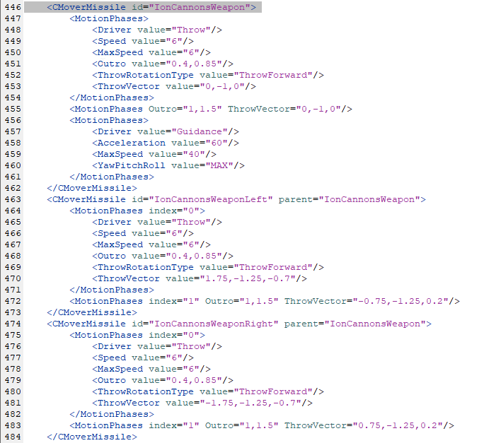

+++
title = "Simulating Starcraft Part 1 - Tracer Bullet"
date = 2024-05-15
description = ""
[taxonomies]
tags=["starcraft", "games", "programming", "rust"]
+++

A while back, I made a [small application](https://github.com/Walnut356/SC2-Upgrade-Calculator) meant to demonstrate some important principles about RTS design, namely that unit stats in a vacuum can be very misleading. As a quick example, stalkers have ~9.7 dps on paper. When fighting marines though, their effective DPS drops to ~8.4 (8.2 with combat shields) due to overkill. That's about the same DPS as a sentry. Unfortunately, there's only so much info that can be extracted from a Time To Kill calculation between two units.

<!-- more -->

Even when focusing only on small-scale interactions, one major flaw is that it doesn't reflect behavior between unit *compositions* and divisibility. For example, a stalker and an adept will 1-shot a zergling, but *only* if their projectiles collide with the zergling at the same time. Otherwise, the zergling regens a tiny bit of HP and lives on "1" hp. This gives them both ideal DPS with no overkill, but really awful dps if the projectiles are spaced out too far.

I made some attempts at predicting fight behavior based on total health vs total DPS between two sets of units, but it never had great accuracy and I ended up setting it aside for quite a while. The recent RTS boom has reignited my interest though, so I want to take another crack at fight prediction.

This is a bit of a journey, so I'll be splitting this post (and the work) into several parts. For now, we're going to lay out a plan, set up the tracer-bullet, and do a small amount of testing for accuracy. The source code for this project will all be available [here](https://github.com/Walnut356/Starcraft-Simulator).

# Why bother?

I have 2 major motivations for handling this programmatically:

* Speed - I don't have all day to fiddle with unit testers and the editor, manipulating values and re-testing and rinsing and repeating. I want to run bulk tests, fiddle with values, and have a new answer within seconds.
* Instrumentation - There's a lot of info that's simply unavailable (or *incredibly* tedious to capture) when manually inspecting a fight - even with frame-by-frame analysis. For example, how much damage *exactly* did all of the zealots do in a maxed out fight? What percentage of the total damage of the entire army was it? You can more or less figure this out by inspecting a VOD, but it might be the single biggest waste of several hours that you could embark on. Trust me. By making my own simulation, I can easily track whatever details I want and inspect them after the fight. I can compare those numbers before and after, say, giving 1 army upgrades, and see how much it truly affects things. I can also do fun things, such as adding in a primitive AI that micros the simulated units.

Both of these motivations rely on me *making changes to the units in the game*. RTS balance and design is endlessly fascinating to me, but I think it falls under a similar umbrella as fighting games - the systems are finnicky and sensitive. Even the tiniest numbers change can have drastic ramifications in other parts of the game. I think the public tools for testing balance - assessing what needs to change, and how much of an impact it has - are weak enough to be genuinely harmful to balance design. It feels like current practice is pretty close to "throw shit at a wall and see what sticks". Even with a proper direction, the fine-tuning is a nightmare beyond just putting it in a ton of people's hands and hoping there's nothing busted lurking beneath the surface.

A minor goal is to make the framework extensible to other RTS games (or simple enough to allow it to be rewritten for other games quickly). Custom units and modified stats should be incredibly easy to add and fiddle with.

As an example of how this sort of thing can be useful, during my initial exploratory work in the editor years ago, I made a neat discovery: picture 2 armies with identical *total* stats, but where one army is comprised of 10 units with identical stats and the other is comprised of 5 units whose stats are twice as high. The less numerous army will win every time, even when rigging the stats so overkill isn't an issue for either army. The reason is because a unit does 100% of its damage, regardless of its hp, until it dies, at which point it does 0% of its damage. This favors armies whose individual units take longer to die. I originally hypothesized that it would be very even, or go back and forth in successive runs due to the better natural target-firing with fewer total targets, but that didn't end up being enough to offset the frequent little hits to the overall damage output. The balance-design implication of this is that, when designing a race like zerg with more numerous units, their stats should be slightly *higher* than proportional to their increased unit count to have the same effectiveness.

Little tests and experiments like this can lead to all sorts of unexpected places. I think part of my motivation for doing this is to help expose just how many switches and knobs there are to fine-tune RTS balance.

# Prior lessons and considerations

This section gets a bit into the weeds. If you're not a programmer or don't care about the ultra-specific details, feel free to skip it.

The TTK calculator was built in Godot via GDScript a few months after I first started learning to program. This lead to some pretty ugly code, but also some more subtle limitations due to the engine itself. GDScript and Godot in general aren't really great places for making non-entity data types. You can extend `Object` or go through the trouble of using GDExtension, both are kinda annoying but I digress. I intentionally chose to accept minor inaccuracies due to not mimicking Starcraft's data types exactly. Most values in the editor are of the `Real` data type, whereas Godot uses single and double precision floats.

`Real` values are in a signed 32 bit fixed point format; the first 20 bits are interpreted as a signed integer, and the remaining 12 bits represent the fractional portion. This gives an integer range of -524,288 to 524,287 with a fractional resolution of 1/4096. Floats are more precise than this, so during successive calculations the extra accuracy can compound and give us divergent behavior than what's expected. How much of a divergence? Well, it's more pronounced in smaller numbers so lets use adrenal gland zerglings. Their attack speed in the editor is `0.696`, divided by the adrenal glands modifier: `1.2`, then divided by the Faster game speed modifier: `1.4`. Here are the results:

* Float64: `0.4142857142857143`
* Fixed32: `0.4140625`

That's a difference of **0.05%**. Unacceptable!

It's worth noting that we have to be a bit careful. For example, this code written as:

```rust
real!(0.696) / real!(1.2) / real!(1.4)
```

results in the value `0.4140625` (bit pattern 169**6**). If you instead write:

```rust
real!(0.696 / 1.2 / 1.4)
```

the answer you get is `0.414306640625` (bit pattern 169**7**). This sort of small divergence is what I want to avoid - numbers need to be converted to `Real` values before they're operated on.

Except there's one small problem, and this begins a list of concessions that my simulator has to make because I don't literally have the Starcraft 2 engine's source code. I don't know how the game speed is actually applied. Every source lists it as exactly 40% faster than "Normal", which is the speed that all the editor's values are relative to. 1.4 is *not* exactly representable with a `Real` value - the closest it can manage is the bit pattern `5734`, or ~`1.39990234375`. Presumably the game clock uses the raw u64/u128 from the system clock, but is it translated to a float at any point? Single or double precision? Or is it directly translated to a `Real`? Is the 1.4x modifier applied as a float, or a `Real`? Essentially what I'm asking is, how divorced is the engine's clock from its own data types? Does the engine clock tick exactly 40% faster, or is this a `f32`/`f64`/`Real` 1.4x modifier on every duration and rate? To extend the previous example, the clock itself ticking faster would be written as:

```rust
real!(f32::from(real!(0.696) / real!(1.2)) / 1.4)
```

While that results in the same value in *this* instance, I'm absolutely certain the game values will present a case where it's different just to fuck with me. For my purposes, I'll be assuming that it's a `Real`, thus a `1.39990234375x` modifier on all values. Using debug cheat codes, you can set the game speed to any value. Giving it an invalid value will *not* change the game speed. Setting the speed to `524287` (`Real::MAX`) results in some wild stuff, but attempting to set it to `524288` (`Real::MAX + 1`) doesn't change the speed. This suggests that it probably is a `Real` modifier, though it's not conclusive.

Here are some other things to think about:

* I don't know if there is rounding, and if it is nearest/even/truncation
* I'm not 100% sure how starcraft 2's pathfinding algorithm works (though I'm vaguely familiar with pathfinding and RTS unit movement in general)
* Zerg health regen has the editor value `0.2734` AND `0.273`. The editor says these values are rounded to the nearest 1/256th (i.e. `0.273` is the correct value) but like... first of all, why? Second, why have an oddly specific value that's *not* rounded to the nearest 1/256th be the default value for health regen for all zerg units? Weird. (Edit: This is actually the other way around. `0.273` is the editor default, `0.2734` is the rounded value that's actually used. Still weird that they don't just set the default to the rounded value though).
* I don't know what RNG algorithm the engine uses. I'm just using the `rand` crate and hopefully that's good enough
* Does random attack delay apply to "secondary" hits? The zealot's second swipe is triggered 0.28 seconds after the first swipe, but is that 0.28 guaranteed, or 0.28 ± random delay?
* I don't know the sub-physics-step ordering of events.

To clarify that last point, while updates happen in chunks to the *observable* gamestate, the engine is one continuous set of operations (more or less) - this is why in many fighting games when 2 players hit a button at the same time, p1 wins the exchange; their data was processed first. In this case, I don't know if healing or damage takes effect first, and when "death" is considered. Imagine a zergling whose hp at the start of tick X is exactly 1. On that tick it takes 1 damage. Does it die? If the regen applies first, the zergling's hp is raised to ~1.00122, it takes 1 damage, and then does *not* die because its hp is above 0 (in-game it would appear to still have exactly 1 hp). Conversely, if damage is applied first, the zergling's HP is reduced to 0, and then 1 of 2 things can happen. If the unit is marked as "dead", no further processing would occur for that unit, it would *not* receive regen, and would die. If it isn't marked for death until later, it *might* receive healing and thus be above 0 hp when checked for death.

This also applies to things like attacking and spellcasts - if their hp is reduced to 0 on the same tick that they would attack, does the attack come out? I think I could test for this using some hand-picked values in the editor, but I'm going to put it off for now since it should be a minor enough detail not to affect things much.

# Initial plan and implementation

The structure is going to be relatively simple - all numeric operations will be done with the `fixed` crate's `I20F12` type, which I've renamed to `Real`. `Unit`s will be generic bags of data, half will be the base stats, the other half dedicated to bookkeeping information. Before I go through several hours of tedious data entry for every single unit, I want a quick tracer bullet for the core system that we can flesh out more later. That means Stalkers, Marines, and Roaches as our only `Unit`s for the time being. They provide a nice mix of attributes (e.g. projectile vs hitscan, zerg regen, combat-focused upgrades, etc) that I can test almost everything. For now though, I don't want to think about position or pathfinding, nor some of the more finnicky details such as ability usage, micro, buffs, debuffs, or threat level.

I ran into a small roadblock while adding unit data with `Real` values - I'd prefer as many values (and entire units) as possible to be `const`, since a major priority is speed. Anything we can do to get work done at compile-time instead of run-time is a big win. While many of the calculations will be evaluated at compile time, even when not declared as `const`, I want to guarantee that they are just in case. The easiest way to translate between a raw integer/float and a `Real` is to cast to a float, multiply by `4096.0`, and then cast back to an integer. Unfortunately, while float operations are allowed in `const` declarations, they are *not* allowed in `const fn` for valid (but kind of dumb) reasons. I'd prefer the unit initializers to be `const fn` where possible so that's a bit of an issue. I tried a bunch of different options (lookup tables for the fractional portion, manually pre-calculating the value and using `from_bits`, implementing the conversions via integer operations, etc.) but they all obfuscated information or were unwieldy. They also had issues cleanly implementing the "convert then operate" semantics that I outlined before. Annoyingly, `std::ops::*` traits *also* aren't `const fn` and thus can't be called in `const` declarations or `const fn` even though they're mostly just delegated to integer operations.

That means we're reduced to macro nonsense. Hooray...

I settled with 2: `real!()` and `const_real!()`. The former is literally just replaced with `Real::from_num` because it's ugly to call everywhere, the latter is a small abomination that "overloads" the arithmetic operators in the most common scenarios (e.g. a `const Real` that is a `Real` multiplied or divided by another `Real`) by internally replacing them with their `const fn` equivalents (e.g. `const_real!(x * y)` -> `($x).saturating_mul(const_real!($y)`). If `const_real` is passed a single parameter, it's converted using the `const_soft_float` crate (which I found while perusing the `const fn` float RFC) whose floating point arithmetic operations can be called in `const fn`. Ugh what a nightmare.

Anyway, I can leverage some of the 1v1 invariants for units to help make things more static - for example, I don't know if there's an upper limit to the number of weapons you can give a unit, but the max you'll see in 1v1 is the thor, with 3. Abilities are capped at 32 per unit, but I can limit that to only a handful.

Worth keeping in mind that we can modify the bookkeeping values to hold any data we might find useful - damage dealt, shots fired, distance traveled, damage blocked with armor, a list of every unit it targeted, etc. Most of this stuff doesn't require much memory to store and isn't very computationally complex. Just like in-game, the supply limit helps ensure that our armies never get so big that the computations take too long.

The `Army` struct will essentially just be a wrapper around a `Vec<Unit>`, and whose methods will provide the majority of the simulation. After working on this concept for a bit, I ran into some annoying lifetime issues as well as some edge cases that I hadn't considered. As a result, I decided to make the armies owned objects inside a `Coordinator` struct that would handle dispatching calls, the "global" RNG state, and other minor stuff. During fights, the main loop will consist of simulating a single tick: first movement for both armies, then healing, then damage. One army will calculate its values before the other, but the effect of that should be minimized via things like random attack delay and projectile travel speed. To keep the main loop (and reference juggling) simple, much of the functionality can just dispatch to individual `Army` functions. It returns an `Outcome` struct, which is essentially just a wrapper that can lazily evaluate statistics at the end of the fight.

```rust
pub fn simulate(&mut self) -> Outcome {
    let mut a1_units = self.a1.units.len();
    let mut a2_units = self.a2.units.len();

    while a1_units != 0 && a2_units != 0 {
        self.acquire_targets();
        self.heal();
        self.attack();
        self.tick_projectiles();

        self.time += TICK;
        a1_units = self.units_left(Team1);
        a2_units = self.units_left(Team2);
    }

    while !self.a1.projectiles.is_empty()
        && !self.a2.projectiles.is_empty() {
        self.heal();
        self.tick_projectiles();
        self.time += TICK;
        a1_units = self.units_left(Team1);
        a2_units = self.units_left(Team2);
    }
    ...
}
```

It's important that we wait until all active projectiles expire before truly ending the fight, as this is how draw occur.

I had to redesign the `Weapon` struct and `attack` functions several times to future-proof, as I'll eventually need to get around to things like multiple weapons and weapon priority. For now, targets are chosen randomly, and the first gun that can shoot the given target is the one that fires. Travel time is currently pretty primitive and just assumes units are always at their max range (not a horrible approximation considering default unit behavior). The hitscan/projectile split is easier to implement here, rather than having to retrofit it later. Once position values are fully taken into account, it should provide much better accuracy than the "everything is hitscan" approach that the TTK calculator used. It'll always have some minor inaccuracies because I don't think I have it in me to replicate all of the tiny phases of a single projectile that each have different speeds, accelerations, and various other factors that make the projectiles so visually appealing. Besides, I think in most cases the random attack delay accounts for a bigger variation in when a projectile hits than all the animation factors combined.


<sup>Phoenix projectile animation phases</sup>

Somewhere during the process of completing Advent of Code 2016 in C, I learned the value of handles. Rust *really* doesn't want you passing around mutable pointers to everything. The humble `usize` can act as a "pointer" though, so long as you never change the ordering of the `Vec` that contains the object you want. To my surprise, even ignoring the time saved from a happy borrow checker, this ends up saving me even more time and headache because I'm not allowed to sweep up "dead" units, which is actually desirable. We don't have to worry about holding onto "garbage" and wrecking the performance of our game because there is no game. Dead units *do* tell interesting tales, so keeping them around for post-fight analysis is something I'd likely have wanted to do anyway.

I realized at some point that it might be better to put some of these bits of bookkeeping information in their own `Vec`s in `Army` struct rather than stored in the unit itself. Some values, like attack cooldown, are checked for every unit at once, so it should be a prime candidate for auto-vectorization and will reduce cache churn a bit as the `Unit` structs aren't exactly small. Using handles makes this much easier as well, since a unit's handle will be the same value as its bookkeeping handle. I'm honestly really pleased with this solution, it's been much more convenient than some of my initial ideas.

The most complicated portion of the simulation loop is the function where units decide whether or not they should fire their weapon. I can use a very similar state machine to one that might be used in an actual game engine, alongside some special processing for damage point. One minor point worth noting is that I'm using timestamps (i.e. "what time will it be when I'm allowed to shoot again") instead of timers (i.e. "when this value hits 0 I can shoot again"), as it reduces the amount of mutable state.

The first thing we have to do is check if the unit is currently attacking and, if so, if they've finished the wind-up (`DmgPoint`) of the attack

```rust
for (u_handle, unit) in attk.units.iter_mut().enumerate() {
    if unit.is_dead() {
        continue;
    }
    // launch attack if we've finished backswing
    if let State::DmgPoint(x) = unit.state {
        // backswing is a timestamp
        if x > self.time {
            continue;
        }
        let t_handle = unit.curr_target.unwrap();
        let target = &mut dfnd.units[t_handle];
        let weapon = unit
            .try_get_weapon(target)
            .expect("Can only enter State::Backswing with a weapon");

        match weapon.projectile {
            ProjType::Projectile(x) => attk.projectiles.push(Projectile::new(
                u_handle,
                t_handle,
                weapon.range,
                x,
                self.time,
            )),
            ProjType::Hitscan => Coordinator::apply_damage(unit, target, self.time),
        }

        unit.state = State::Attack;
    }
    ...
```

Next we check if the unit can attack, if it has a target, and then grab references to the necessary objects. As a tiny aside, something I learned while working on slippi stats is that complicated state machines with lots of guard clauses are an exception to the "let your code speak for itself" rule. Summing up all the properties necessary to reach a specific spot in the code is a big help. It could be said that that's a sign to split the function into smaller functions, but I find that having to jump around to a million mini functions to see what each individual part does is more mental work than keeping it all in one place and just adding these small "checkpoint" comments.

```rust
    ...
    if attk.attack_cds[u_handle] > self.time {
        continue;
    }

    if unit.curr_target.is_none() {
        continue;
    }

    // not dead, can attack, has target, *might* already be attacking:

    let t_handle = unit.curr_target.unwrap();
    let target = &mut dfnd.units[t_handle];
    let weapon = unit.try_get_weapon(target);
    if weapon.is_none() {
        continue;
    }
    let weapon = weapon.unwrap();
    ...
```

Next, the complicated bit. Some of the attacks in the game hit multiple times, like the zealot's swipes or the thor's AoE missiles. The consecutive hits are triggered some static amount of time after the first hit. Sometimes that static amount of time is 0 ticks. Luckily, there's only 4 major "types" of attack behavior: single hits, simultaneous 2 hits (e.g. phoenix), offset 2 hits (e.g. viking, zealot), and offset 4 hits (e.g. thor). We can put those in an enum and store the attack offsets inside them where necessary. This is one of those times where Rust's enums really shine.

We'll also need to track which part of the attack we're in. Super Smash Bros Melee handles this by just treating them each as unique states, so we can do the same

```rust
    ...
    let (attack_cd, new_state) = match weapon.multihit {
        Multihit::Offset2(x) if unit.state == State::Attack => (x, State::Attack2),
        Multihit::Single | Multihit::Instant2 | Multihit::Offset2(_) => (
            weapon.attack_speed + weapon.get_delay(&mut self.rng),
            // damage_point is stored as a timestamp
            State::DmgPoint(self.time + weapon.damage_point),
        ),
        Multihit::Offset4(x) => match unit.state {
            State::Attack => (x[0], State::Attack2),
            State::Attack2 => (x[1], State::Attack3),
            State::Attack3 => (x[2], State::Attack4),
            State::Attack4 => (
                weapon.attack_speed + weapon.get_delay(&mut self.rng),
                State::Attack,
            ),
            _ => panic!("Unreachable"),
        },
    };

    attk.attack_cds[u_handle] = self.time + attack_cd;
    unit.state = new_state;
}
```

A little messy, but it is what it is. Nested and conditional matches are always kinda ugly. Everything else is pretty straight forward - just iterating over units and modifying values in obvious ways.

# Results

Since the goal is to surpass the TTK calculator, I want to simulate more than just 1v1 unit fights. We can start small with 1 stalker vs 2-3 marines. Based on in-game behavior, the stalker should *always* win against 2 marines, and *always* lose against 3 marines. I'll be running the simulation 1000 times with a new random seed each time (which currently determines attack delay and targeting).

```txt
Simulation time (1000 runs): 3.713ms
Team 1: {Stalker: 1}
Team 2: {Marine: 2}
Team 1 wins: 1000 | Team 2 wins: 0 | Draws: 0
Average in-game fight duration: 10.1086s
```

```txt
Simulation time (1000 runs): 3.6282ms
Team 1: {Stalker: 1}
Team 2: {Marine: 2}
Team 1 wins: 1000 | Team 2 wins: 0 | Draws: 0
Average in-game fight duration: 10.106s
```

Perfect! Now lets try a mirrored fight to see that if there's any sort of bias - let's say 10 roaches vs 10 roaches.

```txt
Simulation time (1000 runs): 51.5669ms
Team 1: {Roach: 10}
Team 2: {Roach: 10}
Team 1 wins: 509 | Team 2 wins: 490 | Draws: 1
Average in-game fight duration: 23.4155s
```

I ran it several times and team 2 sometimes ended up with more wins than team 1, so it looks like we're in the clear. If it ever becomes an issue, I can add in some extra handling to remove the advantage - probably by making death not "count" until the end of the tick.

How about 10 stalkers vs 12 roaches? This fight is close enough to depend on targeting and pathing when the engagement happens. To mitigate this a bit, the editor runs are (somewhat unscientifically) executed by smooshing the 2 armies up against each other using move commands, then attack moving with both at the same time. The unit tester allows selecting both teams at once, so both receive the command at identical timings.

I ran 20 fights in the unit tester and the roaches won 17 times, the stalkers only winning 2 times, with 1 draw (the final 2 units killing each other at the same time). Now the simulation:

```txt
Simulation time (1000 runs): 49.3858ms
Team 1: {Stalker: 10}
Team 2: {Roach: 12}
Team 1 wins: 121 | Team 2 wins: 878 | Draws: 1
Average in-game fight duration: 21.5962s
```

Wow, that's remarkably close. I figured there would be more inaccuracy to be honest. When watching a fight, it's clear that due to the reduced range of the roaches, they're more likely to have to reposition after their target dies. Additionally, the random targeting in the simulation is very different from the proximity-based targeting in-game, which leads to "waves" of deaths. I'm not sure if I should be worried or happy that these factors aren't muddying the results quite yet.

Take a look at how long the simulation took to run vs the amount of "game time" simulated. The simulation's in-game time was consistently a few seconds faster than the real runs, but that's not too important. For 1000 runs it took 49ms. To run the in-game test 1000 times it would take 21,000 seconds. That's over 5 and a half *hours*. So uh... that's a pretty decent time savings. I can probably squeeze out more performance with a bit of effort, but this is more than fine for a first pass.

Even when bumping the unit counts to extreme values that couldn't exist in a 1v1 match, the processing time isn't too bad.

```txt
Simulation time (1000 runs): 9.5682863s
Team 1: {Stalker: 1000}
Team 2: {Stalker: 1000}
Team 1 wins: 507 | Team 2 wins: 493 | Draws: 0
Average in-game fight duration: 34.6072s
```

# Next Steps

At this point, the core logic looks okay and the structs aren't likely to change *too* drastically, so it's probably worth doing the data entry for most of the remaining "it moves and shoots"-type ground units. The next thing I want to work on is probably position values, collisions, and pathing. That's a whole can of worms though, since I'm starting to veer into less familiar territory. It goes hand-in-hand with things like terrain, flying unit separation, and the "wiggling" that back-line units do when trying to get in range of their target. I might be able to put it off by working on abilities and buffs next, but there's lots of trouble lurking there too. Wish me luck.
