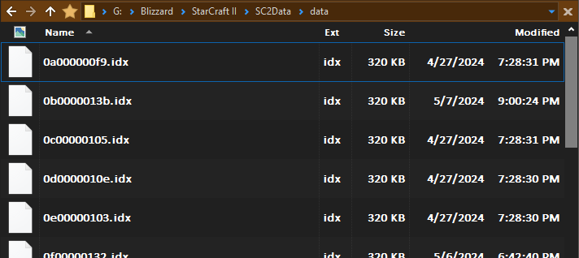

+++
title = "Simulating Starcraft Part 2 - Data Wrangling"
date = 2024-06-02
description = ""
[taxonomies]
tags=["starcraft", "games", "programming", "rust"]
+++

Oh how naive I was when I thought I'd be moving on to pathfinding and abilities. I had hoped some of the game's mechanics would function better in isolation, so I could gradually add complexity on top of the tracer bullet in a modular way. Unfortunately, that doesn't seem possible without a huge refactoring burden every time I add the next layer. It'll be more worth my time to properly architect it right now, and build it from the ground up with all of the systems it'll need.

<!-- more -->

With that in mind, the best way to figure out what my requirements are, fully, is to look directly into the game's data and see what *its* requirements are. Conveniently, I needed to do this anyway as I'd rather avoid the tedium of entering all of the unit data by hand.

As always, the code for this project is available [here](https://github.com/Walnut356/Starcraft-Simulator)

# Starcraft's Database

When inspecting starcraft 2's installed files a while back, I noticed what looked like a proprietary database format and didn't look too much further into it.



While reading Game Engine Architecture, xml databases were brought up and I had a House moment - I remembered the "view xml" button in the editor. Instead of having to manually enter unit data, I could make a quick parser for the xml. I'd been mulling over creating some sort of external json data store for the same purpose anyway, so this would be perfect. There's an "export balance data" button in the editor that dumps 1000 xml files, one for each unit and structure. Unfortunately, the data from this dump is far from complete. It'll make more sense in a moment, but it looks like this function just traverses the `unitdata.xml`, resolves the versioning and links, cleans up the xml structure, and outputs a file for each unit. This ends up hiding some of the nitty-gritty of the weapon functionality that I can't really ignore.

Investigating further, I stumbled across an old reddit thread that pointed me to [this website](http://www.zezula.net/en/casc/main.html) which explains the proprietary database format that blizzard games use, and provides a GUI application called `cascview` to inspect the data. Using `cascview`, I was able to extract the `liberty`, `swarm`, `void`, and `voidmulti` `.sc2mod/base.sc2data/gamedata` folders, which contain xml formatted data for every... well, every *thing* in the game. More data than we need to be honest. It's still going to be a bit of work to make it usable though.

The game and editor seem to work based on a sort of "versioning" system. `voidmulti` does not contain all the data for all the current 1v1 units as one might hope. Instead, the base data is held in the expansion where it was first defined, and future files are applied "on top" of old files, replacing any relevant data fields. While I'm sure that makes some things very easy for the developers, it poses a slight annoyance for me, as I now more or less have to do the same. Additionally, there's quite a bit of "unused" data, even within the subset of 1v1 units. Many units still have various forms of alpha/beta attributes (e.g. adept shield upgrade, replicant unit data, mothership core, warhound, herc). Some things are also structured in such a way that makes it hard to parse without replicating the engine's struct layout - something I've been skirting the line of, as I can take many more shortcuts if I don't.

I have a couple of options:

* Parse the data into sructs, store the structs as raw binary data, and then `mem::transmute` them from the raw data at runtime
* Parse the data into an intermediate format, generate Rust source files with the `const` declarations in them, and insert those files into the crate before compiling

I wasn't super comfortable with source code generation prior to reading Crafting Interpreters, but they did it a lot for their `jlox` interpreter (since Java doesn't have macros) and it grew on me. I'd generated assembly and vm code before when working on [nand2tetris from scratch in Rust](https://github.com/Walnut356/hack_emu), but for some reason it hadn't occurred to me to generate high-level source code. In any case, I'm not super fond of either idea. The second one sounds more like what I want, but also feels like it leaves the system less modular than the first. I've done binary formats before though, so I may as well get some more experience with codegen.

# Parsing

Parsing these "loose" data formats in Rust can feels a little painful sometimes, but xml felt notably worse than the json, amazon ion, and some other event-based systems I've worked with before. Stringly-typed is already rough, but xml feels a lot like completely unstructured data, so the parsing code ends up requiring a lot of nested loops and matches. I used `roxmltree`, which had great performance, but I almost would have liked something a bit more "batteries included" like `serde_json` where it just dumps everything into a big `HashMap` with pre-existing enum-types.

## Structure

The xml documents are grouped by "type" (e.g. `unitdata.xml`, `weapondata.xml`, `abildata.xml`) and some of the nodes are just links to other data via string IDs:

```xml
<Catalog>
    <CUnit id="Zealot">
        <DeathRevealRadius value="3"/>
        <Race value="Prot"/>
        <Mob value="Multiplayer"/>
        <LifeStart value="100"/>
        <LifeMax value="100"/>
        <LifeArmor value="1"/>
        <LifeArmorName value="Unit/LifeArmorName/ProtossArmor"/>
        <ShieldsStart value="50"/>
        ...
        <WeaponArray Link="PsiBlades"/>
        ...
```

This is... less than ideal. It's not so bad when one file links to another file like this, but it's hardly ever just one link. And those links lead to more links. Sometimes, they link right back to the file you were just in. Untangling this spaghetti by hand so I could understand it enough to write the parser was the first time I've ever understood the market for ultrawide monitors.

If you look up the `WeaponArray` link, `PsiBlades`, in the `weapondata` file, you're treated to this listing:

```xml
<CWeaponLegacy id="PsiBlades">
    <EditorCategories value="Race:Protoss"/>
    <Icon value="Assets\Textures\btn-upgrade-protoss-groundweaponslevel0.dds"/>
    <TargetFilters value="Ground,Visible;Missile,Stasis,Dead,Hidden,Invulnerable"/>
    <Range value="0.1"/>
    <Period value="1.2"/>
    <DamagePoint value="0"/>
    <Effect value="PsiBladesBurst"/>
    <Options index="Melee" value="1"/>
    <DisplayAttackCount value="2"/>
</CWeaponLegacy>
```

Oh, you wanted to know how much damage they deal? Sorry, that information is in another castle. Follow the `Effect` link into `effectdata.xml`.

```xml
<CEffectCreatePersistent id="PsiBladesBurst">
    <EditorCategories value="Race:Protoss"/>
    <PeriodCount value="2"/>
    <WhichLocation Value="TargetUnit"/>
    <TimeScaleSource Value="Caster"/>
    <Flags index="Channeled" value="1"/>
    <PeriodicEffectArray value="PsiBlades"/>
    <PeriodicPeriodArray value="0"/>
    <PeriodicPeriodArray value="0.28"/>
</CEffectCreatePersistent>
```

Still no damage. That's because this is the handling for Zealots attacking twice - the `PeriodicEffectArray` tells us the weapon effect that will apply, and the listings under it describe how many times, and at what intervals they occur. So we follow the `PsiBlades` link (thankfully in the same file) and finally we can see the rest of the weapon's stats:

```xml
<CEffectDamage id="PsiBlades" parent="DU_WEAP">
        <EditorCategories value="Race:Protoss"/>
        <Amount value="8"/>
        <Death value="Eviscerate"/>
        <ValidatorArray value="NotHidden"/>
</CEffectDamage>
```

Neat...

Not everything can be that bad though, right? How about marauder attacks? The `WeaponLink` is to `PunisherGrenades`:

```xml
<CWeaponLegacy id="PunisherGrenades">
    <EditorCategories value="Race:Terran"/>
    <DisplayEffect value="PunisherGrenadesU"/>
    <TargetFilters value="Ground,Visible;Missile,Stasis,Dead,Hidden,Invulnerable"/>
    <Range value="6"/>
    <Period value="1.5"/>
    <DamagePoint value="0"/>
    <Backswing value="0"/>
    <Effect value="PunisherGrenadesLM"/>
    <Icon value="Assets\Textures\btn-upgrade-terran-infantryweaponslevel0.dds"/>
</CWeaponLegacy>
```

So there's a `DisplayEffect` leading to `PunisherGrenadesU` and an `Effect` leading to `PunisherGrenadesLM`.

```xml
<CEffectDamage id="PunisherGrenadesU" parent="DU_WEAP">
        <EditorCategories value="Race:Terran"/>
        <Kind value="Ranged"/>
        <Amount value="10"/>
        <Death value="Blast"/>
        <AttributeBonus index="Armored" value="10"/>
</CEffectDamage>
```

Cool, it looks like the `DisplayEffect` link just takes us directly to the damage values. But wait, what about the projectile? I need the speed and acceleration values for that. It looks like LM is short for "Launch Missile" (but don't think that these suffixes are used with any sort of consistency, that would be too easy). Following the `PunisherGrenadesLM` link takes us to this listing:

```xml
<CEffectLaunchMissile id="PunisherGrenadesLM">
        <EditorCategories value="Race:Terran"/>
        <ImpactEffect value="PunisherGrenadesSet"/>
        <Movers Link="PunisherGrenadesWeapon"/>
</CEffectLaunchMissile>
```

The `ImpactEffect` links to an object that applies the damage and, conditionally, the slow from concussive shells. The `Movers` links to the `moverdata.xml` file, which has our motion phases. But wait, back up. Why didn't the zealot's weapon data have a `DisplayEffect`? And for that matter, the Stalker's `ParticleDisruptors` don't have an `Effect`:

```xml
<CWeaponLegacy id="ParticleDisruptors">
    <EditorCategories value="Race:Protoss"/>
    <Icon value="Assets\Textures\btn-upgrade-protoss-groundweaponslevel0.dds"/>
    <DisplayEffect value="ParticleDisruptorsU"/>
    <TargetFilters value="Visible;Missile,Stasis,Dead,Hidden,Invulnerable"/>
    <Range value="6"/>
    <Period value="1.44"/>
</CWeaponLegacy>
```

Up til now, I've been using `liberty.sc2mod`, as it has most of the game's data, and no missing fields (or so I thought). After fiddling with `cascview` a bit more, I realized I was missing `core.sc2mod`, which has *base class definitions for most of the structs*. Whoops.

```xml
<CWeapon default="1">
    <Name value="Weapon/Name/##id##"/>
    <DisplayName value="Weapon/Name/##id##"/>
    <EditorCategories value="Race:Neutral"/>
    ...
    <DisplayEffect value="##id##"/>
    <MinScanRange value="5"/>
    <Range value="5"/>
    <RangeSlop value="1"/>
    <TeleportResetRange value="500"/>
    <ArcSlop value="11.25"/>
    <Period value="0.8332"/>
    <DamagePoint value="0.167"/>
    <Backswing value="0.5"/>
    ...
</CWeapon>
<CWeaponLegacy default="1">
    ...
    <RandomDelayMin value="-0.0625"/>
    <RandomDelayMax value="0.125"/>
    <Effect value="##id##"/>
    ...
</CWeaponLegacy>
```

Ah. Those `##id##` tags are, I think, used for "creation wizards" within the editor, and function like placeholders in format strings. We can confirm this by looking up the name of the Stalker's weapon in `effectdata.xml`.

```xml
<CEffectLaunchMissile id="ParticleDisruptors">
    <EditorCategories value="Race:Protoss"/>
    <ImpactEffect value="ParticleDisruptorsU"/>
    <ValidatorArray index="0" value="StalkerTargetFilters"/>
    <ValidatorArray value=""/>
    <AmmoUnit value="StalkerWeapon"/>
</CEffectLaunchMissile>
```

Okay... but where's the `Mover`? Maybe it's from the base class of `CEffectLaunchMissile`?

```xml
<CEffectLaunchMissile default="1">
        <DeathType value="Impact"/>
        <Flags index="PointFallback" value="1"/>
        <Flags index="ValidateAbil" value="1"/>
        <Flags index="ValidateBenign" value="1"/>
        <Flags index="ValidateTeleport" value="1"/>
        <Flags index="ValidateWeapon" value="1"/>
        <Visibility value="Snapshot"/>
        <AmmoOwner Value="Creator"/>
        <AmmoUnit value="##id##Weapon"/>
        <ValidatorArray value="##id##TargetFilters"/>
        <LaunchLocation Value="SourceUnit"/>
        <ImpactLocation Value="TargetUnit"/>
        <PlacementAround Value="Unknown"/>
</CEffectLaunchMissile>
```

Uh... huh. So `Movers` aren't a default part of this struct, they were explicitly added to the marauder's missile. So how does the stalker's missile know how to move? I guess we can look up the `AmmoUnit`? I'm not sure exactly what that is, but it's the only thing that seems like it might have a mover. It's got "unit" in the name, so lets try `unitdata.xml`.

```xml
<CUnit id="StalkerWeapon" parent="MISSILE">
        <Race value="Prot"/>
        <EditorCategories value="ObjectType:Projectile,ObjectFamily:Melee"/>
</CUnit>
```

Still no `Mover`. At least we have an all-caps `parent` attribute, so lets head back over to `core.sc2mod` and look up what `MISSILE` is.

```XML
 <CUnit default="1" id="MISSILE">
    ...
    <LifeStart value="10"/>
    <LifeMax value="10"/>
    <Mover value="##id##"/>
    ...
</CUnit>
```

Hey, there it is!

Not everything is this bad, but everything is its own brand of pain. You want to know how much the damage increases per upgrade? Head on down to `upgradedata.xml`. Build time? That's tied to the buildings themselves, which are in `unitdata.xml`, but training units its treated as a *spell*, so you also need to have `abildata.xml` handy. You don't even want to *know* how awful the Colossus attack is. Expand this at your own risk:

<details>
<summary>Beware, unspeakable horrors inside</summary>

```xml
<CEffectSet id="ThermalLances">
    <EditorCategories value="Race:Protoss"/>
    <EffectArray value="ThermalLancesForward"/>
    <EffectArray value="ThermalLancesReverse"/>
</CEffectSet>
```

2 beams, 2 effects, pretty straight forward. Probably not much more complicated than the zealot's attacks

```xml
<CEffectCreatePersistent id="ThermalLancesForward">
    <EditorCategories value="Race:Protoss"/>
    <ExpireDelay value="0.375"/>
    <PeriodCount value="11"/>
    <Marker>
        <MatchFlags index="Id" value="1"/>
    </Marker>
    <WhichLocation Value="TargetUnit"/>
    <TimeScaleSource Value="Caster"/>
    <Flags index="Channeled" value="1"/>
    <PeriodicEffectArray value="ThermalLancesE"/>
    <PeriodicOffsetArray value="-1.25,0,0"/>
    <PeriodicOffsetArray value="-1,0,0"/>
    <PeriodicOffsetArray value="-0.75,0,0"/>
    <PeriodicOffsetArray value="-0.5,0,0"/>
    <PeriodicOffsetArray value="-0.25,0,0"/>
    <PeriodicOffsetArray value="0,0,0"/>
    <PeriodicOffsetArray value="0.25,0,0"/>
    <PeriodicOffsetArray value="0.5,0,0"/>
    <PeriodicOffsetArray value="0.75,0,0"/>
    <PeriodicOffsetArray value="1,0,0"/>
    <PeriodicOffsetArray value="1.25,0,0"/>
    <PeriodicPeriodArray value="0.0312"/>
    <ExpireEffect value="ThermalLancesMU"/>
</CEffectCreatePersistent>
<CEffectCreatePersistent id="ThermalLancesReverse">
    <EditorCategories value="Race:Protoss"/>
    <ExpireDelay value="0.375"/>
    <PeriodCount value="11"/>
    <Marker>
        <MatchFlags index="Id" value="1"/>
    </Marker>
    <WhichLocation Value="TargetUnit"/>
    <TimeScaleSource Value="Caster"/>
    <Flags index="Channeled" value="1"/>
    <PeriodicEffectArray value="ThermalLancesEReverse"/>
    <PeriodicOffsetArray value="1.25,0,0"/>
    <PeriodicOffsetArray value="1,0,0"/>
    <PeriodicOffsetArray value="0.75,0,0"/>
    <PeriodicOffsetArray value="0.5,0,0"/>
    <PeriodicOffsetArray value="0.25,0,0"/>
    <PeriodicOffsetArray value="0,0,0"/>
    <PeriodicOffsetArray value="-0.25,0,0"/>
    <PeriodicOffsetArray value="-0.5,0,0"/>
    <PeriodicOffsetArray value="-0.75,0,0"/>
    <PeriodicOffsetArray value="-1,0,0"/>
    <PeriodicOffsetArray value="-1.25,0,0"/>
    <PeriodicPeriodArray value="0.0312"/>
    <ExpireEffect value="ThermalLancesMU"/>
</CEffectCreatePersistent>
```

Oh. Oh *no*. It's not a rectangular collision check, it's 11 individual circular checks that happen really quickly one after another with *eleven* small positional offsets. Oh you think that's bad? The hellion attack has *twenty four*.

And don't think the movement was the only thing that ended up duplicated

```xml
<CEffectEnumArea id="ThermalLancesE">
    <EditorCategories value="Race:Protoss"/>
    <SearchFilters value="Ground;Player,Ally,Missile,Stasis,Dead,Hidden,Invulnerable"/>
    <AreaArray Radius="0.15" Effect="ThermalLancesDamageDelay"/>
    <SearchFlags index="CallForHelp" value="1"/>
    <ExcludeArray Value="Target"/>
</CEffectEnumArea>
<CEffectEnumArea id="ThermalLancesEReverse">
    <EditorCategories value="Race:Protoss"/>
    <SearchFilters value="Ground;Player,Ally,Missile,Stasis,Dead,Hidden,Invulnerable"/>
    <AreaArray Radius="0.15" Effect="ThermalLancesDamageDelay"/>
    <SearchFlags index="CallForHelp" value="1"/>
    <ExcludeArray Value="Target"/>
</CEffectEnumArea>
```

And here's the actual damage numbers

```xml
<CEffectDamage id="ThermalLancesMU" parent="DU_WEAP">
    <EditorCategories value="Race:Protoss"/>
    <Visibility value="Visible"/>
    <Kind value="Splash"/>
    <KindSplash value="Splash"/>
    <Amount value="20"/>
    <ValidatorArray value="ThermalLancesCliffLevel"/>
    <ValidatorArray value="NotHidden"/>
    <ValidatorArray value="noMarkers"/>
    <Death value="Fire"/>
</CEffectDamage>
<CEffectCreatePersistent id="ThermalLancesDamageDelay">
    <EditorCategories value="Race:Protoss"/>
    <WhichLocation Value="TargetUnit"/>
    <ExpireDelay value="0.25"/>
    <FinalEffect value="ThermalLancesMU"/>
</CEffectCreatePersistent>
```

Ick.
</details>

<br/>

Don't forget about the myriad of weird exceptions and non-standard names and unexpected interrelationships.

* Lurkers aren't called Lurker, they're called "LurkerMP".
* The siege tank doesn't have it's siege-mode gun in its `WeaponArray`, that's in an entirely separate unit called "SiegeTankSieged". Oh yeah, and LurkerMP doesn't have a weapon, only "LurkerMPBurrowed", because every zerg ground unit has an entirly separate "Burrowed" counterpart.
* The thor is split between 2 entities, one for each AA mode, but that means both contain identical copies of the anti-ground weapon.
* There are parent classes `DU_WEAP`, `DU_WEAP_MISSILE`, and `DU_WEAP_SPLASH`. The latter 2 have `DU_WEAP` as a parent, but set the `Kind` value to `Ranged` and `Splash` respectively. Can that be used as a shorthand to determine if something is ranged/melee/splash? Haha. Nope. There are lots of exceptions, like the Viking's missiles that have a parent of `DU_WEAP_SPLASH`, but then manually set the `Kind` to `Ranged`, invalidating the only unique factor of its parent class.
* As far as I can tell, there's no indication for hitscan vs projectile besides the absence of a `Mover` and/or `CEffectLaunchMissile` (which are both somewhat annoying to check for)
* It's not always clear when something has been removed in a new patch.

## Wrangling

This process was kinda messy. I'm parsing 5 "generations" of 6 files, and each of those files frequently link to other objects in other files. I spent a long time trying to "route" the parser and cleanly get all the info I needed in 1 pass with carefully ordered stream-parsing and stored links for data that's needed later. In the end, I just shoved everything into hashmaps like `serde_json`, as it allows me to correct mistakes or add/remove data from the final output much more easily.

Having the documents and maps be `'static` saves a bunch of headaches later. Normally, I'd use `lazy_static` for this sort of thing, but I tried out the `static_init` crate and was pleasantly surprised. It doesn't really function much differently for the user, but I find the attribute macro to be less noisy than the top-level function-like macro that `lazy_static` uses. I've heard `static_init` also initializes before `fn main()` is run rather than the first time the object is accessed, so that's neat. As always, the `paste` crate comes in handy for defining new identifiers inside macros:

```rust
macro_rules! include_data {
($x: ident, $y: literal) => {
    paste!(
    pub const [<_ $x _WOL>]: &str = include_str!(
        concat!(r"..\..\mods\liberty.sc2mod\base.sc2data\gamedata\", $y, ".xml")
        );
    pub const [<_ $x _HOTS>]: &str = include_str!(
        concat!(r"..\..\mods\swarm.sc2mod\base.sc2data\gamedata\", $y, ".xml")
        );
    pub const [<_ $x _LOTV>]: &str = include_str!(
        concat!(r"..\..\mods\void.sc2mod\base.sc2data\gamedata\", $y, ".xml")
        );
    pub const [<_ $x _MULTI>]: &str = include_str!(
        concat!(r"..\..\mods\voidmulti.sc2mod\base.sc2data\gamedata\", $y, ".xml")
        );

    #[dynamic]
    static [<$x _WOL>]: Document<'static> = Document::parse([<_ $x _WOL>]).unwrap();
    #[dynamic]
    static [<$x _HOTS>]: Document<'static> = Document::parse([<_ $x _HOTS>]).unwrap();
    #[dynamic]
    static [<$x _LOTV>]: Document<'static> = Document::parse([<_ $x _LOTV>]).unwrap();
    #[dynamic]
    static [<$x _MULTI>]: Document<'static> = Document::parse([<_ $x _MULTI>]).unwrap();
    );
}}

include_data!(UNIT, "unitdata");
include_data!(WEAPON, "weapondata");
include_data!(EFFECT, "effectdata");
include_data!(ABIL, "abildata");
include_data!(UPGRADE, "upgradedata");
include_data!(MOVER, "moverdata");
```

You'll notice that I didn't include the `core` data at all. I found it easier to bake the `core` data into the parser's invariants since it's all "abstract classes" anyway.

<!-- Initially, I was going to fully automate the parsing - check buildings for what units can be built, parse only those units, get the weapons from those units, etc. That ended up being a a bit of trouble due to the aforementioned "sometimes a single 'game' unit is made up of multiple 'editor' units" thing that I'm trying to avoid implementing for the simulator. The ability for units to morph into other units, or ones that spawn new units (high templar -> archon, swarmhost -> locust, etc.) wasn't helping things either. In the end I just manually grabbed all the unit names I needed and the rest is automated. -->

The code isn't too complex; each file has a bespoke function that initializes each of its top-level nodes with appropriate defaults, and then lets a generic recursive function handle the child and nested-child nodes. Since everything is a string, there's not a huge need for the data-types enum that `serde-json` uses. Everything just gets shoved in this recursive `Tag` struct to be sorted later.

```rust
type Map<K, V> = IndexMap<K, V, FxBuildHasher>;

#[derive(Debug, Default)]
pub struct Tag {
    pub kind: &'static str,
    pub attrs: Map<&'static str, &'static str>,
    pub children: Map<&'static str, Tag>,
}

impl Tag {
    fn new(kind: &'static str, attrs: Map<&'static str, &'static str>) -> Self {
        Self {
            kind,
            attrs,
            children: Default::default(),
        }
    }
}
```

The `Array` type is worth talking about further. Arrays are *sometimes* nested within some sort of bespoke container (e.g. `CardLayouts`), but often aren't (e.g. `WeaponArray`). I had to add in a bit of special handling for arrays, since they're usually designated by repeated tags, which would end up overwriting each other. There's some added complexity because in subsequent patches, array contents are accessed by index, but we want to access them by the name of the object contained within. Since insertion order matters, I went with `IndexMap` rather than the trusty `FxHashMap` that I normally opt for. Every time I use hashmaps in Rust, I always default to `.get()`. I end up thinking to myself "surely someone must have thought that hashmaps need an `update_or_insert()` so you don't always have to resort to `match`/`if let`", and then I remember `.entry()` exists and does exactly what I want. If you haven't used that api before, definitely look into it.

First things first, we have to handle those arrays. To make the structure more consistent, I'm artificially putting all array elements into their own containers. That means we need to

1. Detect flat arrays and container arrays
2. Make flat arrays into container arrays
3. update or insert whatever data belongs at that location

I've commented this code pretty heavily because there's a lot of possible execution paths and the hoops I have to jump through with Rust's conditional constructs don't map very cleanly to what the code means semantically. I'm sure there's a cleaner way to write this, but it is what it is.

```rust
// There are some arrays that don't align to these 2 conditions
// but I don't need the data from them
if child.tag_name().name().ends_with("Array") || child.tag_name().name() == "Flags" {\
    // `entry` acts as the "container" for the array (think of its type as `Vec`),
    // the elements are stored in its `children` map
    let entry = map.entry(name).or_insert(Tag {
        kind: name,
        attrs: Default::default(),
        children: Default::default(),
    });
    let elements = &mut entry.children;

    if let Some(&idx) = attrs.get("index") {
        match idx.parse::<usize>() {
            Ok(x) => {
                // If the numeric index doesn't exist in the map, we insert and
                // use the numeric index is used as a key since there isn't really
                // an alternative
                if elements.get_index_entry(x).is_none() {
                    elements.insert(
                        idx,
                        Tag {
                            kind: name,
                            attrs,
                            children: Default::default(),
                        },
                    );
                } else {
                    update_attrs(&attrs, &mut elements[x].attrs)
                }
                // If this is one of the nested array structures, recurse using the
                // container's element map to store the nodes
                if child.has_children() {
                    init_children(
                        child.children(),
                        &mut elements.get_index_mut(x).unwrap().1.children,
                    )
                }
            }
            // Index is not a number, so it's probably a new element
            Err(_) => {
                let entry = elements
                    .entry(idx)
                    .and_modify(|x| update_attrs(&attrs, &mut x.attrs))
                    .or_insert(Tag::new(idx, attrs));

                if child.has_children() {
                    init_children(child.children(), &mut entry.children)
                }
            }
        }
    } else {
        // the extra bit of nonsense is because we need &'static str and this is more
        // "robust" than defining a const array for number -> str conversion. The leak
        // hardly matters for such a short running program
        elements.insert(
            elements.len().to_string().leak(),
            Tag {
                kind: name,
                attrs,
                children: Default::default(),
            },
        );
    }
...
```

Whew, alright. A bit complicated, but it works. Luckily, the other two cases are very simple. If it's a flat node, we're only really required to update or insert the attributes. If it's not an array but it does have children, we can simply recurse using the entry's `children` map as our new base `map`.

```rust
...
} else if !child.has_children() {
    map
        .entry(name)
        .and_modify(|x| update_attrs(&attrs, &mut x.attrs))
        .or_insert(Tag::new(name, attrs));
} else {
    let entry = map
        .entry(name)
        .and_modify(|x| update_attrs(&attrs, &mut x.attrs))
        .or_insert(Tag::new(name, attrs));

    init_children(child.children(), &mut entry.children)
}
```

All files are parsed fully up-front, and that makes routing a non-issue since I can access whatever I want without having to worry about storing links for later. The xml data has some tags used by the editor to help group specific objects, and I can piggyback off of that to filter the unit map for only the units and structures that can appear in 1v1 matches. By checking what units can actually be produced by each of the structures, I can filter it down even further to only those units that are a part of the *current* 1v1 ruleset. Parts of the list need to be hand-made to accommodate abilities that transform units into other units, but that's not too bad. Once I have a list of units, I can grab their weapon data links, traverse the spaghetti to figure out what "kind" of attack it is, if it has a mover, etc.

As verbose as Rust can be some times, it gives me a lot of peace of mind when wiring up this sort of thing. There's a lot of possible paths, but I'm not allowed to ignore any, so the program either instantly crashed upon an incorrect assumption, or worked perfectly. It took very little debugging to get the output I wanted, and that's not because I made no mistakes. I might have been able to hit the "run" button faster with Python, but I likely would lost more time than I gained by tracking down the silent failures that I assumed wouldn't occur.

# Codegen

It's not difficult or complicated, since it's just some const struct definitions. It ends up as a bunch of format strings, with some conditional logic to handle things like how many weapons a unit has.

As I was writing it though, I realized that the old shape of my structs no longer really fit. Now that I have a clear picture of all of the factors involved, it's obvious that I need to make more sweeping architectural decisions right now, and that my prior plans were way too crude. Unfortunately, this means I can't *quite* finish the codegen, as I need to know how my structs need to look. To know how they need to look, I need to know how the data will be used. To know how the data will be used, I need to decide exactly what kind of "simulation" I'm going for, which will be the topic of the next post.