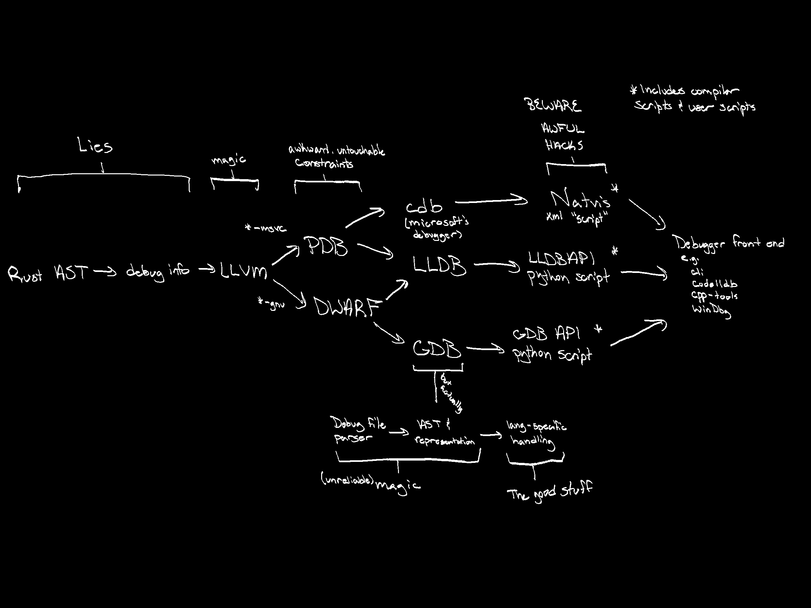
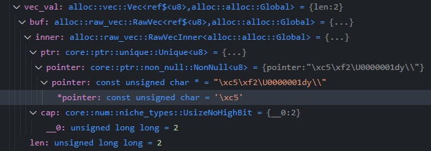
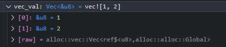

+++
title = "So you want better debug info?"
date = 2025-02-01

[taxonomies]
tags=["programming", "rust", "debugging"]
+++

Let me start with an emphatic **"me too"**.

I've put many of my side projects on hold because recent events have resulted in, what I consider to be, an unacceptable degredation of the debugging experience. It's a bit hard to focus on whatever I'm doing when I have to fight to figure out what's in a `Vec`. One of the great things about programming is that we're the ones who make our own tools; we don't have to just blindly accept mediocrity.

<!--more-->

Debug info seems sortof like water treatment or waste disposal: everyone relies on it, but it's not all that glamorous to maintain. It affects - and is affected by - so many disparate parts of the compiler. Changes considered safe elsewhere, like the name or ordering of private fields in standard library types, can break debug info. Updating your debugger can break debug info. The IDE extension that wraps your debugger can break debug info. It's a bit of a nightmare.

That being said, things are improving. By the time this is posted, nightly Rust will [hopefully have drastically better debug info](https://github.com/rust-lang/rust/pull/135354) than stable - especially for `*-msvc` targets. I did a ton of digging, experimentation, and hair pulling to get things as good as they are, and most of that was via cryptic or incomplete documentation (if any existed at all). I want to talk a bit about how debug info works, the challenges involved, and the plan going forward. Hopefully, that can serve to lower the barrier of entry to working on it, or at the very least make it clear why things aren't (and won't be) 100% perfect.

Before I get into the meat of things, I just want to note that this is my first "major" open source contribution - both towards Rust, and overall. So first of all, **wooooo let's go!** It's been a bit nerve wracking, and if I accidentally merge-commit instead of rebase one more time I'm gonna curl up like an armadillo and implode, but it's been cool. I always said I wanted to work on dev tools, and here I am actually doing it.

In any case, to give an idea of the surface area debug info touches, here's a diagram:

Now, I'm not an expert. Maybe this isn't so bad for someone who is. It was definitely daunting for me though. There's lots of rabbit holes, and I certainly haven't explored them all.

# Definitions

### Debug info

A set of lies that Rust tells LLVM - which is translated into an intermediate format - such that a piece of data in memory can have some or all of its meaningful info artificially reconstructed by a debugger while the program is running.

I worded that *very* carefully. There's a lot of nuance contained there, and I'll try to clarify some of it here:

* This whole stack is a game of telephone and LLVM is one middle-man among many. Some of them are in our control (i.e. open source/open to contributions), some are not.
* As alluded to in the prior point, this can be a "lossy" process. It doesn't *have* to be, but at time of writing, it is. LLVM has a limited API with which to generate debug info nodes. Debuggers can and will ignore nodes.
* The amount of "lossy" heavily depends on *which* middlemen you use. LLDB "looks through" type aliases of primitives (e.g. `u8`'s will be reported as `unsigned char`). The PDB format loses generic argument information. GDB respects type aliases, but is hard coded to assume the type of all pointers and references to be `*mut`.
* Debug info generation is arbitrary. There is no requirement to represent types 1:1 with their in-memory representation. You can include more (or less) information, so long as there is enough that, combined with your language's invariants, the debugger can extract the info you want.
* A further caveat of the above is that you are not required to read a struct the same way that the program operates on it. This is vital for things like hashmaps, where it wouldn't make much sense to run the program's hashing algorithm on a key that you can't possibly know without inspecting the contents of the map in the first place.

### DWARF

A specification for a debug info format that is used for `*-gnu` targets. It is typically embedded directly in the compiled binary.

### PDB

A [proprietary debug info format made by microsoft](https://learn.microsoft.com/en-us/visualstudio/debugger/specify-symbol-dot-pdb-and-source-files-in-the-visual-studio-debugger?view=vs-2022), used for `*-msvc` targets. It is contained in a separate file from the compiled binary. PDB itself is actually a container format which organizes a set of CodeView objects. Trying to find more information about PDB and especially CodeView can be really difficult. Microsoft's [blog post](https://devblogs.microsoft.com/cppblog/whats-inside-a-pdb-file/) links to a [404](https://support.microsoft.com/en-US/help/121366). Stackoverflow [questions about those 404's](https://stackoverflow.com/questions/1418660/microsofts-codeview-format-specs) lead to 404's. The wayback machine hadn't archived many of the links in the answers. I did find [one](http://www.openwatcom.org/ftp/devel/docs/CodeView.pdf) that's still kicking though. I'd say "save it while you can", but this one *has* been archived, so we should be safe.

CodeView is an absolutely ancient format that seemingly has not changed much since its inception. There's significantly less flexibility and expressiveness compared to DWARF. It was made purely for C and later adapted for C++, so there's 0 extensibility for non-C concepts. Not that it's fully featured for its intended languages either, but I digress.

While PDB's specification isn't public, `msdia140.dll` has a [documented API that can be used to read them](https://learn.microsoft.com/en-us/visualstudio/debugger/debug-interface-access/getting-started-debug-interface-access-sdk?view=vs-2022). Microsoft also [open-sourced a PDB reader written in C++](https://github.com/microsoft/microsoft-pdb), so it's not a complete black-box.

Both of the above formats contain information about types (name, size, alignment, qualifiers, etc.), function signatures, source code mappings (which line in which file does this instruction address correspond to?), scope contents, and more.

### Debuggers

The programs that load your executable (and its debug info) and provide utilities like variable inspection and breakpoints. The 3 major players are GDB, LLDB, and CDB. Many developers use them wrapped in an IDE extension or other external program (native debug, codelldb, lldb-dap, WinDbg, etc.)

### Debugger Visualizers

A set of APIs that debuggers expose such that end-users can have some control over how their data is displayed. Typically they're written as plugins for the debugger, or as script files that the debugger can load in at run-time. They can be though of as "prettifiers", but they usually have enough extra power behind them to pull off some neat tricks as we'll see later.

# The Rust Layer

Debug info is generated [during the codegen phase](https://github.com/rust-lang/rust/tree/master/compiler/rustc_codegen_llvm/src/debuginfo) using the AST of the source code and an FFI wrapper around [LLVM's debug info API](https://github.com/llvm/llvm-project/blob/main/llvm/include/llvm-c/DebugInfo.h). If you've made a toy programming language before, nothing about the AST processing is particularly surprising.

This layer is the one we have the most *control* over for modifications and fixes. I emphasize "control", because this is not the layer that has the most *power* to actually effect fixes. Almost anything done on this layer is in service of, and constrained by, the limitations of another layer. Consequently, most of the fixes here are workarounds and lies to get things to work "well enough"; fixing things in the middle layers typically requires a lot more effort and some extra hoop jumping.

It's not uncommon to try a workaround for some debugger limitation and run straight into a brick wall of [unreproducable, catostrophic errors](https://github.com/rust-lang/rust/pull/136080#issuecomment-2614188770), [inconsistent handling of inline-initialized possibly-const static fields](https://github.com/rust-lang/rust/pull/133990#discussion_r1874236993) (jfc), or other such nonsense, and be thrown into territory far outside what you've been researching.

To be clear, that's not the end of the world It just means that the first-party ability to get the debug info perfect, quickly, is less powerful than one would expect. As an example, PDB not supporting generic args needs to be fixed by Microsoft. We can work around it via some gross string-based hacks, or by generating different, less "true" debug info, but the core issue still cannot be fixed on our end.

Debugger visualizers technically also fall into "Rust layer" territory, but they're at the other end of the pipeline, so I'll talk about those later.

# LLVM and Raw Debug Info

This is the layer I know the least about. I've done some exploratory inspection with the Rust [PDB crate](https://crates.io/crates/pdb2), as well as perusing the [DWARF specification](https://dwarfstd.org/dwarf5std.html), but nothing super extensive. I don't really know how LLVM's API works internally, aside from the fact that there's SO MUCH INDIRECTION HOLY COW. Maybe I'd have had better luck using Visual Studio, but the VSCode extension I was using could *not* handle it. There's quite a bit of `struct.DoThing()` whose entire implementation is `this->member.DoThing()`, and *that* function's implementation is *also* `this->member.DoThing()`. Between that, everything being an opaque typedef'd pointer, random forward declarations and namespaces everywhere, and having to open both the header and the implementation of 700 different files, it's pretty maddening to navigate. Almost certainly a skill issue, but *wow*.

One thing worth noting is that LLVM has two different PDB handlers - "native", which appears to be written from scratch, and "DIA", which is a wrapper for the [`msdia140.dll`](https://learn.microsoft.com/en-us/visualstudio/debugger/debug-interface-access/getting-started-debug-interface-access-sdk?view=vs-2022) COM pointer interface. One might work better than the other, but that can't be relied upon since Rust cannot guarantee which version anyone is using.

I more or less just assume LLVM does \<the right thing\> and that any problems are inherent to the debug info specs, or can be solved elsewhere. Even if that isn't true, it's not a terrible assumption; these are probably the hardest layers of the stack to modify. Something like a revision of the DWARF standard would take years and adoption of the new standard is *very* slow. LLVM itself has a decently fast patch cycle, but it's a huge and complicated project, and their needs aren't perfectly aligned with our own.

# Debuggers

As mentioned previously, the three most relevant are CDB, GDB, and LLDB. I'd love to see usage statistics for each of them, but judging by the [Rust survey](https://blog.rust-lang.org/2024/02/19/2023-Rust-Annual-Survey-2023-results.html) (70% Linux, 32% Windows, 62% VSCode, Rust analyzer for VSCode prefers CodeLLDB), most people probably use LLDB, so that's the one I'll talk the most about.

The most important thing to understand is that debuggers do not natively support Rust. Even though Rust generates debug info that the debugger can read, that's not quite enough. Debug info specs are pretty C-centric, and "it's C" is the default handling for unknown/unsupported languages in LLDB. To mitigate this, LLDB and GDB both offer facilities for language plugins to help bridge the gap between the debugger's internal representation of the debug info and the actual data in-memory at debug-time.

An easy example of why this matters is the debug info for references. CDB implicitly treats (and displays) all refs as pointers (`&u8` -> `unsigned char *`, which is then sometimes interpreted as a c-string). LLDB and GDB respect reference nodes, but also display the type "C-style" (e.g. `u8 &` as opposed to `&u8`). That's not the end of the world, but what about a `&&u8`? `&&` in C-land means ["r-value reference"](https://learn.microsoft.com/en-us/cpp/cpp/rvalue-reference-declarator-amp-amp?view=msvc-170), which doesn't have an equivalent in Rust. When you inspect this value via the debugger, `&&u8` effectively becomes `&u8`. That means you'll be looking at the address of the *first 8 bits of the address* of a `u8` value.

And hey, what about the difference between `&mut` and `&`? DWARF has tags for both mutable and immutable types, but PDB seemingly doesn't. Even if it did, LLDB's API doesn't have a way to check for them. You can treat the `const` tag as meaning "immutable", but now *GDB's* Rust plugin will ignore that and [unconditionally call it `*mut`](https://github.com/bminor/binutils-gdb/blob/e90210d9bb2776f4e8cf29d36b3b190dfa1b4e6d/gdb/rust-lang.c#L1044). That's a simple fix on their end, but no matter what it'll be in a broken state somewhere in the interim.

Hopefully you're starting to see the issue: much of debug info's constraints are about the interplay between the limitations of the debug info format and the debuggers' API, all through C-tinted glasses. There are multiple formats and multiple APIs at multiple levels of completeness, resulting in a complex web of capabilities and limitations. It's not so bad when DWARF and PDB disagree because we can conditionally alter Rust's behavior at compile-time with a simple "are we compiling for Windows?" flag. But the compiler isn't (and cannot be, without a first-party debugger) debugger-aware. GDB and CDB handle mutually exclusive debug info (DWARF and PDB respectively), but LLDB can handle both. It gets very tricky when GDB or CDB disagrees with LLDB.

To narrow our focus a little, let's take a look at LLDB's plugin system. The basis of it is an inheritable, mostly virtual class called a [`TypeSystem`](https://github.com/llvm/llvm-project/blob/main/lldb/include/lldb/Symbol/TypeSystem.h). Rust currently piggybacks on [`TypeSystemClang`](https://github.com/llvm/llvm-project/blob/main/lldb/source/Plugins/TypeSystem/Clang/TypeSystemClang.h) - the default, somewhat C-oriented `TypeSystem`. To add language support, it "just" requires writing a `TypeSystemRust`. For additional capabilities, there's another set of classes that can be used to let LLDB understand the language's syntax and evaluate "rust-like" expressions in its REPL. Those are then compiled to a dynamically linked library for LLDB to load at runtime, which *could* decouple its upkeep from the LLVM patch cycle. Could.

We're getting into territory here that is well out of my depth. I mentioned before, but I'm not a professional developer (yet!). These sorts of bureaucratic and architectural decisions feel like they should be made by someone much wiser than I am. A working `TypeSystemRust` *used* to exist. It was canned in 2019 - so far as I've heard - due to a maintenance burden. It was then upkept by a third party as a dependency in a popular debugger plugin for VSCode. That third party then canned it in mid 2024 due to a maintenance burden. After monkeying with bandaid fixes in several other layers of this stack, I (tentatively) think that the best path forward is to resume maintenance of `TypeSystemRust`. Or, more than likely, completely re-write it as the API has changed substantially since the last Rust-official version.

There are 3 major questions that need to be answered though.

### Whose Repo?

There are [hints](https://github.com/llvm/llvm-project/blob/10ed0e406589604bf8ea5edd571a6f72dd8a6721/lldb/source/Plugins/TypeSystem/Clang/TypeSystemClang.cpp#L114) that [LLVM expects a Rust plugin](https://rust-lang.zulipchat.com/#narrow/channel/317568-t-compiler.2Fwg-debugging/topic/Revamping.20Debuginfo/near/486768435) at some point. At the same time, they also make it [very clear that the plugin system exists such that languages can create and maintain their own](https://lldb.llvm.org/resources/addinglanguagesupport.html), irrespective of LLVM's patch cycle.To put on my semantics hat again, which does this mean?

1. "We expect there to be a Rust plugin eventually, but your lang support goes in your repos - these aren't our problem"
2. "If you want it in your repo for more control, go for it. It's not required to be part of LLVM's to work"

Maybe I'm being optimistic, but a major benefit would be that we'd have some help from the LLDB crew for things like breaking API changes. Rust already has a pipeline for upstreaming patches to LLVM, so it wouldn't be a complete logistical nightmare. On the other hand, the plugin model is really convenient for the patch cycle and distribution methods Rust currently has. As we'll see later, debugger helper files are already distributed in every Rust toolchain.

### Which language?

LLVM is written in C++. It occurs to me that the lack of support for the plugin we used to have may have been due to a shortage of people *willing* to work primarily in C++. Keeping the plugin in the Rust repo means there's no real red-tape preventing us from FFI-wrapping LLDB and writing `TypeSystemRust` in pure Rust. It wouldn't be the first instance of that sort of thing in the compiler. The initial workload would be pretty big though, since existing LLDB wrappers are very outdated and/or don't build properly on Windows. Funnily enough, that likely has the same root cause: a lack of people and interest.

Someone more versed in generating and hooking up these wrappers would have a better idea of the upfront cost than I do. Maybe it's prohibitive, maybe it's not. I've given it a few looks before, but I always end up putting it off because it's *really* hard to be motivated to diagnose linker errors. For a while that was how fixing debug info in general felt to me though, so maybe some day a switch will flick over in my brain (read: something will annoy me enough) and I'll have a workable crate before the heat death of the universe.

### How much?

Once again, I've been over-simplifying things. It *seems* like all that's needed is a `TypeSystem`, but that's not quite true. If I'm understanding things correctly, there's actually 5ish modules that are important for a "perfect" experience, and a `TypeSystem` might not even be 100% necessary to get a better experience than we have right now.

LLDB documentation is pretty coy about what a `TypeSystem` even does. From a quick once-over, it looks like way to recognize and organize types based on the underlying debug info. It can store context and inspect type names to categorize things in a way that LLDB likes. It also looks like it's the layer "underneath" the python API. There's kindof a lot there though, so I'm not fully confident in that answer. Supporting the `TypeSystem` is a `DWARFASTParser` which is exactly what the name implies - it reads the DWARF info and provides that information to `TypeSystem`s in a uniform format. It seems like a fair number of our issues with misinterpreted or ignored DWARF tags could be fixed there. Additionally, there's an `ExpressionParser` which is a little interpreter for Rust-like code so LLDB's REPL can evaluate expressions. I say "little", but interpreters are always a decent amount of code.

Then, we have the `Language` and `LanguageRuntime`. The former appears to be the C++ equivalent of the python debugger visualizer API, with the obvious advantages of speed, and access to LLDB's internals. `LanguageRuntime` looks like it's meant to handle Exceptions and dynamic types (I think `&dyn` qualifies?).

So which of those do we actually write? It's complicated. Judging by the C++ `Language` plugin, those can be standalone and do not require a bespoke `TypeSystem`. There would likely be some tangible benefits to using a Rust `Language` plugin over the python scripts we're currently using, but it's a hard sell when considering the contribution barrier is now C++ instead of python. Compiling LLDB to test it isn't a trivial task either, whereas python scripts can be loaded and reloaded at debug-time.

If we do make a `TypeSystemRust`, there won't be much benefit over `TypeSystemClang` unless we also make a `DWARFASTParserRust`. There might be some small benefits even if we don't, but the real fix is just not restricting the shape of the debug info we can generate in the first place, and that requires a `DWARFASTParser`. It's also not 100% clear to me how non-DWARF debug info is handled. I think the PDB is "translated" to DWARF, which is then passed to the `DWARFASTParser`? At time of writing, that's still on my list of things to look into.

Ideally, we'd just make all of the plugins, but that's quite a bit of surface area and they aren't trivial to throw together.

We may have already veered into wishlist territory, but I'll *definitely* put us there by saying I'd love if Rust just had its own debugger. That opens the door for things like custom debug info formats, a first party VSCode plugin, the compiler and debugger working hand-in-hand, etc. It's obviously a huge undertaking, but not outside the realm of possibility considering things like [RADDebugger](https://github.com/EpicGamesExt/raddebugger), which has its own debug info format, or languages like Python that maintain their own debugger. Writing a basic program that loads other programs, steps through them, and inspects variables [isn't actually all that difficult](https://www.timdbg.com/posts/writing-a-debugger-from-scratch-part-1/). The annoying parts come with all of the advanced features that LLDB has. Some of those, like expression parsing, are "already done" between miri, rust-analyzer, and the compiler itself. We'd "just" need to hook them up to eachother in some way. Others like remote debugging or exotic target support are more taxing, but aren't 100% necessary in the short/medium term.

# Debugger Visualizers

There are two "layers" to this layer. On one hand, there's the rarely-used [debugger visualizer API](https://doc.rust-lang.org/reference/attributes/debugger.html) for Rust library authors, which I'll be covering in more depth in my next post, where I walk through creating visualizers for the [`TwoVec` crate](https://walnut356.github.io/posts/twovec-a-very-silly-container/). For today, the more relevant scripts are those distributed with Rust toolcahins. They come in two flavors: XML, and Python. In both cases, the purpose is to prettify the output from the debugger. This is done by partially exposing the debugger's internal representation of objects. There's usually a way to store extra state and context details, override the displayed fields and type name, and run user-defined functions on the underlying data.

Microsoft is once again the odd one out, using an XML schema called [Natvis](https://learn.microsoft.com/en-us/visualstudio/debugger/create-custom-views-of-native-objects?view=vs-2022). XML really isn't the greatest format for this sort of thing, but it works well enough. There's support for expression evaluation, context-variable storage, and pseudo-functions. The major missing features are the ability to override the displayed type name, and the ability to create custom views of primitives.

GDB And LLDB both offer a `Providers` python API. You register a type (or a way to identify the type, like a regex), and then values of that type are put in a class with a specific interface. That interface is what's used to populate the summary and fields for each value. For example, the raw debug info for a `Vec` contains the length and the internal pointer, but that's not very useful.

A simple script can read the memory at the pointer's address and cast the interpretation of those bytes to the element type of the `Vec`, outputting them as pseudo-fields. Some additional work can clean up the type names and provide a pleasing summary:

If you're interested in how these work, reconstructing [hashmaps](https://github.com/rust-lang/rust/blob/43ca9d18e333797f0aa3b525501a7cec8d61a96b/src/etc/lldb_providers.py#L621) and [niche-optimized enums](https://github.com/rust-lang/rust/blob/43ca9d18e333797f0aa3b525501a7cec8d61a96b/compiler/rustc_codegen_llvm/src/debuginfo/metadata/enums/cpp_like.rs#L50) are both pretty cool.

In this way, debugger visualizers are the "prestige" at the end of the lie told by the compiler all the way back in the Rust layer.

Just like the Rust layer, we have quite a lot of control here. We're still limited by the debugger API, but there's a lot of clever hacks and workarounds possible when both ends of the pipeline are in sync. And, well, sometimes those hacks are necessary in the short term. As mentiond in the prior section, changing the debugger itself is a much more intensive process. I used the word "hacks" intentionally though - they are ugly, complicated, fragile, and only function when things actually *are* in sync. Those hacks raise some (to me) moderate dilemmas.

Say that you're fixing some type output and you run into a debugger constraint. The current output isn't *wrong*, but it's missing some key info. There's a solution, but it requires lying about the type such that the *raw* output of the debugger is incoherent at best and outright misleading at worst. But, when run through a script, that new debug info provides enough extra pieces that the debugger displays perfect information. Is that an acceptable solution? Remember, the scripts are, to some extent, opt-in. They need to be loaded by the debugger at run-time, either manually or through some kind of automation step. The scripts supports the 3 major debuggers, but what about other debuggers? Is lowering the quality of their experience worth it for the increase in quality for *current* popular debuggers? Does it matter how frequently/infrequently this type is viewed via debuggers?

Maybe the answer is simple, but I can't shake the brain worm that says "it doesn't have to be this way". The best of both worlds is fixing the debugger so that Rust doesn't have to lie in the first place. The supported debuggers get perfect output, and unspported ones (or, ones whose scripts haven't been loaded) get a mediocre, but coherent experience.

And while we're talking subjectivity, what even is "perfect output" in the first place? I think "perfect for VSCode" and "perfect for CLI" are different metrics. Not every debugger UI is one that's piped through VSCode. Who are we optimizing for? I have an inherent bias of `*-msvc` on VSCode with LLDB because that's what I use. Changes that benefit my workflow could easily ruin someone else's. I prefer to show the contents of a pointer rather than the pointer's address. I've been in situations situations where the other way around is preferable though. It's not so bad if you can display all of the information (even if it's through a nested menu), but that's not always possible on the visualizer-end.

Currently, `Vec`'s summary is its length and you have to expand it to view its contents. CodeLLDB used to format vecs like the `vec![]` macro as I displayed above. It's maybe noisier, but it's very convenient for smaller vecs. The downside is that now it's much more annoying to view the length. We could add the length to the top of the list of child elements, but now the expression parser will see the length as the 0th child-element of the `Vec`, which can be unintuitive in some niche cases when inspecting via LLDB's REPL.

What kind of error messages do we provide when something is in an invalid state? Can we always detect if something is in an invalid state? For example, sometimes an out-of-scope string's pointer isn't set to null and still displays partial contents even though it's no longer valid. I *think* this can be fixed, but it might require large changes to how debug info is generated back in the Rust layer. I have no idea how nested scopes are currently handled - maybe it's something we're not even touching and it'd be a big overhaul, maybe it's just one field on a debug info node that's populated with the wrong value.

I'll stop myself, but these sort of things crop up a lot. It's highly subjective, you can't optimize for everyone, and they aren't easy topics to resolve in a code review or pull request.

# Wrapping up

There's still a few more pseudo-layers I could cover like testing, Rust AST generation, or the debug adapter protocol, and a *lot* more detail I could add, but this is already pretty long. Debug info is a complex topic with complex systems driving it. At time of writing, there just isn't enough interest to give it the upkeep it deserves. If you want to help out, feel free to drop by the Rust Zulip's `t-compiler/wg-debugging` channel.

On a more personal note, this brain-dump maybe came across as pessimistic, but I really have enjoyed this process. I've struggled a lot in my life with self-efficacy - the belief in one's own ability to achieve a goal. I think it's easy to fall into the trap that just because something hasn't been done so far, it means it can't be done. That someone smarter has tried and failed or that it was found to be a suboptimal solution. As it turns out, sometimes nobody had the time or nobody cared enough to follow through. You can just do a thing, and sometimes that makes a difference. I didn't have many opportunities for that growing up, and it's really gratifying to see my time and effort turn into something tangible and useful.