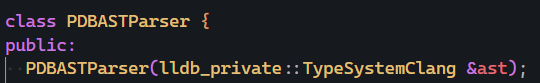

+++
title = "LLDB's TypeSystems: An Unfinished Interface"
date = 2025-03-28

[taxonomies]
tags=["programming", "rust", "debugging"]
+++

Well, it's "done". `TypeSystemRust` has a [(semi) working prototype for LLDB 19.x](https://github.com/Walnut356/llvm-project/tree/lldbrust/19.x). It doesn't support expressions or MSVC targets (i.e. PDB debug info), and there are a whole host of catastrophic crashes, but it more or less proves what it needs to: Rust's debugging experience *can* be improved, and there are worthwhile benefits to a working `TypeSystem` that can't be emulated on other layers of the debugging stack.

If you want to test it out, you'll need to build my fork from source (sorry), but then `lldb.exe` can be used as-is, or you can point a debugger extension like lldb-dap or CodeLLDB to your newly built `lldb-dap.exe` or `liblldb.dll` respectively. If you're on Windows, make sure to compile for MSVC otherwise CodeLLDB won't be able to interface with `liblldb` properly.

<!--more-->

This is a loose followup to my [previous post](https://walnut356.github.io/posts/so-you-want-better-debug-info/) about improving Rust's debugging experience. It's not 100% necessary reading, but explains some details about the debugging stack, the challenges of getting debug output to work properly with different debuggers, and why I'd spend a such a big chunk of time on this. For reference, this plugin took me a little over a month to write. I didn't track hours because I'm a dummy, but I'd probably put it in the ballpark of 80-100. I'd like to think that's due to the mitigating factors that I'll get into below, rather than me just being slow. It also would have taken *significantly* longer had I not had Vadimcn's LLDB 16.x `TypeSystemRust` to use as a reference (if you're reading this, your warnings were 100% correct lol).

To quickly list some benefits of a dedicated `TypeSystem`:

* *Drastically* improved performance, especially when displaying container types (e.g. `Vec`, `Hashmap`, etc.) due to `SyntheticProviders` being compiled C++ rather than python scripts. There's also ways to cut down on a decent amount of the regex usage.
* Debug nodes can be interpreted in arbitrary ways, meaning we can convey significantly more information to the debugger at compile-time. This means we have a ton more options to prettify the output and extract useful information (e.g. `mut` vs non-`mut` pointers/refs/variables, better/easier `dyn T` inspection, better source-mapping of closures)
* Rust expressions in the lldb repl (e.g. `x as *const u8` rather than `(u8*)x`, `x.y` instead of `x->y`) and could allow for some very cool tricks like retrieving `Hashmap` values through the familiar `map[key]` syntax.
* Debugger visualizer scripts should end up easier for library authors to write since we can ensure consistent information regardless of the debug info available - currently PDB-based debug info requires a few helping hands from the script to do its job properly. By stuffing those hacks in the `TypeSystem`, we wouldn't need to have a string-manipulation-`get_template_args` function in every single python script. We could also improve the `SBType` and `SBValue` interfaces themselves to allow them to access more of the DWARF modifiers and possibly upstream those improvements to LLDB itself.

If the title of the post wasn't clear, I have some... *opinions* regarding my experience writing the plugin. I do intend to help contribute to some fixes, but I'm one person with limited time and motivation. I want to record my thoughts here though, because I think they're the most valuable at this exact moment: I'm now *somewhat* familiar with LLDB internals, but 2 months ago I was starting from 0. It's easy for people creating \<a thing\> to lose perspective and not understand the difficulties faced by those who don't already have an intimate understanding of the system itself or its context (supporting systems, jargon, domain knowledge). That perspective is *vitally* important for a public API that is meant to be used by people who aren't LLDB devs.

On one hand, it's a very powerful interface and it surprised me with how much "just works" by implementing relatively few functions. On the other, the architecture is unbelievably convoluted and the documentation is, with no exaggeration, completely non-existent. I think it is *incredibly* close to being in a mainstream-useable state, but the current issues make it difficult to recommend to the third party languages it's trying to appeal to.

As of writing, I know of exactly 3 implementations of the `TypeSystem` interface aside from mine: `TypeSystemClang`, which is shipped with LLDB and supports C/C++ (with partial support for Pascal, Rust, and D); `TypeSystemSwift` which is maintained by literally Apple in [their fork of LLVM]((https://github.com/swiftlang/llvm-project/tree/next/lldb/source/Plugins/TypeSystem/Swift)); and `TypeSystemRust`, [formerly upkept by Vadimcn](https://archive.softwareheritage.org/browse/origin/directory/?branch=refs/heads/codelldb/16.x&origin_url=https://github.com/vadimcn/llvm-project&path=lldb/source/Plugins/TypeSystem/Rust&timestamp=2023-09-11T04:55:10Z) for the popular CodeLLDB VSCode extension.

After writing my own `TypeSystemRust`, the low number of implementers does not surprise me.

# What does a `TypeSystem` do?

I mentioned this in my previous post, but the [official docs](https://lldb.llvm.org/resources/addinglanguagesupport.html#add-a-typesystem-for-the-language) don't really say. Alarmingly, the comments in the source code don't explain anything either:

```rust
/// Interface for representing a type system.
///
/// Implemented by language plugins to define the type system for a given
/// language.
///
/// This interface extensively used opaque pointers to prevent that generic
/// LLDB code has dependencies on language plugins. The type and semantics of
/// these opaque pointers are defined by the TypeSystem implementation inside
/// the respective language plugin. Opaque pointers from one TypeSystem
/// instance should never be passed to a different TypeSystem instance (even
/// when the language plugin for both TypeSystem instances is the same).
///
/// Most of the functions in this class should not be called directly but only
/// called by their respective counterparts in CompilerType, CompilerDecl and
/// CompilerDeclContext.
```

The first two lines basically say "A TypeSystem is a TypeSystem". I've said it before, but ideal documentation should, bare minimum, answer the following 3 questions:

* What does this do?
* Why would I want it to (use-case, comparison to similar methods, etc.)?
* How does it do it (internal implementation, performance characteristics, failure states)?

The third question is answered, but the first two aren't. Perusing the methods is equally unhelpful; the majority have no comments at all and their names require a bunch of contextual knowledge to understand. Some appear similar in name to parts of the Python interface, but that's still not an answer. `TypeSystemClang`'s comments (of which there are few) and implementation also don't make things any clearer, but for different reasons that I'll get into later.

A quick once-over of the `Language` and `LanguageRuntime` interfaces suggests that those plugins are used similarly to the Python interface - run-time value inspection and formatting. It's not clear how `TypeSystem` fits into that. The only other hint given by the official docs is that if the debug info is coming from DWARF, the `TypeSystem` should subclass `DWARFASTParser`.

# DWARF AST Parsing, Types, and Decls

`DWARFASTParser` is an interface that takes raw dwarf debug info entries (DIE's or, informally, nodes) from a `SymbolFileDWARF` and turns them into an in-memory representation of the type (which I'll call `LangType`). A `void*` to the `LangType` is then wrapped in a `CompilerType`, which associates it with the appropriate `TypeSystem`. The `CompilerType` is passed back to the `SymbolFileDWARF`, which associates it with its DIE for later retrieval, wraps it in an `lldb::Type` - an object that also contains contextual information about the type - and passes a shared pointer to that back to the `DWARFASTParser`. The `DWARFASTParser` populates the contextual information if possible, and then passes the `lldb::Type` back to whoever called `ParseTypeFromDWARF` in the first place.

Uh.... huh.

In Rust terms, the class layout it looks vaguely like this:

```rust
trait TypeSystem {...}

struct LangType {...}

struct CompilerType {
    lang_type: *mut c_void,
    type_system: Arc<dyn TypeSystem>
}

impl CompilerType {
    // implements a similar interface to TypeSystem
    // and delegates everything
    fn get_byte_size(&self) -> usize {
        self.type_system.get_byte_size(self.lang_type)
    }
    ...
}

// implements a similar interface to CompilerType
// but also has other data and utilities
struct Type {
    compiler_type: CompilerType,
    ...
}
```

The purpose of this "telescopic" class layout is, ostensibly, to allow arbitrary `LangType` structs and `TypeSystem` implementations.

In context, that implies that the purpose of the `TypeSystem` is to cast the `void*` back to a `LangType*` and interpret the internals of that `LangType` for queries like `GetByteSize()` and `GetFieldAtIndex()`, right?

```rust
impl TypeSystem for TypeSystemLang {
    fn get_byte_size(&self, t: *mut c_void) -> usize {
        let lang_type = t as *mut LangType;
        // operate on the internals of LangType
        // that CompilerType doesn't know about
        ...
    }
}
```

Well... maybe.

I'm going to come back to that, but first I want to cover the architectural issues. The whole `Type`, `CompilerType`, `LangType` thing isn't horrible, but mixed with the litany of other classes that work this way it gets very tangled very quickly.

There's this feeling of inconsistency when operating on data, because it's not always clear when you should be storing/using any of the 3 layers of `Type` objects (which doesn't even count things like `TypeImpl` and `SBType`). To make matters worse, the names of classes and methods aren't descriptive enough on their own to convey intent properly. You can dig into the implementation, but that's a huge undertaking because the class relationships make it hard to find where the logic-code even is.

`DWARFDIE` is a big offender. 90% of your time implementing the `DWARFASTParser` is monkeying with `DWARFDIE` objects and their subsidiaries (`DWARFAttributes`, `DWARFFormValue`, etc.). Does the DIE in `DWARFDIE` stand for Debug Info Entry? Probably, but if so, why is there *also* a `DWARFDebugInfoEntry` class and in what way is it different? Neither are documented in any way, so you'll have to figure that out for yourself. I had a good laugh the first time I saw `GetDIE()`, a `DWARFDIE` method which returns a `DWARFDebugInfoEntry`. That method doesn't have a doc comment either so it just looks like absolute nonsense.

Let's say you have a `DWARFFormValue` - a wrapper around the data in a DWARF attribute - and you call `Reference()` on it. One overload returns a `DWARFDIE`, other other takes a `uint64_t` and returns a `uint64_t`. What does that function do? How can the overloads possibly accomplish the same thing with return-type differences like that? Some DWARF attributes like `DW_AT_type` store offsets into the DWARF file that point to other DWARF nodes. I assume the first overload "dereferences" that offset and returns the appropriate DIE. But not every attribute tag stores an offset. Can this function fail? How so? If it really does what I think it does, why isn't it called `Dereference`, or `GetReferencedDIE`? The latter is the name of a method on `DWARFDIE` (that, funnily enough, ends up calling `DWARFFormValue::Reference()`) and is a much better "self documenting" name than `Reference`.

Can I find this out by reading the source code? Kinda, but I end up having to jump down 7 other rabbit holes. Should I be able to hover over the type name and have most those questions answered in a few seconds by the doc comments? **Yes**.

Several dozen hours into writing the `TypeSystem`, I read in the LLVM contribution guidelines that [every class and function needs to be described](https://llvm.org/docs/CodingStandards.html#class-overviews). It specifically states **"The reader should be able to understand how to use interfaces without reading the code itself"**. Would that I could describe the bitter, betrayed sound that escaped my throat in that moment. The handful of words that followed are left to your imagination.

I'm going to temporarily put on the green goblin mask to prove a point, so don't worry too much if you don't understand the finer details.

### A Quick Jaunt into Madness

Near the end of the `DWARFASTParser` implementation, I had to write functions to create and retrieve `Decl` and `DeclContext` objects. In short, `Decl`s are declarations/definitions of structs, typedefs, functions, etc. `DeclContext`s are scopes (compile unit, struct, lexical block, etc.) and they store `Decl`s. Worth noting, both of these classes are defined within `libclang`, not `liblldb`. They also have the same `CompilerDecl` relationship to `Decl` as `CompilerType` has to `LangType`. None of that is clear at first glance and requires digging into a bunch of *other* stuff, but if I went into that we'd be here all day.

```rust
// same for Decl
struct DeclContext {...}

struct CompilerDeclContext {
    decl_ctx: *mut c_void,
    type_system: Arc<dyn TypeSystem>
}
```

To figure out where `DeclContext`s come from and how they're associated with type in the first place, I started with the `TypeSystemClang` entry point `GetDeclContextForType`, which is passed a `CompilerType&`. `GetDeclContextForType` internally calls an overloaded version of the same function that takes a `QualType`. That `QualType` is acquired via `ClangUtil::GetQualType(compiler_type)` Now we have additional questions: what is `ClangUtil::GetQualType`, and what is a `QualType`?

#### QualType diversion

Internally, that calls `QualType::getFromOpaquePtr(compiler_type.GetOpaqueQualType())` which is pretty straight forward. Except 1. `getFromOpaquePtr` uses a different capitalization scheme from seemingly the entire rest of the LLVM codebase for some reason? and 2. `GetOpaqueQualType` just returns the `void*` to the `LangType`.

But wait, since the `CompilerType` function is specifically called "get opaque **QualType**", that means `QualType` - defined within the `clang` compiler itself - is the expected type underlying `CompilerType`'s `void*`, right? Does that mean I should be using `QualType` for `TypeSystemRust`? Surely not, otherwise why use a `void*` at all?

Anyway, `QualType` is a packed-pointer type, basically a `clang::Type*` with a bit of extra metadata. Looking at the methods of `QualType`, it looks like it's very much built for C/C++ types. `clang::Type` (different from `lldb::Type`) appears to be a bitfields describing a type.

Anyway, where were we again?

#### Back to DeclContexts

Right, `TypeSystemClang::GetDeclContextForType`, which takes a `QualType`. For a quick tracer bullet, we'll look only at how struct types are handled. That code path returns `llvm::cast<clang::RecordType>(qual_type)->getDecl()`. Alright, so what is a `RecordType`?

#### RecordType diversion

`RecordType` is a child of `TagType` that seems to be used purely for classification purposes, like a sum-type enum in Rust. So what is `TagType`?

#### TagType diversion

A child of `clang::Type`, but with 1 extra member of type `TagDecl`. What is a `TagDecl`?

#### TagDecl divsersion

According to the doc comment, "Represents the declaration of a struct/union/class/enum." and it inherits from `DeclContext` among other things.

#### Back to RecordType

Where were we? Oh yeah, `RecordType::getDecl()`. That returns `(RecordDecl*)(TagType::getDecl())`. What does `TagType::getDecl()` do?

#### Back to TagType

Returns `getInterestingTagDecl(decl)`. Yes, it's really called that. So what does `getInterestingTagDecl` do?

### Interesting TagDecl diversion

It iterates over "redecls" and returns the first one that passes `isCompleteDefinition() || isBeingDefined()`.

So what is a redecl?

#### Redecl diversion

clangd points me to an inherited function from `Redeclarable<TagDecl>`, whose doc comment helpfully explains "Returns an iterator range for all the redeclarations of the same decl. It will iterate at least once (when this decl is the only one)". Neat I guess? So we can more or less pretend that it doesn't exist. But wait, how does `TagDecl` fit into this again? We saw it earlier, but now we need to know more.

#### Back to TagDecl

`TagDecl` inherits `Decl` and `DeclContext`. The `DeclContext` bitfields are what are inspected via `isCompleteDefinition()` and `isBeingDefined()`.

That value is then `reinterpret_cast` into a `RecordDecl*`, which has a bit of extra struct-related data.

So all-in-all, we have something like this? I don't even know

```rust
// this is all in clang, not lldb
struct Type { ... }

struct Decl { ... }
struct DeclContext { ... }

struct TagDecl {
    decl: Decl,
    decl_ctx: DeclContext,
}

impl Redeclarable for TagDecl {
    ...
}

struct RecordDecl {
    decl: TagDecl,
    ...
}

struct TagType {
    t: Type,
    decl: *const TagDecl,
}

// maybe an enum with RecordType being a variant
// would be more appropriate?
struct RecordType(TagType)
```

All of that, only to learn that a `DeclContext` should already be associated with a type before `GetDeclContextForType` is called and that it's function is just a simple member retrieval. Great...

While we're here, I just want to once again draw your attention to how many diversions you *haven't* seen. I presented you with a definition of `DeclContext` at the start of this and hand-waved away how I figured that out. The `DeclContext` class, being in clang instead of lldb, has a doc comment. It begins with the following:

```rust
/// DeclContext - This is used only as base class of specific decl types that
/// can act as declaration contexts. These decls are (only the top classes
/// that directly derive from DeclContext are mentioned, not their subclasses):
```

and then proceeds to list *thirteen* other classes. And you're telling me that's not all of them?

Good *god*.

So no, I wasn't exaggerating when I said we'd be here all day if I didn't gloss over things. The kicker? The minimum information necessary to store in a `DeclContext` is the scope's name and a list of child `Decl`s. Clang's `DeclContext` *declaration* (not definition) spans **1329** lines of C++ code. `DeclContextRust`'s - which is both declaration *and* definition - takes just 44.

Hopefully I've made my point. Was any part of that explanation confusing? Did your eyes glaze over? Does some of the complexity seem a bit unnecessary?

Everything is like this. It's maddening. I called it a possible skill issue before, but I don't think so now. It really is just 17 layers of indirection when 0 would do. I mentioned before that `TypeSystemClang` wasn't a useful resource to explain what a `TypeSystem` does and this is why. It's a gigantic time-sink to understand, and once you finally do, you realize it ties itself to the clang compiler in a way that other languages can't, with underlying representations that contain huge swaths information that the debugger API can't even take advantage of.

I'll say again, it was still this painful *after* several dozen hours of mucking around in adjacent parts of LLDB and clang.

I get that piggybacking on clang's classes saves time, but the utility and specificity required by the compiler vs the debugger are so different that I feel like it's just not worth it. `TypeSystemClang` doesn't exist *purely* as a reference for people to use when implementing their own `TypeSystem`, but does *have* to serve as one. Muddying that reference this much for a small-ish time save and dubious extra functionality feels like a mistake to me.

# What does `TypeSystem` do? (for real this time)

Most `TypeSystem` functions take a `void*`, cast it to a `LangType*`, and then operate on the underlying data to answer queries like `GetByteSize`, `IsEnumerationType`, and `GetFieldAtIndex`

In my case, the implementation of `TypeSystemRust::GetByteSize` (or any inspection function for that matter) *does not* require any data that doesn't already exist within the `RustType` struct I've defined. Which makes sense, because `RustType` is how you communicate the debug info to the rest of LLDB in the first place.

So what does the `TypeSystem` itself do?

Nothing.

Or, at least, nothing that can't be done by something else. My implementation has precisely 1 capability that isn't handled somewhere else - a map that associates `DWARFDIE`s with their respective `CompilerDecl`/`CompilerDeclContext`. And even that *should* be handled by the `SymbolFileDWARF`, which already has a map that associates `DWARFDIE`s with `CompilerType`s.

I'm sure I could technically think of a use for being able to store info that can be accessed for all the types collectively, but I struggle to see the point when the `ASTParser` and `SymbolFile` interfaces can already do that. I do not understand why a `LangType` can't just inspect itself via a `Type` interface, with both the `TypeSystem` and `CompilerType` classes thrown in the garbage. It seems like all we're doing with a `TypeSystem` is manually implementing a v-table. Maybe there's a good reason for this, I don't know. Without any explanation, it feels unnecessary.

# Mixed Messages

I want to make it clear that, in the official docs, it is *offhandedly* mentioned that "If your type info is going to come from DWARF info, you will want to subclass DWARFASTParser."

About 80% of the time I've spent so far was researching and implementing the `DWARFASTParser` and the `RustType` objects. I spent a single day writing the `TypeSystem` itself, and the remaining few days were spent writing the `Language` plugin that does things like displaying `Vec` elements instead of its heap pointer. Another sizeable chunk of time still needs to go into writing an expression parser.

If your goal is to get a better output than `TypeSystemClang` and it can't be fixed with the public `SB` API, the improvement is going to come from interpreting the debug info differently via `ASTParser` - thus generating different `LangType` objects - or via the `Language` plugin, which can interact with the `LangType` internals. If your goal is non-C expressions for the repl, that comes from the `ExpressionParser`, not the `TypeSystem`.

`TypeSystem` is the vast *minority* of the work and does not really accomplish anything in isolation. It's just a middleman. The docs definitely do not make it clear enough that that is the case. Realizing "oh, this is actually going to be 10x more work than I was lead to believe" is not fun.

I guess maybe you could write a `TypeSystem` that uses `QualType`, thus you don't have to write your own `DWARFASTParser` but like... the point of this is *third party language support*. As a reminder, `QualType` relies on `clang::Type`, the internal representation for types in a *C/C++ compiler*. It is incredibly C-oriented, rightfully so. But that makes it *very* unsuited to third party languages when they have non-C concepts, or disagree with C about what a term "means". In Rust a reference is a borrowing pointer. In C++, a reference is a magical "maybe a pointer, maybe not, but you interact with it like it's not, wOoOoO" that debuggers treat as such.

> From [cppreference](https://en.cppreference.com/w/cpp/language/reference):
>
> References are not objects; **they do not necessarily occupy storage**, although the compiler may allocate storage if it is necessary to implement the desired semantics (e.g. a non-static data member of reference type usually increases the size of the class by the amount necessary to store a memory address).
>
>Because references are not objects, there are **no arrays of references, no pointers to references, and no references to references**

This causes dumb issues that conflict with Rust's semantics even if the debug info is 100% accurate from the Rust compiler.

It might be a different story if there was a `TypeSystemLLVM` and a default `DWARFASTParserLLVM` that more or less just exposed the raw DWARF data in a default "sane" way. Maybe by assuming the data was generated via LLVM's `DIBuilder` API, and that if you have the `DW_TAG_struct` node, it probably represents a struct. At that point, it's on the compiler devs to make sure they're generating sane debug info, which is easy because they already are. There wouldn't be anything to gain or lose by implementing your own DWARF parser - a huge time-save for implementers - and the `LLVMType` objects given out could then be interpreted uniquely by the `TypeSystem` and/or `Language` plugin. Maybe that was the goal at some point, but right now we're in this awkward interim where the pieces don't fit together quite right.

Oh yeah, I almost forgot. What if your debug info comes from PDB, as it does for Rust compiled to `*-msvc`? Well, you get to eat shit.

`DWARFASTParser` is an interface and is not `TypeSystem`-aware, so it can be subclassed by your `TypeSystem`, or you can make a standalone `DWARFASTParserRust`. For some reason, `PDBASTParser` is *not* an interface.  Not only does `PDBASTParser`'s constructor require a `TypeSystem` it *explicitly* requires a `TypeSystemClang`.



The can-of-worms required to fix that is why my prototype doesn't have PDB support at the moment.

# Will it make Rust debugging better?

We've now arrived back at the title of the post. The `TypeSystem`/language support interface feels 80% complete. It's *so* close to being a game changer for debugging, but it's not something I could reasonably ask people on the Rust team (let alone random OSS contributors) to learn about and help maintain.

Maybe the convoluted architecture wouldn't be so bad if there were proper explanations of what everything is, what it does, and why it exists. Maybe the lack of documentation wouldn't be so bad if the architecture was simple and straightforward. As it stands though, both combined makes it too difficult to onboard people.

To be clear, I don't actually think the total surface area of `ASTParser` + `TypeSystem` + `Language` + `ExpressionParser` is too much, it's just too difficult to figure out *how* to implement them. I can see, beneath the current issues, a version of this interface that's reasonable to implement by a single person in a few days for their toy language, with no loss in power or flexibility.

It also might not be quite as easy to distribute as it appeared on the tin. It's called a "plugin", and LLDB has the capability to load some plugins dynamically at runtime. But from what I can tell, `TypeSystem` requires a full standalone build of LLDB because it works through LLDB's private internals rather than the `SB` API. I could absolutely be wrong about this, I haven't experimented with it enough to have a confident answer. If I'm right though, it'd be pretty disappointing. Building and distributing custom LLDB is a much bigger ask than distributing a `TypeSystemRust.dll`.

So as it stands, Rust debugging probably won't improve beyond little tweaks or fixes in the short term. That may change if the situation with LLDB improves, or if the core Rust maintainers take a keen interest and push through the roadblocks, akin to Apple with `TypeSystemSwift`.

In any case, I'll keep plugging away at this prototype, and maybe make some contributions to LLDB itself. Maybe some day it'll be more than a prototype. All of the groundwork is there for a better debugging experience, it's just going to take some time and some elbow grease.

<hr></hr>

Last but not least, I have a few specific nitpicks. I hate to have them hanging off the end like this, but this post was already such a nightmare to organize and pace, so it is what it is.


* There are no facilities that I could find to inspect a `TypeSystem` at run-time. I couldn't see which `TypeSystem`s were loaded, dump their states, nor determine which languages were associated with which `TypeSystem`.
* If multiple `TypeSystem`s are valid for a single language, there's no way to pick which one to use aside from removing the language from the results of `TypeSystem::SupportsLanguage` and recompiling. That means if there ever *is* an official `TypeSystemRust` (or `TypeSystem` can be loaded as a plugin), there would have to be an upstream change to `TypeSystemClang` to remove the Rust language flag.
* There's weird little problems with the public `SB` interfaces. Some DWARF tags (including ones that C/C++ uses, [such as the `DW_AT_mutable`](https://en.cppreference.com/w/cpp/keyword/mutable) or the `restrict` modifier) may as well not exist because there's no way to actually look at them via the SBType interface. It's weird because `lldb::Type` even has functions to add/remove the restrict modifier from a type, but the user-facing `SBType` interface can't access it so what's the point?
* The function that allows you override a type's name when printing it out (python: `get_type_name`, C++ `GetSyntheticTypeName`) is not publicly documented despite being a *massive* feature of the `SyntheticProvider`. It's not mentioned anywhere, despite the documentation [describing the "full" interface](https://lldb.llvm.org/use/variable.html#synthetic-children).
* Headers relying on headers that are generated at compile time (like SBLanguages.h) is a weird choice. I'm sure there's a reason for it, but it leads to a lot of little annoyances prior to the first full build if you aren't able to source those files from elsewhere. This is partially on me for building this on Windows because I hate myself, but I don't think the requirement of a special `lldb-dev` package on Linux is a great situation either.
* LLDB is dependent on clang, which means you need to do an in-tree build of clang before you can do a standalone build of LLDB. Everything is there, I'm not sure why cmake can't make it work without having to sit through 30+ minutes of a full clang compile, but it's pretty annoying.
* An option to build liblldb as a static lib would be awesome for those of us who want to make FFI wrappers. Last I checked there was a PR for it, but when I tried to build from that PR I ended up with a bunch of linker errors that I wasn't able to diagnose - but I'm also not experienced with that stuff, so it could be a simple fix or a Windows issue. If that's not an option, a C interface akin to LLVM-C would be a huge help instead.
* the [formatter byte code](https://lldb.llvm.org/resources/formatterbytecode.html), while cool, is borderline worthless for targets that don't end up populating template args (e.g. `TypeSystemClang` with PDB debug info). You most want synthetic providers for container types, but if you can't get the type of the element, you can't cast the container's pointer. Being able to look up an arbitrary type by name could help, or `TypeSystemClang` could just actually pull the template args from PDB info. I know PDB doesn't have them explicitly, but `TypeSystemClang` primarily handles C++ and Rust, both of which use the same `S<T>` syntax for templates.

* From what I can tell, the only way to apply a Synthetic to a type is via a regex, an exact name match, or a callback via a python script. There should definitely be a way to take a C++ callback of some kind. For example, there's nothing in a Rust type's name that distinguishes a `struct` from a sum-type `enum`. Checking via regex requires a raw `.*` wildcard (which the current Rust-distributed scripts currently do), and then delegating to a "default" and "enum" provider, which is exorbitantly wasteful. Using a python function isn't much better since, well, it's python.

In the C++ code you can return an invalid synthetic provider, but it still flags the type as having a synthetic, which causes issues for downstream consumers. For example, CodeLLDB adds an extra dropdown menu for values with synthetic types. Populating those isn't cheap when you have a `Vec` with 2000 `u8`'s in it.

Conversely, it's trivial for the `Language` plugin to cast the opaque type pointer to a `RustType` and call `IsSumType()`. It would be awesome if I could attach synthetics via that function. There is a [disgusting hack](https://github.com/Walnut356/llvm-project/blob/72c08d25f69266e001851b578801c229d1aba260/lldb/source/Plugins/Language/Rust/RustLanguage.cpp#L292) that hijacks an unrelated function to accomplish that, but that really shouldn't be necessary
